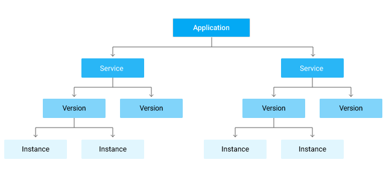
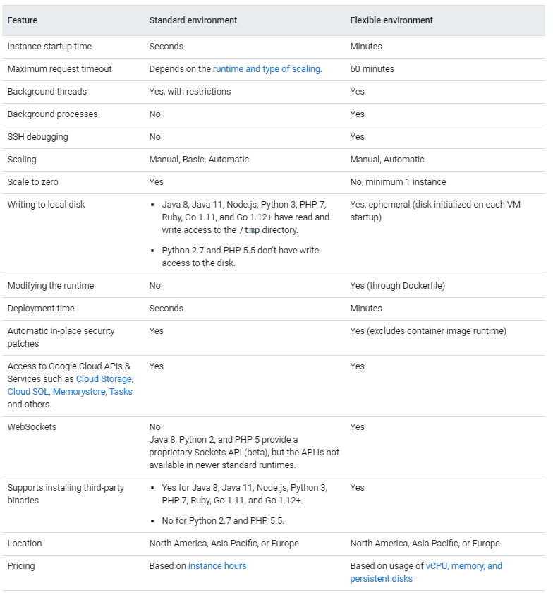

# App Engine

- single application resource that consists of one or more services
- Each service can be configured to use different runtimes and to operate with different performance settings
- Within each service, you deploy versions of that service
- Each version then runs within one or more instances
  - depending on how much traffic you configured it to handle.

### Components of an application

- When you create your App Engine app, all your resources are created in the region that you choose
  - including your app code along with a collection of settings, credentials, and your app's metadata

#### Services

- factor your large apps into logical components
- can securely share App Engine features and communicate with one another
  - the only way to execute code in these services is through an HTTP invocation, such as a user request or a RESTful API call
  - Code in one service can't directly call code in another service
- Each service in App Engine consists of the source code from your app and the corresponding App Engine configuration files

#### Versions

- allows you to quickly switch between different versions of that app for rollbacks, testing, or other temporary events
- route traffic to one or more versions
  - migrating traffic
  - splitting traffic

#### Instances

- versions run on one or more instances
- By default, App Engine scales your app to match the load

### Application requests

- `https://VERSION_ID-dot-SERVICE_ID-dot-PROJECT_ID.REGION_ID.r.appspot.com`
- When your application handles a request, it can also write its own logging messages to stdout and stderr

### Limits

| Limit                                              | Free app | Paid app                                            |
| -------------------------------------------------- | -------- | --------------------------------------------------- |
| Maximum services per app                           | 5        | 105                                                 |
| Maximum versions per app                           | 15       | 210                                                 |
| Maximum versions per app                           | 15       | 210                                                 |
| Maximum instances per manual/basic scaling version | 20       | Paid app US:25 (200 for us-central) Paid app EU: 25 |

## Pricing

https://cloud.google.com/appengine/pricing

## Microservices Architecture on Google App Engine

https://cloud.google.com/appengine/docs/standard/java/microservices-on-app-engine

- Microservices allow a large application to be decomposed into independent constituent parts, with each part having its own realm of responsibility
- A properly implemented microservices-based application can achieve the following goals:
  - Define strong contracts between the various microservices.
  - Allow for independent deployment cycles, including rollback.
  - Facilitate concurrent, A/B release testing on subsystems.
  - Minimize test automation and quality-assurance overhead.
  - Improve clarity of logging and monitoring.
  - Provide fine-grained cost accounting.
  - Increase overall application scalability and reliability.

### App Engine Services as microservices

- Code can be deployed to services independently, and different services can be written in different languages, such as Python, Java, Go, and PHP. Autoscaling
- load balancing, and machine instance types are all managed independently for services

### Versions within services

This structure opens up myriad possibilities, including:
  - smoke testing a new version
  - A/B testing between different versions
  - simplified roll-forward and rollback operations

### Service isolation

- services share some App Engine resources
  - Cloud Datastore, Memcache, and Task Queues, for example
- it's important for a microservices-based application to maintain code- and data-isolation between microservices
- There are architecture patterns that help mitigate unwanted sharing
  - namespaces can be used as a developer pattern to isolate the data
  - For Task Queue isolation, a developer convention of queue names can be employed, such as user-service-queue-1
- Each service (and version) has independent logs, though they can be viewed together.
- Costs for instance-hours (the CPU and memory for running your code) are not separated for services
- There is no way to limit access to specific services.
- you can view a request and the resulting microservice requests for services in the same project as a single composed trace

### Project isolation

- if you want a more formal enforcement of separation, you can use multiple App Engine projects
- Unless you have a specific need for one of the advantages offered by using multiple projects
  - it's best to start with using multiple services within a single project because performance will be better and the administrative overhead will be minimized
  - you can also choose some hybrid of the two approaches.

## The App Engine Standard Environment

- based on container instances running on Google's infrastructure
- Containers are preconfigured with one of several available runtimes.
- easy to build and deploy an application that runs reliably even under heavy load and with large amounts of data
- Applications run in a secure, sandboxed environment
- distribute requests across multiple servers, and scaling servers to meet traffic demands

### Standard environment languages and runtimes

- Python (2 & 3)
- Java
- Node.js
- PHP
- Ruby
- Go

### Instance classes

- The instance class determines the amount of memory and CPU available to each instance, the amount of free quota, and the cost per hour after your app exceeds the free quota.

## App Engine Flexible Environment

- automatically scales your app up and down while also balancing the load

### Runtimes

- Go
- Java 8
- PHP 5 / 7
- Python 2.7 / 3.6
- .NET
- Node.js
- Ruby
- Custom runtimes
  - supplying a custom Docker image or Dockerfile from the open source community

### Features

- Customizable infrastructure
  - instances are Compute Engine virtual machines
- Performance options
  - You can specify how much CPU and memory each instance of your application needs
- Native feature support
  - Features such as microservices, authorization, SQL and NoSQL databases, traffic splitting, logging, versioning, security scanning, and content delivery networks are natively supported
- Managed virtual machines:
  - Instances are health-checked, healed as necessary, and co-located with other services within the project.
  - Critical, backwards compatible updates are automatically applied to the underlying operating system.
  - VM instances are automatically located by geographical region according to the settings in your project
    - all of a project's VM instances are co-located for optimal performance.
  - VM instances are restarted on a weekly basis
    - apply any necessary operating system and security updates
  - You always have root access to Compute Engine VM instances
    - SSH access is disabled by default

## Choosing an App Engine environment

- You can also choose to simultaneously use both environments
  - services to take advantage of each environment's individual benefits

### When to choose the standard environment

- Applications that need to deal with rapid scaling.
- optimal for:
  - Source code is written in specific versions of the supported programming languages
  - Intended to run for free or at very low cost, where you pay only for what you need and when you need it
    - can scale to 0
  - Experiences sudden and extreme spikes of traffic

### When to choose the flexible environment

- Applications that receive
  - consistent traffic
  - experience regular traffic fluctuations
  - or meet the parameters for scaling up and down gradually
- optimal for:
  - Source code that is written in a version of any of the supported programming languages
  - Runs in a Docker container that includes a custom runtime or source code written in __other programming languages__
  - Uses or depends on frameworks that include native code.
  - Accesses the resources or services of your Google Cloud project that reside in the Compute Engine network

### Comparing high-level features

### Comparing the flexible environment to Compute Engine

- VM instances are restarted on a weekly basis
- Code deployments can take longer as container images are built by using the Cloud Build service

### Migrating from standard to the flexible environment

If you have an application in the standard environment, you might want to move some services to the flexible environment