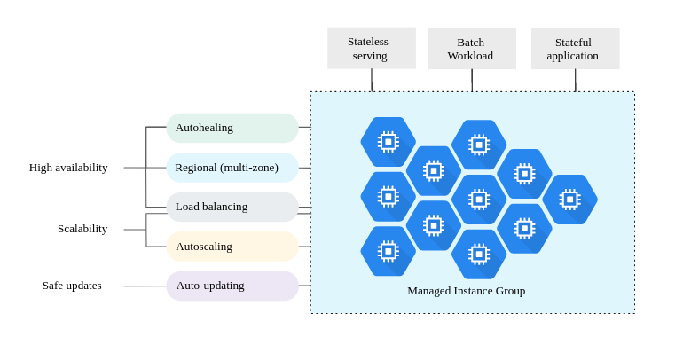
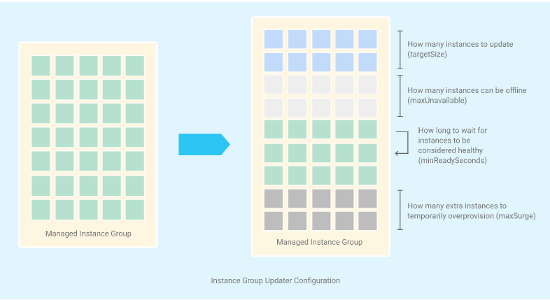
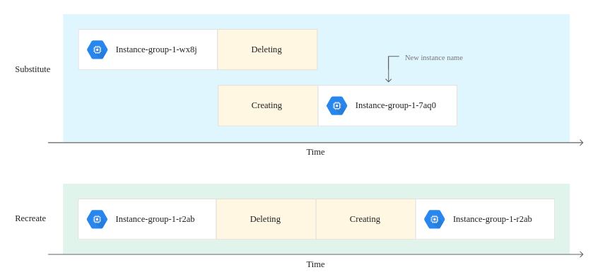
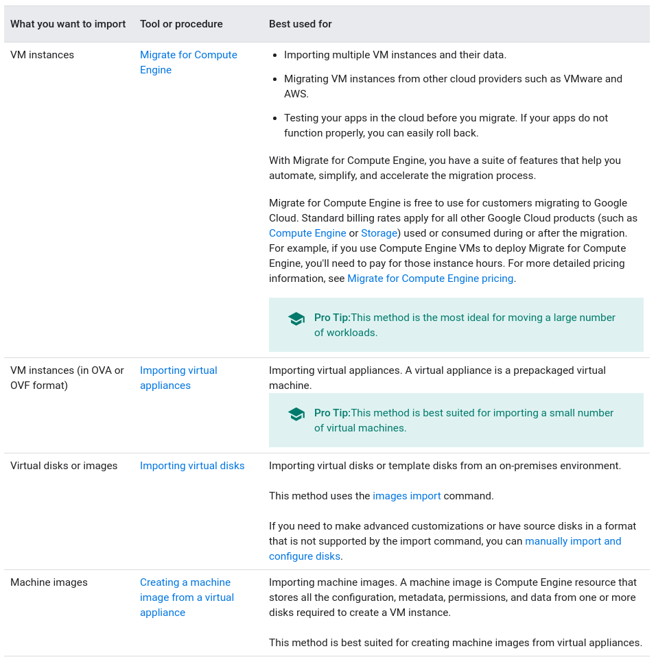
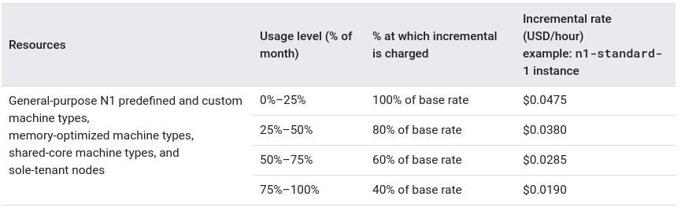
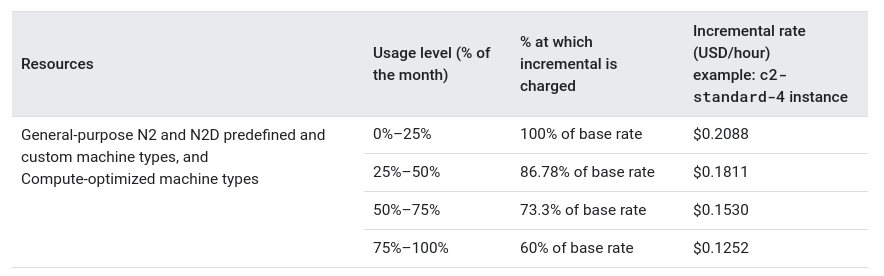
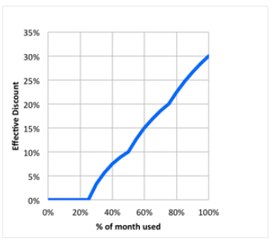
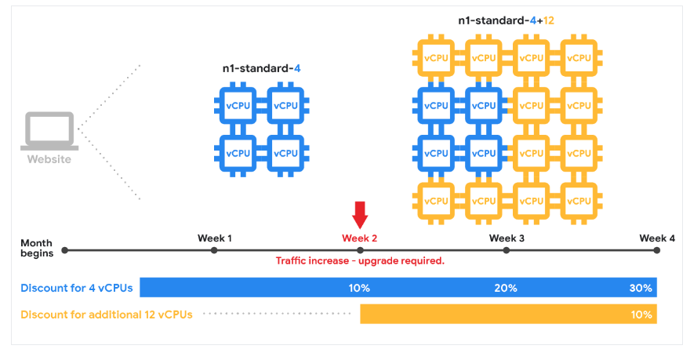

# Google Compute Engine

Compute Engine is an Infrastructure-as-a-Service product offering flexible, self-managed virtual machines hosted on Google's infrastructure. Compute Engine includes Linux and Windows based virtual machines running on KVM, local and durable storage options, and a simple REST based API for configuration and control.

---

# Storage Options
https://cloud.google.com/compute/docs/disks/

## General Information
- Persistent disks have built-in redundancy
- To protect data loss due to user error create snapshots of persistent disks
- Restrictions:
  - It is not possible to attach a PD to an instance in other project
  - A balanced PD can be attached at most 10VM instance in read-only mode
  - Shared core instances are limited to a maximum of 16 PD and 3TB total PD space, others have a 128 PD limit and 257 TB total space

## Classification regarding data location:
- Zonal:
  - Data is physically located in only one zone
- Regional:
  - Data is replicated and stored in two different zones, in the same region
  - Used when lower Recovery Point Objective (RPO) and Recovery Time Objective (RTO) are required, compared to using snapshots
- Local:
  - Disk is physically attached directly to server that hosts VM instance
  - Data is deleted when instance is stopped
  - There is no redundancy, data is not replicated
  - Can't use custom encryption keys
  - Not supported on shared-core
  - Number of Local SSDs that can be attached depends on machine type and number of vCPUS
    - options are 1 to 8, 16 or 24
  - Can be used on preemptible instances -> similar rules applied

## Classification regarding type of disk:
- Standard: standard HDD
- Balanced: backed by solid-state drives, but has lower cost and performance (didn't find the reason for that)
- SSD: solid-state drives

- **Zonal Standard PD**:  Efficient and reliable block storage
- **Regional Standard PD**:  Same as previous and has synchronous replication across two zones in a region
- **Zonal Balanced PD**:  Cost-effective and reliable block storage
- **Regional Balanced PD**:  Same as previous and has synchronous replication across two zones in a region
- **Zonal SSD PD**:  Fast and reliable block storage
- **Regional SSD PD**:  Same as previous and has synchronous replication across two zones in a region
- **Local SSD**: : High performance local block storage
- **Cloud Storage Buckets**:  Affordable object storage

| | Zonal Standard PD | Regional Standard PD | Zonal Balanced PD | Regional Balanced PD| Zonal SSD PD | Regional SSD PD| Local SSDs | Cloud Storage Buckets|
|-|-|-|-|-|-|-|-|-|
|Minimum capacity per disk| 10 GB | 200  GB | 10 GB | 10 GB | 10 GB | 10 GB | 375 GB | n/a|
|Maximum capacity per disk| 64TB | 64TB | 64TB | 64TB | 64TB | 64TB | 375 GB | n/a |
|Capacity increment| 1 GB | 1 GB | 1 GB | 1 GB | 1 GB | 1 GB | 375 GB | n/a |
|Maximum capacity per instance| 257 TB | 257 TB | 257 TB | 257 TB | 257 TB | 257 TB | 9 TB | Almost infinite |
|Scope of access| Zone | Zone | Zone | Zone | Zone | Zone | Instance | Global |
| Data redundancy | Zonal | Multi-zonal | Zonal | Multi-zonal | Zonal | Multi-zonal | None | Regional, dual-regional or multiregional|
| Encryption at rest | :heavy_check_mark: | :heavy_check_mark: | :heavy_check_mark: | :heavy_check_mark: | :heavy_check_mark: | :heavy_check_mark: | :heavy_check_mark: | :heavy_check_mark: |
| Custom Enccyption Keys |  :heavy_check_mark: | :heavy_check_mark: |  :heavy_check_mark: | :heavy_check_mark: |  :heavy_check_mark: | :heavy_check_mark: |  :x: | :heavy_check_mark: |
| Machine type support | All | All | Most | Most | Most | Most | Most | All |
| Price (per GB/ month in UDS) (12/07/2020)| $0.040 | $0.080 | $0.100 | $0.200 | $0.170 | $0.340 | $0.080 (preemptible $0.048) | Vary based on type, size, number of operations and network usage |
| Read IOPS per GB | 0.75 | 0.75 | 6 | 6 | 30 | 30 | - | - |
| Write IOPS per GB | 1.5 | 1.5 | 6 | 6 | 30 | 30 | - | - |
| Read IOPS per instance | 7,500* | 7,500* | 15,000-80,000* | 15,000-60,000* | 15,000-100,000* | 15,000-60,000* | 900,000 (SCSI)  2,400,000 (NVMe) | - |
| Write IOPS per instance | 15,000* | 15,000* | 15,000-30,000* | 15,000-30,000* | 15,000-100,000* | 15,000-30,000* |  800,000 (SCSI)  1,200,000 (NVMe) | - |
|Read throughput per GB (MB/s)|0.12|0.12|0.28|0.28|0.48|0.48|-|-|
|Write throughput per GB (MB/s)|0.12|0.12|0.28|0.28|0.48|0.48|-|-|
|Read throughput per instance (MB/s)|240-1,200*|240-1,200*|240-1,200*|240-1,200*|240-1,200*|240-1,200*|9,360|-|
|Write throughput per instance (MB/s)|76-400*|38-200*|120-600*|240-1,200*|120-600*|4,680|-|

\* Persistent disk IOPS and throughput performance depends on disk size, instance vCPU count, and I/O block size, among other factors.

---
---

# Designing Robust Systems

## Robust sustem
- Can withstand certain amount of failures or disruptions without interrupting your service or affecting your users expreience using your service

## Types of failures
- Unexpected single instance failure
    - Due to hardware or system failure
	- Mitigate:
		- Persistent disks
		- Startup scripts
- Unexpected single instance reboot
	- Unlike failure, instance is automatically rebooted
	- Mitigate:
		- back up data
		- use presistent disks
		- startup scripts
- Zone or region failures
	- can cause all instances in a zone or region to be inaccessible or fail
	- Mitigate
		- Diversity across regions and zones + load balancing
		- back up data and replicate persistent disks across zones

### Tips
- Live migration (enabled by default)
  - Instance are moved prior to maintenance events
  - Might experience decrease in performance for a short period of time
  - Can be disabled if application needs maximum perfomance always (instance will stop and reboot, instead)
- Distributed instances across zones and regions
- Use Zonal DNS names (instead of global)
  - Zonal DNS names function independently of other locations -> more fault-tolerant
- Use managed instance groups
  - Homogeneus groups of instances
  - Autoscaling and autohealing
  - Can be created across multiple zones within same region
- Use load balancing and autoscaling
- Use startup and shitdown scripts
- Back up your data
  - Create persistent disk snapshots
  - Replicate data to a persistent disk in another region or zone

---
---

# Creating a VM Instance with a custom machine type

- Available for general-purpose machine types only
- Ideal for the following scenarios:
	- Workloads aren't a good fit for predefined available
	- Need more processing power or memory but not all the upgrades
## Specifications
- Memory multiple of 256MB:
	- 6.75 GB, 7 GB but not 6.9 GB
- Same disk capacity limitations as predefined
- vCPU and memory possbile ranges vary dependign on the machine type
https://cloud.google.com/compute/docs/machine-types#general_purpose

## Pricing
- Based on number of vCPUs and memory hours
- Different from predefined machines (more expensive)
- Sustained usage discounts are calculated differently

## Expressing memory in GB
1 GB = 1024 MB

---
---

# Preemptible VM instances

Lower price, but might be stoped by Compute Engine if it requires access to those resources for other tasks.

## Limitations
- Might be stoped (generally low probability)
- Always stoped after 24 hours (counter resets if stoped and started again)
- Might not always be available
- Can't live migrate to regular or automatically restart when there is a mainatenance event
- Not covered by any Service Level Agreement
- Free Tier credits do not apply to preemptible instances

## Steps to preempt an instance
1. Preemprtion notice in the form of a ACPI G2 Soft Off signal.
2. If instance does not stop CE sends as ACPI G3 Mechanical Off signal
3. CE transitions instance to TERMINATED state
(no charge if CE stops instance less than 1 minute before it is created)

## Preemption selection
- Avoids too many isntances from single customer
- Preempts new instances over older ones (helps minimize lost work across cluster)
- DOES NOT use CPU usage to select
- Average rate 5%-15% / day / project

## Preemptible instances in a managed instance group
You can create preemptible instances in a managed instance group, with the following limitations:
- Can create or add new prremptible instances only when CE resources are available
- If CE stops a prremptible instance, the group repeatedly tries to recreate that instance using the specified instance template

## Premium operating systems on preemptible instances
- premium operating systems costs are not reduced
- the way you are billed does not change:
	- If CE stops preemptible instance, you will be billed as if you stoped it yourself)
	- Minimum usage rates apply
	- Usage rounded up to the nearest usage increment
- billed by the second
## Local SSDs
- Work as usual
- Not charged if preempted in the first minute after start running

## GPUs on preemptible instances
- GPUs are allowed on preemptible instances
- Lower prices for the GPUs
- Same process as all preemptible instances

## Testing preemption settings
- Simulating a maintenance event
- Just stopping the instance will do the job

---
---

# Instance Groups
Collection of VM instances that can be managed as a single entity

https://cloud.google.com/compute/docs/instance-groups/

## Managed Instance Groups (MIGs)

* Automated services:
  * Autoscalng (based on CPU use, load balancing capacity, Monitoring metrics etc.)
  * Autohealing -> heath checking signals
  * Zonal or Regional (multi zonal) deployment:
    * Regional add higher availability and higher maximum capacity
  * Automatic updating
* Uses:
  * Stateless serving wokloads (e.g. frontends)
  * Stateless batch, highe-perfomance or hight-throughput compute workloads (e.g. image processing)
  * Stateful applications, such as databases, legacy applications, and long-running batch computations with checkpointing
* Benefits:
  * High availability
  * Protection against zonal failures
  * Scalability
  * Automated updates (rolling, canary etc.)
  * Support for stateful workloads (https://cloud.google.com/compute/docs/instance-groups/stateful-migs)
* Support preemptible instances and containers
* Example of possible operations:
  * Create a managed instance group
  * Change the instance template for a managed instance group
  * Resize a managed instance group
    * automatically
    * manually
    * disable creation retries mode
    * create instances with specific names
    * delete specific instances
  * Abandone instances from a group
  * Recreate instances in the group
  * Delete a managed instance group
  * Create groups of preemptible instances
  * Canary instances templates within a managed instance group
    * keep groups of instances with diferent versions of templates, in order to decide which to keep later
* IAM:
  * All the operations performed by Compute Engine as part of the managed instance group are performed by the Google APIs service account for your project.
  * PROJECT_ID@cloudservices.gserviceaccount.com
  * We have to ensure that the service account has enough privileges:
    * `compute.instanceAdmin.v1`, to create resources based on the instance template
    * `serviceAccountUser`, to create instances that can run as a service account
    * Permissions to all the resources referenced from instance templates (images, disks, VPC, neworks etc.)

### Automatically rolling out updates to instances in a MIG
https://cloud.google.com/compute/docs/instance-groups/rolling-out-updates-to-managed-instance-groups

* Limitations:
  * Cannot use automated rolling updates if MIG has stateful configurations.  (instead see: [Selectively updating instances in a MIG](https://cloud.google.com/compute/docs/instance-groups/updating-selected-instances-in-a-mig)
  * To preserve custom instance names, the replacement method must be set to `recreate`
* Basic rolling update
  * Gradually applied to all instances
  * Options:
	
    * Mode:
      * Proactive: automated rolling update
      * Opportunistic: update applied manually or when new instances are created
    * Max surge
      * how many new instances MIG can create above its `targetSize`
      * fixed number or percentage (rounded up)
      * faster update -> aditional costs
    * Max unavailable
      * how many new instances can be unavailable at any time during the update
      * Includes instances that are unavailable for other reasons
      * fixed number or percentage (rounded down)
    * Minimum wait time
      * Time before considering a new or restarted instance as update. Timer starts after:
        * Instance's status is `RUNNING` and
        * Intance is `HEALTHY` (if health checking is enabled)
    * Minimal action
      * `RESTART`: stop and start instance and perfoms update (if update requires instance to be replace, Updater will perform a `REPLACE`)
      * `REPLACE`: deletes existing instance and creates new one from the target template
    * Replacement method
      * Recreate
      * Substitute
      

  *  Automated updates support up to 2 instance template versions in MIG

* Canary update
  * Similar to basic rollign update, but it is done in two phases
    * First you set just a portion of the instances to be updated
    * Later you decide if you will commit the update to all the instances, or roll it back
* 

## Unmanaged Instance Groups
* Can contain heterogeneus instances
* Do not offer most MIGs services
* Not good for highly available and scalable workloads
* Use if you need to apply load balancing to groups of heterogeneous instances, or if you need to manage the instances yourself

---
---
# Running Startup Scripts
* Script is run as root after the network is available
	* Script is copied to local file
	* Permission to run file is set
	* File is run
* Any file type might be provided
  * shebang needs to be added (e.g. "#! /usr/bin/python")
* Length limit of 256kb
  * If greater than 256kb, script can be stored in Cloud Storage and its url provided as "startup-script-url" metadata.

* It is possible to rerun startup scripts on running VM instances:
	* `sudo google_metadata_script_runner startup` (On Debian, CentOS, and RHEL images)
* It is possible to access startup scripts logs:
  * `sudo journalctl -u google-startup-scripts.service`
  
* Scripts can access instance metadata key-values, as environment variables

* You can run startup scripts on Windows instances by using unique, Windows-specific metadata keys
  * https://cloud.google.com/compute/docs/startupscript#providing_a_startup_script_for_windows_instances
---
---
# Running Shutdown Scripts
* Setting is similar to startup scripts
* Limitations:
  * Time Limit:
    * 90 seconds (on-demand instances)
    * 30 seconds (preemptible instances)
* Compute engine cannot guarantee that the shutdown script will complete
* Runs when:
  * `instances.delete` or `instances.stop` request to the API
  * Compute Engine stops a preemptible instance
  * `sudo shutdown` or `sudo reboot`
  * Instance is shut down manually
* Won't run:
  * instance is reset using `instances().reset`

---
---
# Choosing an import method

---
---

# Containers on Compute Engine

Common tools to run and manage containerized apps:
* Docker and Podman
* Kubernetes
* Containers on Compute Engine: easy way to deploy container to Compute Engine VM instances or managed instance groups
* LXD images for a lift-and-shift migration solution. LXD runs on Ubuntu images
* Container Regisry to manage container image versions

## Installing Container Technologies on your instances
* Specify a container image when creating an instance -> CE automatically supplies an up-to-date Container-Optimized OS witho docker and lauches container
* Manually install whatever container technologie in a VM instance

---
---

# Sustained use discounts
https://cloud.google.com/compute/docs/sustained-use-discounts
* Limitations:
  * Do not apply to VMs created using the App Engine flexible environment and Dataflow
  * Do not apply to E2 machine types
  * Do not apply to preemptible instances
* Discounts reset at the beginnig of each month (to take adcantage of full discount, VMs must be created on the first day of the month)
  

* Compute Engine automatically calculates and applies sustained use discounts based on vCPU and memory usage across each region and separately for each machine type

* For GPU devices, Compute Engine calculates sustained use discounts based on the number of a GPU model that you have attached to running VM instances during the month. You can receive sustained use discounts only on GPUs of the same model. Sustained use discounts for GPUs are calculated separately from instance machine type, vCPU, and memory discounts.
---
---

# Main FAQ

## What is a virtual CPU (vCPU) in Compute Engine
- A single hardware hyper-thread on one of the available CPU platforms
- Intel Xeon allow multiple threads on each physical prcessor core

## Billing
- Compute Instace -> per second, 1 minute minimum
- Storage -> based on amount of data
- Network -> data transfered between VMs and internet

## Support
- Google offers paid support for enterprise customers

## Service Level Agreement (SLA):
https://cloud.google.com/compute/docs/sla