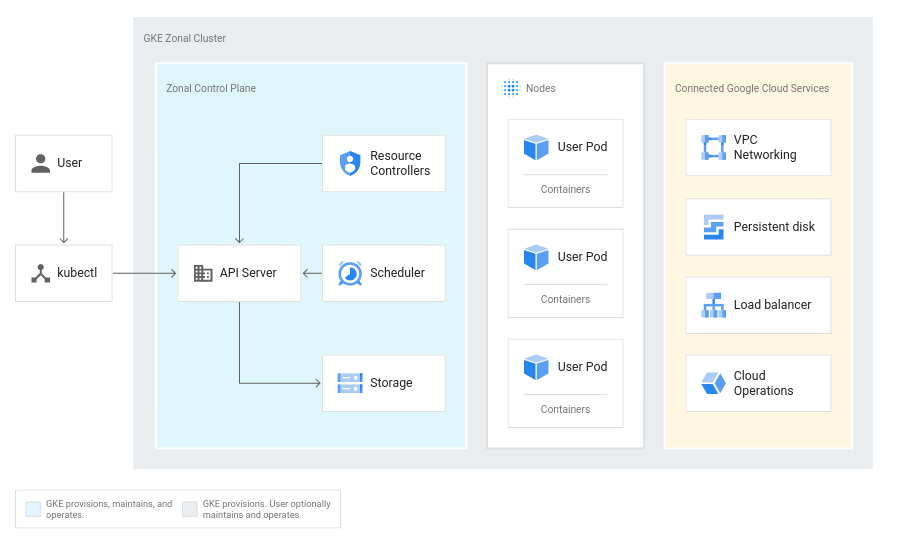
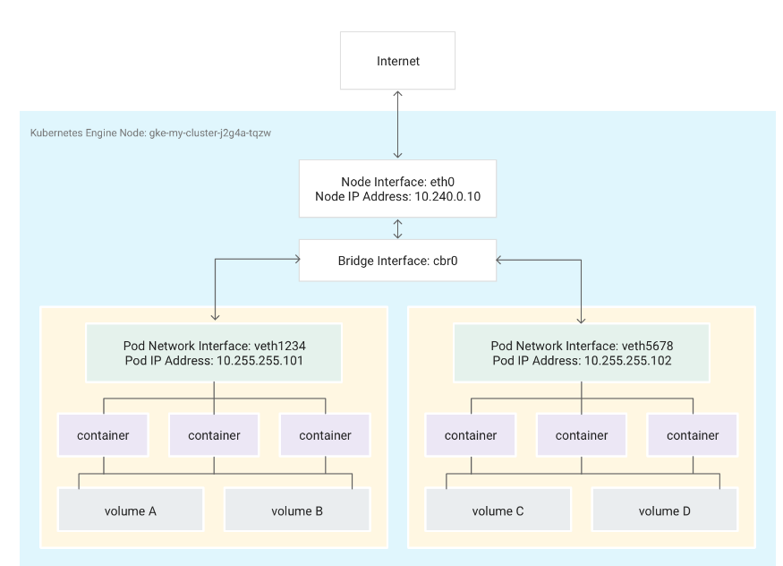
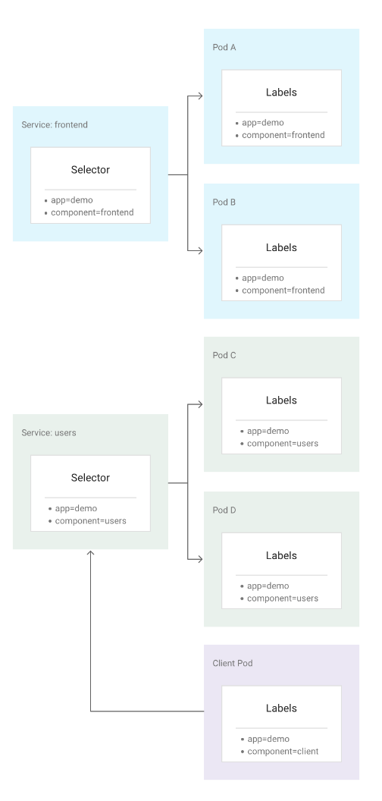
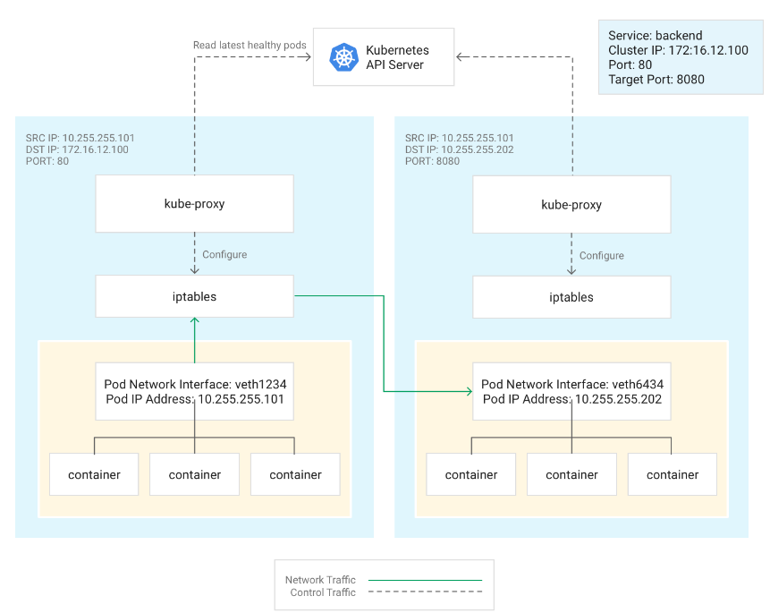
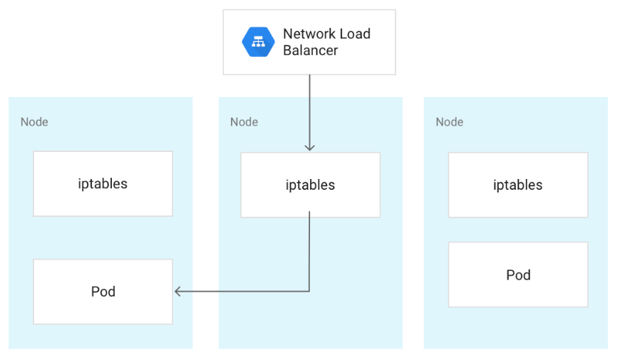

## Google Kubernetes Engine (GKE)

- manage environment for deploying, managing and scaling containerized applications
- multiple Compute Engine instances grouped to form a cluster

### Cluster orchestration with GKE

- Powered by Kubernetes opens source cluster management system
- deploy and manage applications, perform administration tasks, set policies, and monitor the health of deployed workloads
- same design principles that run popular Google services
- benefits:
  - automatic management
  - monitoring and liveness probes for application containers
  - automatic scaling
  - rolling updates

#### Kubernetes on Goolge Cloud

- benefit of advanced cluster management features GC provides:
  - load-balancing for CE instances
  - Node pools to designate sub

### Kubernetes versions and features

- automatically upgraded to run new versions of Kubernetes, as they become stable
- In most cases, Kubernetes features that are listed as Beta or Stable are included with GKE
- Kubernetes Alpha features are available in special GKE alpha clusters

### GKE workloads

- containers, whether for applications or batch jobs, are collectively called workloads
- GKE supports the use of Docker containers
- Cloud Build to build container images (such as Docker) from a variety of source code repositories
- Artifact Registry or Container Registry to store and serve your container images

## Cluster architecture

- cluster is the foundation of GKE:
  - kubernetes objects all run on top of a cluster
- a cluster consists of:
  - at leat one control plane
  - multiple worker machines -> __nodes__
- control plane and node machines run the Kubernetes cluster orchestration system



### Control plane

- runs control plane processes, including:
  - Kubernetes API server
  - scheduler
  - core resource controllers
- lifecycle is managed by GKE when you create or delete cluster
  - includes upgrades to Kubernetes
    - automatcilly or manually (if prefer to upgrade earlier than automatic schedule)

#### Control plane and the Kubernetes API

- unified endpoint for cluster
- all interatctions with cluster via Kubernetes API
  - calls made directly via HTTP/gRPC
  - or indirectly through `kubectl` commands or Cloud Console
- runs Kubernetes API server to handle requests
  - single "source of truth" for entire cluster

#### Control plane and node interaction

- control plane is responsible for deciding what runs on all of the cluster's nodes
  - scheduling workloads, managing the workloads' lifecycle, scaling, and upgrades
- also manages network and storage resources for those workloads
- The control plane and nodes also communicate using Kubernetes APIs

#### Control plane interactions with the gcr.io container registry

- container images for the Kubernetes software running on the control plane (and nodes) are pulled from the gcr.io container registry
- outage affecting the gcr.io registry may cause:
  - Creating new clusters will fail
  - Upgrading clusters will fail
  - Disruptions to workloads may occur even without user intervention
- In the event of a zonal or regional outage of the gcr.io container registry, Google may redirect requests to a zone or region not affected by the outage.

### Nodes

- the worker machines that run your containerized applications and other workloads
- A cluster typically has one or more nodes
  - Compute Engine VM instances that GKE creates on your behalf when you create a cluster
- runs the services necessary to support the Docker containers that make up your cluster's workloads
  - Docker runtime and Kubernetes node agent (kubelet)
- In GKE, there are also a number of special containers that run as per-node agents to provide functionality such as log collection and intra-cluster network connectivity.

#### Node machine type

- default is e2-medium
- you can select different machine types when creating a cluster

#### Node OS images

- specialized OS image for running containers
- You can specify which OS image your clusters and node pools use

#### Minimum CPU platform

- you can specify a baseline minimum CPU platform for its nodes
- Choosing a specific CPU platform can be advantageous for advanced or compute-intensive workloads

### Node allocatable resources

- resources are required to run the GKE and Kubernetes node components necessary to make that node function as part of your cluster
- disparity between node's total resources and allocatable resources in GKE
- the amount of resources that GKE reserves for Kubernetes components scales upward for larger machines
- Windows Server nodes also require more resources than a typical Linux node (approximately 1.5 times more)
- You can make a request for resources for your Pods or limit their resource usage
- To inspect the node allocatable resources available in a cluster: `kubectl describe node node-name | grep Allocatable -B 7 -A 6`

#### Eviction threshold

- GKE reserves an additional 100 MiB of memory on each node for kubelet eviction

#### Allocatable memory and CPU resources

- `Allocatable = Capacity - Reserved - Eviction Threshold`

- For memory resources, GKE reserves the following:
  - 255 MiB of memory for machines with less than 1 GB of memory
  - 25% of the first 4GB of memory
  - 20% of the next 4GB of memory (up to 8GB)
  - 10% of the next 8GB of memory (up to 16GB)
  - 6% of the next 112GB of memory (up to 128GB)
  - 2% of any memory above 128GB
- For CPU resources, GKE reserves the following:
  - 6% of the first core
  - 1% of the next core (up to 2 cores)
  - 0.5% of the next 2 cores (up to 4 cores)
  - 0.25% of any cores above 4 cores

#### Allocatable local ephemeral storage resources

- Beginning in GKE version 1.10, you can manage your local ephemeral storage resources as you do your CPU and memory resources.

##### Ephemeral storage backed by boot disk

- `EVICTION-THRESHOLD = 10% * BOOT-DISK-CAPACITY`
- `SYSTEM-RESERVATION = Min(50% * BOOT-DISK-CAPACITY, 6K + 35% * BOOT-DISK-CAPACITY, 100 GB)`

## Regional Clusters

- By default, a cluster's control plane (master) and nodes all run in a single compute zone
- Regional clusters increase the availability of both a cluster's control plane (master) and its nodes by replicating them across multiple zones of a region
- default -> replicated across three zones of a region, but you can customize the number of replicas.
- outage -> nodes can be rebalanced manually or by using the cluster autoscaler
- advantages of multi-zonal clusters, with the following additional benefits:
  - Resilience from single zone failure
  - Continuous master upgrades, master resize, and reduced downtime from master failures
- Limitations:
  - By default, regional clusters consist of nine nodes (three per zone) -> 9 IP addresses
    - new GC accounts are granted only 8 IP addresses
      - request increase in cota
      - reduce number of nodes per zone
  - For regional clusters that run GPUs, you must either choose a region that has GPUs in three zones, or specify zones using the --node-locations flag

### Pricing

- requires more of your project's regional quotas than a similar zonal or multi-zonal cluster
- charged for node-to-node traffic across zones

### Persistent storage in regional clusters

- unless a zone is specified GKE assigns dist to a random zone

### Autoscaling regional clusters

- Overprovisioning scaling limits
  - guarantee a minimum level of availability even when some zones are unavailable

## Cluster autoscaler

- automatically resizes the number of nodes in a given node pool, based on the demands of your workloads
- you specify a minimum and maximum size for the node pool
- Before enabling cluster autoscaler, design your workloads to tolerate potential disruption or ensure that critical Pods are not interrupted
- works on a per-node pool basis

### Operating criteria

- assumptions:
  - All replicated Pods can be restarted on some other node
  - Users or administrators are not manually managing nodes
  - All nodes in a single node pool have the same set of labels
  - attempts to expand the least expensive possible node pool
    - reduced cost of preemptible VMs is taken into account
  - Labels manually added after initial cluster or node pool creation are not tracked

### Balancing across zones

- cluster autoscaler attempts to keep managed instance group whit the same instance type sizes balanced when scaling up


### Autoscaling profiles (beta)

- balanced: The default profile.
- optimize-utilization: 
  - Prioritize optimizing utilization over keeping spare resources in the cluster
  - Scales down the cluster more aggressively: it can remove more nodes, and remove nodes faster
  - optimized for use with batch workloads that are not sensitive to start-up latency
  - not recommended with serving workloads

### Considering Pod scheduling and disruption

A node's deletion could be prevented if it contains a Pod with any of these conditions:

- The Pod's affinity or anti-affinity rules prevent rescheduling
- The Pod has local storage
- The Pod is not managed by a Controller such as a Deployment, StatefulSet, Job or ReplicaSet


### Limitations

- Local persistent volumes not supported
- Scaling up a node group of size 0, for Pods requesting resources beyond CPU, memory and GPU (ex. ephemeral-storage)
- Supports up to 5000 nodes running 30 pods each
- honors a graceful termination period of 10 minutes for rescheduling the node's Pods onto a different node before forcibly terminating the node
- Occasionally, the cluster autoscaler cannot scale down completely and an extra node exists after scaling down
- Custom scheduling with altered Filters is not supported

## Pod

- run on nodes in your cluster
- smallest, most basic deployable objects in Kubernetes
  - represents a single instance of a running process in cluster
- contain one or more containers
  - multiple containers -> advanced use cases
- also contain
  - network -> unique IP address
  - storage
- self-contained
- not recommended to create individual Pods directly -> create a set of identical Pods, called replicas
- set of replicated Pods are created and managed by a controller, such as a Deployment
- Controllers manage the lifecycle of their constituent Pods and can also perform horizontal scaling
- it is highly recommended that you use a controller to manage your Pods

### Pod lifecycle

- pods are ephemeral -> not designed to run forever
- pods do not heal or repair themselves
- pod status:
  - Pending
  - Running
  - Succeeded
  - Failed
  - Unknown

### Creating Pods

- it is not necessary nor recommended to create Pods directly
- use a controller, such as a Deployment

### Pod requests

- When a Pod starts running, it requests an amount of CPU and memory
- Kubernetes schedule the Pod onto an appropriate node to run the workload
- You can configure the CPU and memory requests for a Pod, based on the resources your applications need. You can also specify requests for individual containers running in the Pod
  - default request for CPU is 100m
  - no default request for memory
  - small a value for CPU or memory requests ->  reduce performance
  - large value -> increase costs

### Pod limits

- By default, a Pod has no upper bound on the maximum amount of CPU or memory it can use on a node
- You can set limits to control the amount of CPU or memory your Pod can use on a node
- you can specify limits for individual containers running in the Pod
- Limits are not taken into consideration when scheduling Pods, but can prevent resource contention among Pods on the same node
- __It is strongly recommended that you configure limits for your Pods__

### Pod templates

- Controller objects contain a Pod template field
- contain a Pod specification which determines how each Pod should run
  - which containers to run
  - which volumes to mount
- template changes affect future pods only

### Controlling which nodes a Pod runs on

- By default, Pods run on nodes in the default node pool for the cluster
- You can configure the node pool a Pod selects explicitly or implicitly:
  - force a Pod to deploy to a specific node pool by setting a nodeSelector in the Pod manifest
  - You can specify resource requests for the containers you run

### Pod usage patterns

- Pods that run a single container: you can think of a Pod as a wrapper
- Pods that run multiple containers that need to work together
  - co-managed programs that need to share resources
  - The Pod wraps these containers and storage resources together as a single manageable entity
- Each Pod is meant to run a single instance of a given application

### Pod termination
- Pods terminate gracefully when their processes are complete
- default graceful termination period of 30 seconds (`--grace-period`)


## Deployment

- Deployments represent a set of multiple, identical Pods with no unique identities
- runs multiple replicas of application and automatically replaces any instances that fail or become unresponsive
- managed by the Kubernetes Deployment controller
- use a Pod template, which contains a specification for its Pods
- When a Deployment's Pod template is changed, new Pods are automatically created one at a time.
- Deployment automatically replaces Pods that fail or are evicted from their nodes

### Usage patterns

- well-suited for stateless applications that use ReadOnlyMany or ReadWriteMany volumes mounted on multiple replicas
- not well-suited for workloads that use ReadWriteOnce volumes
- For stateful applications using ReadWriteOnce volumes, use StatefulSets

### Creating Deployments

- create a Deployment using the kubectl apply, or kubectl create commands.
- Deployment manifest file in YAML format:

```apiVersion: apps/v1
kind: Deployment
metadata:
  name: nginx
spec:
  replicas: 3
  selector:
    matchLabels:
      app: nginx
  template:
    metadata:
      labels:
        app: nginx
    spec:
      containers:
      - name: nginx
        image: nginx:1.7.9
        ports:
        - containerPort: 80
```

### Updating Deployments

- by making changes to the Deployment's Pod template specification
  - automatically triggers an update rollout
  - stops the Pods, gradually scales down the number of Pods to zero, then drains and terminates the Pods. Then, the Deployment uses the updated Pod template to bring up new Pods
  - Old Pods are not removed until a sufficient number of new Pods are Running
  - new Pods are not created until a sufficient number of old Pods have been removed
  - Deployments can ensure that at least one less than the desired number of replicas are running, with at most one Pod being unavailable. Similarly, Deployments can ensure that at most one more than the desired number of replicas are running, with at most one more Pod than desired running.

### Managing Deployments

- The following is a list of common management tasks for Deployments:
  - Inspect a Deployment
  - Scale a Deployment
  - Autoscale a Deployment using a HorizontalPodAutoscaler object
  - Delete a Deployment

### Status and lifecycle

- Deployments can be in one of three states during its lifecycle: progressing, completed, or failed.

## Deploying a stateless application
https://cloud.google.com/kubernetes-engine/docs/how-to/stateless-apps

- Stateless applications do not store data or application state to the cluster or to persistent storage
- data and application state stay with the client
- more scalable

### Anatomy of a Deployment
```apiVersion: apps/v1
kind: Deployment
metadata:
  name: my-app
spec:
  replicas: 3
  selector:
    matchLabels:
      run: my-app
  template:
    metadata:
      labels:
        run: my-app
    spec:
      containers:
      - name: hello-app
        image: gcr.io/google-samples/hello-app:1.0
```

where:
- `spec: replicas`: is the number of replicated Pods that the Deployment manages.
- `spec: template: metadata: labels`: is the label given to each Pod, which the Deployment uses to manage the Pods.
- `spec: template: spec`: is the Pod specification, which defines how each Pod should run. `spec: containers` includes the name of the container to run in each Pod and the container image that should run.

### Creating a Deployment

methods:
- Deploy feature in Google Cloud Console's Workloads menu to create a simple Deployment from a container image you've stored in Container Registry
- write a Deployment manifest and run `kubectl apply` to create the resource
  - `kubectl apply -f [DEPLOYMENT_FILE]`
  - `kubectl apply -f [DIRECTORY]/`

### Inspecting the Deployment

methods:
- use the Workloads menu
- use `kubectl describe` and `kubectl get`
  - `kubectl describe deployment [DEPLOYMENT_NAME]`
  - `kubectl get pods -l [KEY]=[VALUE]`

### Updating the Deployment

methods:
- use the Rolling update menu and YAML editor from the Cloud Console Workloads menu.
- make changes to a manifest file and apply them with kubectl apply
-  update the Pod specification's image, resources, or selector fields using kubectl set
-  update a Deployment directly from your shell or in a preferred editor using kubectl edit

#### Rolling back an update

- `kubectl rollout undo deployment my-deployment` : previous version
- `kubectl rollout undo deployment my-deployment --to-revision=3`: specific version

### Scaling a Deployment

- manually scale, using Cloud Console or 
- `kubectl scale`

### Deleting a Deployment

- using Cloud Console
- `kubectl delete`


## Deploying a stateful application
https://cloud.google.com/kubernetes-engine/docs/how-to/stateful-apps

- Stateful applications save data to persistent disk storage for use by the server, by clients, and by other applications
- Persistent storage can be dynamically provisioned, so that the underlying volumes are created on demand
  - configure dynamic provisioning by creating a StorageClass
- a default StorageClass allows you to dynamically provision Compute Engine persistent disks
- Kubernetes uses the StatefulSet controller to deploy stateful applications as StatefulSet objects
- Pods in StatefulSets are not interchangeable: each Pod has a unique identifier that is maintained no matter where it is scheduled.

### Requesting persistent storage in a StatefulSet

- Applications can request persistent storage with a PersistentVolumeClaim
- StatefulSets include a volumeClaimTemplates array, which automatically generates the PersistentVolumeClaim objects
- Each StatefulSet replica gets its own PersistentVolumeClaim object
- You can also use a preexisting disk in a StatefulSet

### Creating a StatefulSet

- `kubectl apply -f statefulset-file`

```
apiVersion: apps/v1
kind: StatefulSet
metadata:
  name: statefulset-name
spec:
  selector:
    matchLabels:
      app: app-name
  serviceName: "service-name"
  replicas: 3
  updateStrategy:
    type: RollingUpdate
  template:
    metadata:
      labels:
        app: app-name
    spec:
      containers:
      - name: container-name
        image: ...
        ports:
        - containerPort: 80
          name: port-name
        volumeMounts:
        - name: pvc-name
          mountPath: ...
  volumeClaimTemplates:
  - metadata:
      name: pvc-name
      annotations:
        ...
    spec:
      accessModes: [ "ReadWriteOnce" ]
      resources:
        requests:
          storage: 1Gi
```

Where:

- `statefulset-name`: name of the StatefulSet.
- `service-name`: name of the Service.
- `app-name`: name of the application run in the Pods.
- `container-name`: name of the containers in the Pods.
- `port-name`: name of the port opened by the StatefulSet.
- `pvc-name`: name of the PersistentVolumeClaim.


### Inspecting a StatefulSet

- `kubectl get statefulset statefulset-name -o yaml`
- `kubectl get pods -l app=app-name`
- `kubectl describe statefulset statefulset-name`
- `kubectl describe pod pod-name`
- `kubectl get pvc`
- `kubectl describe pvc statefulset-name-pvc-name-0`
- `kubectl describe pv pv-name`

### Updating a StatefulSet

- `kubectl apply -f statefulset-file`
  
### Update strategies

- StatefulSet’s updateStrategy field allows you to configure and disable automated rolling updates for containers, labels, resource request/limits, and annotations for the Pods in a StatefulSet
- `spec: updateStrategy`
  - `OnDelete`: pods need to be manually deleted to cause controller to create new Pods
  - `RollingUpdate`: pods automaticaaly deleted

#### Inspecting update rollout

- `kubectl rollout status statefulset statefulset-name`
- `kubectl rollout history statefulset statefulset-name`
- `kubectl rollout undo statefulset statefulset-name`

### Scaling a StatefulSet
- `kubectl scale statefulset statefulset-name --replicas number-of-replicas`

### Deleting a StatefulSet

- `kubectl delete statefulset statefulset-name`

## StatefulSet

https://cloud.google.com/kubernetes-engine/docs/concepts/statefulset

- represent a set of Pods with unique, persistent identities and stable hostnames that GKE maintains regardless of where they are scheduled
- state information and other resilient data for any given StatefulSet Pod is maintained in persistent disk storage associated with the StatefulSet
- ordinal index for the identity and ordering of their Pods
- Pods are deployed in sequential order and are terminated in reverse ordinal order
  - Alternatively, you can specify the `podManagementPolicy: Parallel`
- StatefulSets use a Pod template, which contains a specification for its Pods
- suitable for deploying Kafka, MySQL, Redis, ZooKeeper, and other applications needing unique, persistent identities and stable hostnames

## DaemonSet

https://cloud.google.com/kubernetes-engine/docs/concepts/daemonset

- DaemonSet manages groups of replicated Pods
- DaemonSets attempt to adhere to a one-Pod-per-node model, either across the entire cluster or a subset of nodes
- As you add nodes to a node pool, DaemonSets automatically add Pods to the new nodes as needed
- DaemonSets use a Pod template
- DaemonSet Pods are subject to the same rules of priority as any other Pod
- DaemonSet Pods respect taints and tolerations; however, DaemonSet Pods have some implicit tolerations

### Usage patterns

- ongoing background tasks that you need to run on all or certain nodes, and which do not require user intervention
  - storage daemons like ceph, log collection daemons like fluentd, and node monitoring daemons like collectd

### Creating DaemonSets

```
apiVersion: apps/v1
kind: DaemonSet
metadata:
  name: fluentd
spec:
  selector:
      matchLabels:
        name: fluentd # Label selector that determines which Pods belong to the DaemonSet
  template:
    metadata:
      labels:
        name: fluentd # Pod template's label selector
    spec:
      nodeSelector:
        type: prod # Node label selector that determines on which nodes Pod should be scheduled
                   # In this case, Pods are only scheduled to nodes bearing the label "type: prod"
      containers:
      - name: fluentd
        image: gcr.io/google-containers/fluentd-elasticsearch:1.20
        resources:
          limits:
            memory: 200Mi
          requests:
            cpu: 100m
            memory: 200Mi
```

### Updating DaemonSets

- `spec: updateStrategy`
  - `OnDelete`: pods need to be manually deleted to cause controller to create new Pods
  - `RollingUpdate`: pods automaticaaly deleted

## Security overview
https://cloud.google.com/kubernetes-engine/docs/concepts/security-overview

### Authentication and authorization

- Kubernetes supports two types of authentication:
  - User accounts: known to Kubernetes, but not managed by Kubernetes 
    - google account or Google Cloud service account
  - Service accounts: created and managed by Kubernetes, but can only be used by Kubernetes-created entities
- Once authenticated, you need to authorize these identities to create, read, update or delete Kubernetes resources
- To configure more granular access to Kubernetes resources at the cluster level or within Kubernetes namespaces, you use Role-Based Access Control (RBAC)
  - detailed policies that define which operations and resources you allow users and service accounts to access

### Control plane security

- Kubernetes control plane components are managed and maintained by Google
- By default, the control plane components use a public IP address
  - using authorized networks, and private clusters, allow you to assign a private IP address to the control plane and disable access on the public IP address
- You can handle cluster authentication in Google Kubernetes Engine by using IAM as the identity provider


### Node security

#### Container-Optimized OS

advanced features for enhancing the security of GKE clusters, including:
- Locked-down firewall
- Read-only filesystem where possible
- Limited user accounts and disabled root login

#### Node upgrades

- A best practice is to patch your OS on a regular basis
- You can manually upgrade the nodes in your cluster, but GKE also allows you to enable automatic upgrades.

#### Protecting nodes from untrusted workloads

- unknown or untrusted workloads -> protect the operating system on the node from the untrusted workload running in a Pod
  - execute unknown code submitted by their users, for example
- You can enable GKE Sandbox on your cluster to isolate untrusted workloads in sandboxes on the node
  - Sandbox is built using gVisor, an open source project

#### Securing instance metadata

- lock down sensitive instance metadata paths by disabling legacy APIs and by using metadata concealment
- Metadata concealment ensures that Pods running in your cluster are not able to access sensitive data by filtering requests to fields such as the kube-env
- Metadata concealment firewalls traffic from user Pods (Pods not running on HostNetwork) to the cluster metadata server, only allowing safe queries
- prevents user Pods from using Kubelet credentials for privilege escalation attacks, or from using VM identity for instance escalation attacks
- limitations
  - Metadata concealment only protects access to kube-env and the node's instance identity token.
  - Metadata concealment does not restrict access to the node's service account.
  - Metadata concealment does not restrict access to other related instance metadata.
  - Metadata concealment does not restrict access to other legacy metadata APIs.

### Network security

#### Limiting Pod-to-Pod communication

- By default
  - all Pods in a cluster can be reached over the network via their Pod IP address
  - egress traffic allows outbound connections to any address accessible in the VPC into which the cluster was deployed
  - all ingress and egress traffic is allowed to flow into and out of all Pods
- Cluster administrators and users can lock down the ingress and egress connections created to and from the Pods in a namespace by using network policies
  - use tags to define the traffic flowing through your Pods

#### Filtering load balanced traffic

- Filtering authorized traffic is achieved at the node level by kube-proxy, which filters based on IP address
  - loadBalancerSourceRanges configuration of the Service object
  - if you do not configure loadBalancerSourceRanges, all addresses are allowed to access the Service via its external IP
- For cases in which access to the Service is not required, consider using an internal load balancer
  - internal load balancer also respects the loadBalancerSourceRanges

### Securing your workloads

#### Limiting Pod container process privileges

- GKE allows you to set security-related options via the Security Context on both Pods and containers

```
apiVersion: v1
kind: Pod
metadata:
  name: security-context-demo
spec:
  securityContext:
    runAsUser: 1000
    runAsGroup: 3000
    fsGroup: 2000
  volumes:
  - name: sec-ctx-vol
    emptyDir: {}
  containers:
  - name: sec-ctx-demo
    image: busybox
    command: [ "sh", "-c", "sleep 1h" ]
    volumeMounts:
    - name: sec-ctx-vol
      mountPath: /data/demo
    securityContext:
      allowPrivilegeEscalation: false
```  

- allow you to change security settings of your processes like:
  - User and group to run as
  - Available Linux capabilities
  - Ability to escalate privileges
- In order to change these settings at the cluster level rather than at the Pod or container, you need to implement a PodSecurityPolicy
- The GKE node operating systems, both Container-Optimized OS and Ubuntu, apply the default Docker AppArmor security policies to all containers started by Kubernetes
  - __DENIES__
    - Write files directly in /proc/
    - Write to files that are not in a process ID directory (/proc/<number>)
    - Write to files in /proc/sys other than /proc/sys/kernel/shm*
    - Mount filesystems


#### Giving Pods access to Google Cloud resources

methods:

- Workload Identity (recommended): allows a Kubernetes service account to run as a Google Cloud service account
- Node Service Account: Pods can also authenticate to Google Cloud using the Kubernetes clusters' service account credentials from metadata. However, these credentials can be reached by any Pod running in the cluster if Workload Identity is not enabled
- Service Account JSON key (strongly discouraged): manually use the service account's key

#### Using Binary Authorization

Binary Authorization is a service on Google Cloud that provides software supply-chain security for applications that run in the cloud. Binary Authorization works with images that you deploy to GKE from Container Registry or another container image registry. With Binary Authorization, you can ensure that internal processes that safeguard the quality and integrity of your software have successfully completed before an application is deployed to your production environment.

### Audit logging

- Audit logging provides a way for administrators to retain, query, process, and alert on events that occur in your GKE environments
- By default, GKE logs Admin Activity logs. You can optionally also log Data Access events

## Secrets

- Secrets are secure objects which store sensitive data, such as passwords, OAuth tokens, and SSH keys, in your clusters
- more secure than plaintext ConfigMaps or in Pod specifications
- reduces the risk of exposing the data to unauthorized users

### Creating a Secret

- `kubectl create secret type name data`
  - type:
    - generic: Create a Secret from a local file, directory, or literal value.
    - docker-registry: Creates a dockercfg Secret for use with a Docker registry. Used to authenticate against Docker registries.
      - `kubectl create secret generic credentials --from-file ./username.txt --from-file ./password.txt`
      - `kubectl create secret generic literal-token --from-literal user=admin --from-literal password=1234`
    - tls: Create a TLS secret from the given public/private key pair. The public/private key pair must exist beforehand. The public key certificate must be .PEM encoded and match the given private key
  - name
  - data: 
    - a path to a directory containing one or more configuration files, indicated using the --from-file or --from-env-file flags
    - key-value pairs, each specified using --from-literal flags
- Alternatively, you can create a Secret by defining a Secret object in a YAML manifest 
  - `kubectl create -f file-name.yaml`
- Limitations
  - Non-regular files, such as symlinks, devices, and pipes, are ignored by kubectl. Subdirectories are also ignored; kubectl create secret does not recurse into subdirectories

### Using a Secret

To use a Secret with your workloads, you can specify environment variables that reference the Secret's values, or mount a volume containing the Secret
```
apiVersion: v1
kind: Pod
metadata:
  name: mypod
spec:
  containers:
  - name: mypod
    image: redis
    volumeMounts:
    - name: foo
      mountPath: "/etc/foo"
      readOnly: true
  volumes:
  - name: foo
    secret:
      secretName: mysecret
```

## ConfigMap

- ConfigMaps bind configuration files, command-line arguments, environment variables, port numbers, and other configuration artifacts to your Pods' containers and system components at runtime
- enable you to separate your configurations from your Pods and components
  - helps keep your workloads portable
- useful for storing and sharing non-sensitive, unencrypted configuration information

### Creating a ConfigMap

- `kubectl create configmap name data`
- data can be:
    - a path to a directory containing one or more configuration files, indicated using the --from-file flag.
      - `kubectl create configmap name --from-file path/to/file.properties --from-file path/to/file2.properties`
      - `kubectl create configmap name --from-file path/to/directory`
    - key-value pairs, each specified using --from-literal flags.
      - `kubectl create configmap literal-data --from-literal key1=value1 --from-literal key2=value2`

### Using ConfigMaps

- you can specify an environment variable that references the ConfigMap's values, or mount a volume containing the ConfigMap

## Network

### Networking inside the cluster

#### IP allocation

- Each node has an IP address assigned from the cluster's Virtual Private Cloud (VPC) network
  - connectivity from control components like kube-proxy and the kubelet to the Kubernetes API server
  - node's connection to the rest of the cluster.
- Each node has a pool of IP addresses that GKE assigns Pods running on that node (a /24 CIDR block by default)
  - You can optionally specify the range of IPs when you create the cluster
- Each Pod has a single IP address assigned from the Pod CIDR range of its node -> shared by containers
- Each Service has an IP address, called the ClusterIP, assigned from the cluster's VPC network.


#### Pods

- When Kubernetes schedules a Pod to run on a node, it creates a network namespace for the Pod in the node's Linux kernel.
  - connects the node's physical network interface, with the Pod using a virtual network interface, so that packets can flow to and from the Pod
  - A Pod can also send packets outside of the node using the same virtual interface.
  - From the container's point of view, the Pod appears to be a physical machine with one network interface
    - All containers in the Pod see this same network interface
- a Pod's IP address is an implementation detail, and you should not rely on them



#### Services

- stable IP address and ports
  - unique within the cluster and do not change throughout the lifecycle of the Service
- provides load balancing among the set of Pods whose labels match all the labels you define in the label selector
- Kubernetes also assigns a hostname to the ClusterIP, by adding a DNS entry
  - unique within the cluster and do not change throughout the lifecycle of the Service



##### Kube-Proxy

- Kubernetes manages connectivity among Pods and Services using the kube-proxy component
  - deployed as a static Pod on each node by default
- not an in-line proxy, but an egress-based load- balancing controller
- watches the Kubernetes API server and continually maps the ClusterIP to healthy Pods by adding and removing destination NAT (DNAT) rules to the node's iptables subsystem
  - When a container running in a Pod sends traffic to a Service's ClusterIP, the node selects a Pod at random and routes the traffic to that Pod
- kube-proxy manages ports remapping by adding and removing iptables rules on the node.



### Networking outside the cluster

- GKE provides three different types of load balancers
- You can configure one Service to use multiple types of load balancers simultaneously.
- Types:
  - External load balancers
    - manage traffic coming from outside the cluster and outside your Google Cloud Virtual Private Cloud (VPC) network
    - use forwarding rules associated with the Google Cloud network to route traffic to a Kubernetes node
    - is aware of all nodes in your cluster and configures your VPC network's firewall rules to allow connections to the Service from outside the VPC network, using the Service's external IP address
  - Internal load balancers
    - manage traffic coming from within the same VPC network
    - use forwarding rules associated with the Google Cloud network to route traffic to a Kubernetes node.
  - HTTP(S) load balancers
    - specialized external load balancers used for HTTP(S) traffic
    - use an Ingress resource rather than a forwarding rule to route traffic to a Kubernetes node.
  - The load balancer is not aware of which nodes in the cluster are running Pods for its Service
  - When traffic is routed to a node, the node routes the traffic to a Pod, which may be running on the same node or a different node
    - randomly chosen Pod by using the iptables rules that kube-proxy manages on the node
    - If you want to avoid the extra hops, you can specify that traffic must go to a Pod that is on the same node that initially receives the traffic
      - set externalTrafficPolicy to Local in your Service manifest 
        - load balancer sends traffic only to nodes that have a healthy Pod that belongs to the Service



### Limiting connectivity between nodes

- Creating ingress or egress firewall rules targeting nodes in your cluster may have adverse effects
  - For example, applying egress deny rules to nodes in your cluster could break functionality such as NodePort and kubectl exec.

### Limiting connectivity to Pods and Services

#### Limiting access among Pods

- By default, all Pods running within the same cluster can communicate freely
- you can limit connectivity within a cluster in different ways, depending on your needs.
  - using a network policy
    - restrict the ingress and egress of Pods based on an arbitrary combination of labels, IP ranges, and port numbers
    - As soon as you create the first network policy in a namespace, all other traffic is denied.
    - After creating a network policy, you must explicitly enable it for the cluster


#### Limiting access to an external load balancer

- You can restrict which IP address ranges can access endpoints within your cluster, by configuring the loadBalancerSourceRanges option when configuring the Service
  - can specify multiple ranges
  - can update the configuration of a running Service at any time
  - No VPC firewall rule is created

#### Limiting access to an HTTP(S) load balancer

- you can use a Google Cloud Armor security policy to limit which external IP addresses can access your Service and which responses to return when access is denied because of the security policy
  - configure Cloud Logging to log information about these interactions
- If a Google Cloud Armor security policy is not fine-grained enough, you can enable the Identity-Aware Proxy on your endpoints to implement user-based authentication and authorization for your application

### Known issues

- Containerd-enabled node unable to connect to 172.17/16 range

## Services

- The idea of a Service is to group a set of Pod endpoints into a single resource
- You can configure various ways to access the grouping
  - By default, you get a stable cluster IP address that clients inside the cluster can use to contact Pods in the Service
  - A client sends a request to the stable IP address, and the request is routed to one of the Pods in the Service
- A Service identifies its member Pods with a selector
  - Pod must have all of the labels specified in the selector

```
apiVersion: v1
kind: Service
metadata:
  name: my-service
spec:
  selector:
    app: metrics
    department: engineering
  ports:
  ...
```

### Why use a Service?

- Pods in a Deployment come and go
  - IP addresses change
- With a Service, you get a stable IP address
- A Service also provides load balancing

### Types of Services

- ClusterIP (default): Internal clients send requests to a stable internal IP address
- NodePort: Clients send requests to the IP address of a node on one or more nodePort values that are specified by the Service.
  - extension of the ClusterIP type. So a Service of type NodePort has a cluster IP address.
- LoadBalancer: Clients send requests to the IP address of a network load balancer.
- ExternalName: Internal clients use the DNS name of a Service as an alias for an external DNS name.
- Headless: You can use a headless service in situations where you want a Pod grouping, but don't need a stable IP address.

### Service abstraction

- A Service is an abstraction in the sense that it is not a process that listens on some network interface
- Part of the abstraction is implemented in the iptables rules of the cluster nodes. Depending on the type of the Service, other parts of the abstraction are implemented by Network Load Balancing or HTTP(S) load balancing.

### Arbitrary Service ports

- The value of the port field in a Service manifest is arbitrary
- value of targetPort is not arbitrary
  - Each member Pod must have a container listening on targetPort

### Multiple ports

- If you have more than one ServicePort, each ServicePort must have a unique name

```
apiVersion: v1
kind: Service
metadata:
  name: my-tp-service
spec:
  clusterIP: 10.11.242.196
  externalTrafficPolicy: Cluster
  ports:
  - name: my-first-service-port
    nodePort: 31233
    port: 60000
    protocol: TCP
    targetPort: 50000
  - name: my-second-service-port
    nodePort: 31081
    port: 60001
    protocol: TCP
    targetPort: 8080
  selector:
    app: tests
    department: engineering
  sessionAffinity: None
  type: LoadBalancer
status:
  loadBalancer:
    ingress:
    - ip: 203.0.113.201
```

### Service endpoints
- When you create a Service, Kubernetes creates an Endpoints object that has the same name as your Service
- Kubernetes uses the Endpoints object to keep track of which Pods are members of the Service

## Storage

https://cloud.google.com/kubernetes-engine/docs/concepts/storage-overview

### Managed options
- The simplest storage options are Google Cloud's managed storage products.

### Kubernetes storage abstractions

- provide filesystem and block-based storage to your Pods
- not used with managed databases or Cloud Storage
- Volumes
  - storage unit accessible to containers in a Pod
  - Some volume types are backed by ephemeral storage
  - Ephemeral storage types
    - emptyDir
      - empty directory that containers in the Pod can read and write from
      - When the Pod is removed from a node for any reason, the data in the emptyDir is deleted forever
      - stored on whatever medium is backing the node: disk, SSD, or network storage depending on your environment
      - useful for scratch space and sharing data between multiple containers in a Pod
      - with Linux node pools, you can set the emptyDir.medium field to Memory to tell Kubernetes to mount a tmpfs (RAM-backed filesystem)
    - ConfigMap
      - a way to inject configuration data into Pods
      - data stored in a ConfigMap object can be referenced in a volume of type ConfigMap and then consumed through files running in a Pod
      - The files in a ConfigMap volume are specified by a ConfigMap resource.
    - Secrets
      - used to make sensitive data
      - The data stored in a Secret object can be referenced in a volume of type Secret and then consumed through files running in a Pod
  - Other types:
    - downwardAPI
      - makes Downward API data available to applications. This data includes information about the Pod and container in which an application is running in
    - PersistentVolumeClaim
      - can be used by cluster operators to provision durable storage to be used by applications. A Pod uses a PersistentVolumeClaim to mount a volume that is backed by this durable storage
- Persistent volumes
  - A PersistentVolume is a cluster resource that Pods can use for durable storage.
  - A PersistentVolumesClaim can be used to dynamically provision a PersistentVolume backed by Compute Engine persistent disks for use in your cluster
  - You can also use a PersistentVolumeClaim to provision other types of backing storage like NFS


### Persistent volumes and dynamic provisioning
https://cloud.google.com/kubernetes-engine/docs/concepts/persistent-volumes

#### PersistentVolumes

- used to manage durable storage in a cluster
- typically backed by a persistent disk
- can also use other storage solutions like NFS (Filestore is a NFS solution on Google Cloud)
- Another storage option is Cloud Volumes Service (fully managed, cloud-based data storage service that provides advanced data management capabilities and highly scalable performance)
- PersistentVolume lifecycle is managed by Kubernetes
- can be dynamically provisioned; you do not have to manually create and delete the backing storage
- cluster resources that exist independently of Pods

#### PersistentVolumeClaims

- is a request for and claim to a PersistentVolume resource
- objects request a specific size, access mode, and StorageClass for the PersistentVolume
- If a PersistentVolume that satisfies the request exists or can be provisioned, the PersistentVolumeClaim is bound to that PersistentVolume
- Pods use claims as volumes. The cluster inspects the claim to find the bound volume and mounts that volume for the Pod.
- Portability is another advantage of using PersistentVolumes and PersistentVolumeClaims
  - You can easily use the same Pod specification across different clusters and environments because PersistentVolume is an interface to the actual backing storage

#### StorageClasses

- GKE creates a default StorageClass for you which uses the standard persistent disk type (ext4)
  - The default StorageClass is used when a PersistentVolumeClaim doesn't specify a StorageClassName
- You can create your own StorageClass resources to describe different classes ("profiles") of storage
  - classes might map to quality-of-service levels, or to backup policies
- default fstype (ext4) is not supported with Windows

#### Dynamically provisioning PersistentVolumes

- Most of the time, you don't need to directly configure PersistentVolume objects or create Compute Engine persistent disks
- you can create a PersistentVolumeClaim and Kubernetes automatically provisions a persistent disk for you
- When you delete a claim, the corresponding PersistentVolume object and the provisioned Compute Engine persistent disk are also deleted.
- Should you want to prevent deletion of dynamically provisioned persistent disks, set the reclaim policy of the PersistentVolume resource, or its StorageClass resource, to Retain

### Access modes

- ReadWriteOnce: The volume can be mounted as read-write by a single node.
- ReadOnlyMany (most common- > static content): The volume can be mounted read-only by many nodes.
- ReadWriteMany: The volume can be mounted as read-write by many nodes.
  - PersistentVolume resources that are backed by Compute Engine persistent disks don't support this access mode

### Using preexisting persistent disks as PersistentVolumes

- Dynamically provisioned PersistentVolume resources are empty when they are created
- existing Compute Engine persistent disk populated with data, can be introduced to cluster by manually creating a corresponding PersistentVolume resource
  - must be in the same zone as the cluster nodes

### Deployments vs. StatefulSets

- You can use a PersistentVolumeClaim or VolumeClaim templates in higher level controllers such as Deployments or StatefulSets respectively
- all replicas of a Deployment share the same PersistentVolumeClaim
  - only volumes with modes ReadOnlyMany or ReadWriteMany can work in this setting
- By using StatefulSets with PersistentVolumeClaim templates, you can have applications that can scale up automatically with unique PersistentVolumesClaims associated to each replica Pod

### Regional persistent disks

- regional persistent disks can be dynamically provisioned as needed or manually provisioned in advance by the cluster administrator.

### Zones in persistent disks

- When you add persistent storage to your cluster, unless a zone is specified, GKE assigns the disk to a single zone. GKE chooses the zone at random
- If you dynamically provision a persistent disk in your cluster, we recommend you set the WaitForFirstConsumer volume binding mode on your StorageClass
  - This setting instructs Kubernetes to provision a persistent disk in the same zone that the Pod gets scheduled to.