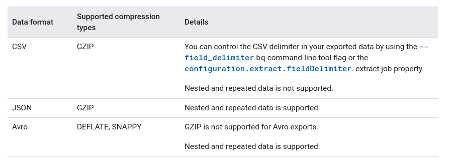

# BigQuery

Enterprise data warehouse that enables super-fast SQL queries

## Loading data into BigQuery

Ways to ingest data into BigQuery:

- Batch load set of data records
  - CSV files, external database, set of log files etc.
  - Traditional extract, transform, and load (ETL)
  - Options:
    - Load from Cloud Storage or local file
      - load job
      - Avro, CSV, JSON, ORC or Parquet
    - BigQuery Data Tranfer
      - automate loading data from
        - Google SaaS
        - third-party application and services
    - export from external data store and import in BigQuery
  - One time or recurring schedule
    - BigQuery Data Transfer Service transfers on a schedule
      - automatically loads data into BigQuery on a regular basis
    - orchestration service such as Cloud Composer
    - cron job to load data on a schedule
- Stream individual records or batches of records
  - one record at time or in batches
  - call straming API directly or use Dataflow with Apache Beam SDK to set streaming pipeline
- Use queries to generate new data and append or overwrite the results to a table
  - data manipulation language (DML) statements to perform bulk inserts
- Use a third-party application or service

### Choosing a data ingestion method

#### Data Source

- BigQuery Data Transfer Service supports the data source?
- Spark or Hadoop -> consider using BigQuery connectors
- Local files -> batch loading
- Log stream, application events etc. -> stream in real time might be easier

#### Slow-changing vs fast changing

- Near real time:
  - streaming
  - Cloud SQL as your online transaction processing (OLTP) database and use federated queries to join the data in BigQuery
- Slowly changes:
  - load job
    - less expensive
    - lower resource usage
- Infrequent changes or in reponse to an event:
  - Dataflow to sream the data or
  - Cloud Functions to acll streaming API in response to a trigger

#### Reliability of the solution

- loosely typed formats such as JSON or CSV, bad data can make an entire load job fail.
- scheduling component could be a failure point in the solution
- With streaming, you can check the success of each record and quickly report an error
- Streaming and load jobs are subject to quotas

#### Latency

- Consider how much data you load and how soon you need the data to be available
- Streaming -> low latency
- Periodic loads -> high latency

#### Data ingestion format

-Schema support
- Flat data or nested and repeated fields
- Embedded newlines
  - BigQuery expects newline-delimited JSON files to contain a single record per line.
- Encoding
  - UTF-8 encoding for both nested or repeated and flat data
  - ISO-8859-1 encoding for flat data only for CSV files.

### Streaming data into BigQuery

#### Checking for data availability:

- data is available whithin a few seconds
- rare circumstances (such as an outage) data in streaming buffer may be temporarily unavailable
  - querys run sucessfuly, skipping buffer
    - will contain warning
- data can take up to 90 min to become available to copy operations

#### Best effort de-duplication:

- stream the same row with the same insertId into the same table in up to 1 min -> may de-duplicate the multiple occurrences -> retaining only one of those occurrences
  - meant for retry scenarios in a distributed system -> no way to determine the state of a streaming insert under certain error conditions
  - should not be relied upon to guarantee absence of duplicates
    - not enough? -> Google Cloud Datastore supports transactions
- You can disable best effort de-duplication 
  - not populating the insertId field for each row inserted
    - get higher streaming ingest quotas in certain regions
  - for Apache Beam and Dataflow -> ignoreInsertIds()

#### Streaming data across data locations

- can stream data to datasets in both the US and EU
- might experience increased latency and error rates

#### Streaming into ingestion-time partitioned tables

- by using insertAll requests
- default: destination partition is inferred from the current UTC time
- you can override the date inference by supplying a partition decorator as part of the insertAll request
  - `mydataset.table$20170301` (31 days in the past and 16 days in the future)

#### Streaming into partitioned tables

You can stream data into a table partitioned on a DATE or TIMESTAMP column that is between 5 years in the past and 1 year in the future. Data outside this range is rejected.

#### Creating tables automatically using template tables

- __NOT RECOMMENDED__
  - use partitioned tables and clustered tables instead
- mechanism to split a logical table
  - smaller tables (grouped by user ID, for example)
- limitations
  - if you modify the template table schema in a non-backward compatible way, any buffered data that uses the old schema will be lost
  - Attempts to query the new fields might require a longer wait of up to 90 minutes

### Loading denormalized, nested, and repeated data

https://cloud.google.com/bigquery/docs/loading-data#loading_denormalized_nested_and_repeated_data

### Loading data from other Google service

#### BigQuery Data Transfer Service
Automates loading data into BigQuery from these services:

- Google SaaS app:
  - Campaign Manager; Cloud Storage; Google Ad Manager; Google Ads; Google Merchant Center (beta); Google Play; Search Ads 360 (beta); YouTube Channel reports; YouTube Content Owner reports
- External cloud storage providers
  - Amazon S3
- Data warehouses
  - Teradata
  - Amazon Redshift

#### Google Analytics 360

#### Dataflow

Dataflow can load data directly into BigQuery

### Alternatives to loading data

- Public datasets
  - stored in BigQuery
- Shared datasets
  - stored in BigQuery
- External data sources
  - without moving data that is stored elsewhere
- Logging files
  - Cloud Logging provides an option to export log files into BigQuery

## Partitioned tables

### Benefits:

- better performance
- lower cost -> reducing number of bytes read by a query
- 
### Tables can be partitioned by:

- Ingestion time (ingestion or arrival time)
  - pseudo column named _PARTITIONTIME
  - the pseudo column data can be manually changed
- Date/timestamp/datetime column
  - `DATE` -> either daily, monthly, or yearly granularity
  - `TIMESTAMP` or `DATETIME` -> any time-unit granularity type, including HOUR.
  - do not need a `_PARTITIONTIME` column
  - two special partitions are created:
    - \_\_NULL__ partition: rows with NULL values in the partitioning column
    - \_\_UNPARTITIONED__ partition: data that exists outside the allowed range of dates
  - Date/timestamp/datetime partitioned tables perform better than tables sharded by date
- Integer range (integer column)
  - you provide:
    - column used to create the integer range partitions
    - start of range (inclusive)
    - end of range (exclusive)
    - interval of each range
  - two special partitions are created:
    - \_\_NULL__ partition
    - \_\_UNPARTITIONED__ partition
  - Integer range partitioning versus clustering:
    - both can improve performance and reduce query cost
    - you can use both at the same column (data is partiioned first)
    - Use integer range partitioning if you want to:
      - explicitily define ranges
      - know query cost before it runs
      - address a partition
    - Use clustering if you:
      - need more than 4000 partitions

### Partitioned table pricing
- based on how much data is stored
- many operations are free, but subject to quotas and limits

## Query Pricing

### Storage costs
Based on amount of data stored. Can be:
- Active 
  - monthly charge ($0.020 per GB)
  - tables or partitions that were modified in last 90 days
- Long-term
  - lower monthly charge ($0.010 per GB)
  - tables or partitions that were NOT modified in last 90 days
  - same cost as Cloud Storage Nearline

### Query costs

- On-demand (default)
  - based on amount of data processed by each query
  - $5.00 per TB
- Flat-rate
  - predictable cost
  - dedicated resources for query processing
  - no charge for individual queries
  - Is purchased as a regional resource
  - Has a 100-slot minimum ($2,000) and is purchased in increments of 100 slots
  - Is available in per-second, monthly, and annual commitments

### Free operations

- Loading (except streaming -> $0.010 per 200 MB), copying, exporting
- deleting datasets, tables, views, partitions and functions)
- metadata operations
- reading pseudo columns or meta tables
- creating, replacing or calling UDFs

#### Always free usage limits

- Storage: first 10 GB per month
- Queries: first 1TB
- BigQuery ML CREATE MODEL queries: first 10 GB of data processed by queries that contain CREATE MODEL statements per month is free.

### Querying Cloud Storage data

When querying an external data source from BigQuery, you are charged for the number of bytes read by the query.

This pricing model includes:

- Data Manipulation Language
- Data Definition Language

### Scripting pricing

- During the BigQuery scripting beta, the BigQuery team recommends using projects with flat-rate reservations
  - number of bytes scanned by a script is generally not known before executing it
- Alternatively, you can use the BigQuery sandbox to take advantage of limited free script execution

## Exporting table data

### Required permissions

- BigQuery permissions:
  - To export data -> `bigquery.tables.export`:
    - contained by rules `bigquery.dataViewer`, `bigquery.dataOwner`, `bigquery.dataEditor`, `bigquery.admin`
  - To create export job -> `bigquery.jobs.create`
    - contained by rules `bigquery.user`, `bigquery.jobUser`, `bigquery.admin`
- Cloud Storage permissions:
  - `storage.objects.create` and `storage.objects.delete` permissions:
    - contained by rules `storage.objectAdmin`, `storage.admin`

### Export limitations

- Cannot export to local file, Sheets or to Drive
- Up to 1 GB to a single file -> use wildcard to export into multiple files
- Nested and repeated data is supported only for Avro and JSON exports (not CSV)
- When you export data in JSON format, INT64 (integer) data types are encoded as JSON strings to preserve 64-bit precision when the data is read by other systems.
- You cannot export data from multiple tables in a single export job.
- Only GZIP compression available when using Cloud Console

### Location considerations
- Colocate your Cloud Storage buckets for exporting data.
- Develop a data management plan.

### Moving BigQuery data between locations
- Location of a dataset cannot be changed
- You can make a copy of the dataset
  - export -> copy to new bucket -> load to bigquery

### Export formats and compression types

## External data sources (also known as a federated data source)

- Can directly query data not stored in BigQuery
- Supported platforms:
  - Cloud Bigtable
  - Cloud Storage
  - Google Drive
  - Cloud SQL
- Supported formats
  - Avro
  - CSV
  - JSON (newline delimited only)
  - ORC
  - Parquet

### Limitations

- data consistency not guaranteed
- Query performance may not be as high
- You cannot use the TableDataList JSON API method
- cannot export data from external data source
- cannot reference an external data source in a wildcard table query
- support table partitioning or clustering in limited ways
- results are not cached
- Querying data in Cloud Bigtable is currently only available in some zones (us-central1 and europe-west1)
- limited to 4 concurrent queries against a Cloud Bigtable external data source

### Access control

https://cloud.google.com/bigquery/docs/access-control

You can grant access at the following BigQuery resource levels:

- organization or Google Cloud project level
- dataset level
- table or view level

Roles __CANNOT__ be applied to individual resources of the following types:

- routines
- models

## Slots

- A BigQuery slot is a virtual CPU used by BigQuery to execute SQL queries
- BigQuery automatically calculates how many slots are required by each query, depending on query size and complexity

### Query execution using slots

- BigQuery it converts the declarative SQL statement into a graph of execution
  - series of query stages
    - sets of execution steps
  - heavily distributed parallel architecture to run these queries
  - Stages communicate with one another by using a fast distributed shuffle architecture
  - query plan can be modified while a query is in flight
  - BigQuery can run multiple stages concurrently
  - BigQuery can leverage speculative execution to accelerate a query, and BigQuery can dynamically repartition a stage to achieve optimal parallelization

### Query execution under slot resource economy

- If a query requests more slots than currently available, BigQuery queues up individual units of work and waits for slots to become available
- The number of slots requested is not related to the amount of capacity you purchase, but rather an indication of the most optimal parallelization
- When query demands exceed slots you committed to, you are not charged for additional slots, and you are not charged for additional on-demand rates. Your individual units of work simply queue up.

### Fair scheduling in BigQuery

- Every query has equal access to all available slots at any time

## Updating dataset properties

After you create a dataset, you can update the following dataset properties:

- Description
- Default expiration time for new tables
- Default partition expiration for new partitioned tables
- Access controls
- Labels

You must be granted `bigquery.datasets.update` and `bigquery.datasets.get` permissions.

The following predefined IAM roles include these permissions:

- bigquery.dataOwner
- bigquery.admin

## Controlling costs in BigQuery

- Avoid `SELECT *`
  - Query only the columns that you need.
  - Applying a `LIMIT` clause to a `SELECT *` query does not affect the amount of data read
- Sample data using preview options
  - Don't run queries to explore or preview table data
- Price your queries before running them
  - Before running queries, preview them to estimate costs:
    - Using the query validator (Cloud Console)
    - Performing a dry run (all, except Cloud Console)
    - Using the pricing calculator
- Limit query costs by restricting the number of bytes billed
  - Use the maximum bytes billed setting to limit query costs
- `LIMIT` doesn’t affect cost
  - Do not use a LIMIT clause as a method of cost control
- View costs using a dashboard and query your audit logs
- Partition data by date
- Materialize query results in stages
- Break your query into stages where each stage materializes the query results by writing them to a destination table
- Consider the cost of large result sets
  - use the default table expiration time to remove the data when it's no longer needed
- Use streaming inserts with caution

## Optimizing storage in BigQuery

- Use the expiration settings to remove unneeded tables and partitions
  - configure default table expiration for datasets, expiration time for tables, and partition expiration for partitioned tables.
- Take advantage of long-term storage
  - Keep your data in BigQuery

## Optimizing communication between slots

Consider the amount of shuffling that is required by your query

- How many bytes are passed between stages?
- How many bytes are passed to each slot?
- For example, a GROUP BY clause passes like values to the same slot for processing
- The amount of data that is shuffled directly impacts communication throughput and as a result, query performance

### Best practices

- Reduce data before using a JOIN
  - Reduce the amount of data that is processed before a JOIN clause
- Do not treat WITH clauses as prepared statements
  - Use `WITH` clauses primarily for readability
- Avoid tables sharded by date
  - Do not use tables sharded by date (also called date-named tables) in place of time-partitioned tables.
- Avoid oversharding tables
  -  Avoid creating too many table shards. If you are sharding tables by date, use time-partitioned tables instead.

## Optimizing query computation

- Avoid repeatedly transforming data via SQL queries
  - If you are using SQL to perform ETL operations, avoid situations where you are repeatedly transforming the same data
  - materialize the transformed results in a destination table
- Avoid JavaScript user-defined functions
  - Avoid using JavaScript user-defined functions. Use native UDFs instead.
- Use approximate aggregation functions
  - If your use case supports it, use an approximate aggregation function
  - instead of using COUNT(DISTINCT), use APPROX_COUNT_DISTINCT(), for example
- Order query operations to maximize performance
  - Use ORDER BY only in the outermost query or within window clauses (analytic functions). Push complex operations to the end of the query
  - filter first to reduce the number of values that you need to sort
- Optimize your join patterns
  - For queries that join data from multiple tables, optimize your join patterns. Start with the largest table.
- Prune partitioned queries
  - When querying a partitioned table, use the _PARTITIONTIME pseudo column to filter the partitions.

## Managing query outputs

Consider the number of bytes written by your query. 
- Are you properly limiting the amount of data written? 
- Are you repeatedly writing the same data?
- impact on performance and cost (if written to permanet destination)

### Best practices
- Avoid repeated joins and subqueries
  - it might be more performant for you to use nested repeated data to represent the relationships
  - Materializing your subquery results
- Carefully consider materializing large result sets
  - Writing large result sets has performance and cost impacts
- Use a LIMIT clause with large sorts
  - Writing results for a query with an ORDER BY clause can result in Resources exceeded errors

## Avoiding SQL anti-patterns

query anti-patterns impact performance in BigQuery.

- Avoid self-joins
  - Use a window function instead.
  - Potentially doubles the number of output rows
- Data skew (when data is partitioned into very unequally sized partitions)
  - If your query processes keys that are heavily skewed to a few values, filter your data as early as possible.
  - if one partition is especially large, it can slow down, or even crash the slot that processes the oversized partition
  - Use an approximate aggregate function such as APPROX_TOP_COUNT to determine if the data is skewed
  - Unbalanced joins:
    - Pre-filter rows from the table with the unbalanced key.
    - If possible, split the query into two queries.
- Cross joins (Cartesian product) (queries where each row from the first table is joined to every row in the second table)
  - Avoid joins that generate more outputs than inputs.
  - Use a GROUP BY clause to pre-aggregate the data.
- Avoid DML statements that update or insert single rows
  - Avoid point-specific DML statements (updating or inserting 1 row at a time)
  - Batch your updates and inserts.
  - BigQuery DML statements are intended for bulk updates

## Query plan and timeline

- Embedded within query jobs, BigQuery includes diagnostic query plan and timing information
- retrieved from the API responses of methods such as `jobs.get`
- similar to statements such as `EXPLAIN` in other database and analytical systems
- For long running queries, BigQuery will periodically update these statistics
  - typically, not more frequently than every 30 seconds

Viewing information with the Cloud Console

### Query plan information

- Stage overview:
  - id, name, status, inputStages
  - startMS, endMs
  - steps
    - READ, WRITE, COMPUTE, FILTER, SORT, AGGREGATE, LIMIT, JOIN, ANALYTIC_FUNCTION, USER_DEFINED_FUNCTION
  - recordsRead, recordsWritten
  - parallelInputs, completedParallelInputs, 
  - shuffleOutPutBytes, shuffleOutputBytesSpilled
- Per-stage timing classification
  - reatios are the fraction of the longest time spent by any worker in any segment
  - timing information:
    - waitRatioAvg, waitMsAvg
    - waitRatioMax, waitMsMax
    - readRatioAvg, readMsAvg
    - readRatioMax, readMsMax
    - computeRatioAvg, computeMsAvg
    - computeRatioMax, computeMsMax
    - writeRatioAvg, writeMsAvg
    - writeRatioMax, writeMsMax
  - Timeline metadata
    - elapsedMs
    - totalSlotMs
    - pendingUnits
    - activeUnits
    - completedUnits

## Introduction to views

- Virtual table defined by a SQL query
- Query it in the same way you query a table
- limitations
  - view dataset and table dataset must be in the same location
  - cannot run job that exports data from view
  - cannot use the TableDataList
  - cannot mix standard SQL and legacy SQL queries when using views. A standard SQL query cannot reference a view defined using legacy SQL syntax.
  - cannot reference query parameters in views
  - The schemas of the underlying tables are stored with the view when the view is created
    - If columns are added, deleted, and so on after the view is created, the reported schema will be inaccurate until the view is updated
    - Even though the reported schema may be inaccurate, all submitted queries produce accurate results
  - You cannot automatically update a legacy SQL view to standard SQL syntax
- You cannot include a temporary user-defined function or a temporary table in the SQL query that defines a view
- You cannot reference a view in a wildcard table query

### View pricing

- the query that defines the view is run each time the view is queried
  - BigQuery's views are logical views, not materialized views
- billed as regular queries

## Managing input data and data sources
- Avoid `SELECT *`
  - Query only the columns that you need.
- Prune partitioned queries
  - When querying a partitioned table, use the _PARTITIONTIME pseudo column to filter the partitions.
- Denormalizing data
  - common strategy for increasing read performance for relational datasets
  - use nested and repeated fields
  - storage savings from using normalized data has less of an effect in modern systems
- Use external data sources appropriately
  - If query performance is a top priority, do not use an external data source
- Avoid excessive wildcard tables
  - When querying wildcard tables, use the most granular prefix possible
  - For example, `FROM bigquery-public-data.noaa_gsod.gsod194*` queries all tables from the 1940s.