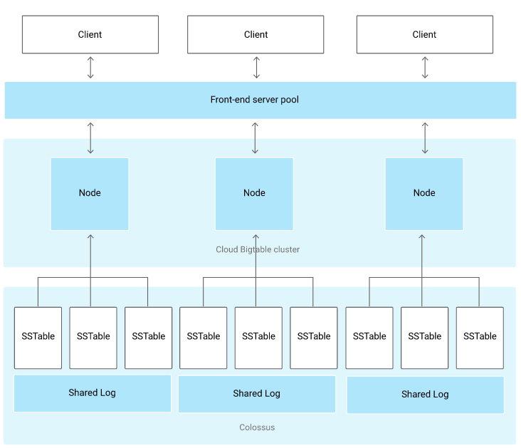
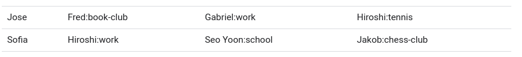
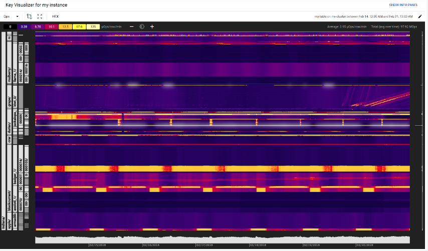
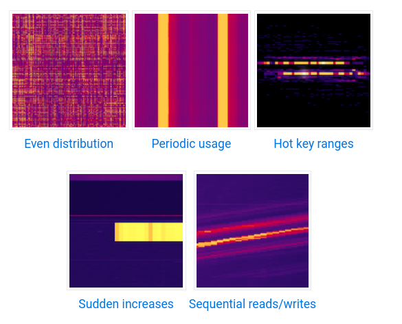

# Cloud BigTable

- Sparsely populated table
- NoSQL (no-join)
- Can scale to billions of rows and thousands of columns
- terabytes or petabytes of data
- A single value per row is indexed (row key)
- Very low latency
- ideal for MapReduce operations
- exposed to applications through multiple client libraries, including a supported extension to the Apache HBase library for Java
- Incredible scalability
- Simple administration
- Cluster resizing without downtime

###  What it's good for:

- Time-series data
- Marketing data
- Financial data
- Internet of Things data
- Graph data

### Cloud Bigtable storage model

- rows
  - Rows are sorted lexicographically by row key
- columns
  - grouped into _families_
    - Column families are not stored in any specific order
  - identified by column family and column qulifier (unique within family)
    - Columns are grouped by column family and sorted in lexicographic order within the column family
- row column intersection
  - can contain multiple cells (versions) with different timestamps
  - All operations are atomic at the row level

### Cloud Bigtable architecture

### Load balancing

### Supported data types

- BigTable treats all data as raw byte strings
- only try to determine type for increment operations
  - target must be 64-bit integer encoded as an 8-byte big-endian value

### Memory and disk usage

- Empty cells
  - do not take any space
- column qulifiers
  - take up space in row
  - often is efficient to use it as data -> have the value as a placeholder
- compactions
  - Bigtable periodically rewrites tables to remove deleted entries and reorganize data -> reads and writes are more efficient
  - no configuration settings for compactions
- Mutations and deletions
  - update the value in a cell -> both the original value and the new value stored for some amount of time -> data is compacted
  - Deletions also take up extra storage space until the table is compacted
- Data compression
  - Bigtable compresses data automatically using intelligent algorithm
  - cannot configure compression settings
  - how to store data so that it can be compressed efficiently:
    - Random data cannot be compressed as efficiently as patterned data
    - Compression works best if identical values are near each other
    - Compress values larger than 1 MiB before storing them in Cloud Bigtable
      - Cloud Bigtable automatically turns off compression for values larger than 1 MiB.

### Data durability

- data is stored on Colossus
- do not need to run an HDFS cluster or any other file system to use Cloud Bigtable
- If instance uses replication, Cloud Bigtable maintains one copy of data in Colossus for each cluster in the instance
- each copy is located in a different zone or region, further improving durability.

### Security

- Acees is controlled by projec IAM roles
- does not support row-level, column-level or cell-lecel restrictions

### Backups

- let you save a copy of a table's schema and data
- restore from the backup to a new table at a later time

## Instances, clusters, and nodes

### Instances

- container for data
- have one or more clusters (up to 4), located in different zones
  - each cluster has at least 1 node
- tables belong to instances
- intances with more than one cluster are using replication
- instance with only 1 cluster are not using replication
- properties
  - storage type
    - SSD (often the most efficient and cost-effective) or HDD
    - choice is permanent
    - every cluster must use the same
  - application prolies
    - instances that use replication
      - control how your applications connect to the instance's clusters
    - instance doesn't use replication
      - can still use app profiles to provide separate identifiers for each of your applications

### Cluster
- Bigtable service in a specific location
- belongs to single instance
- requests are handled by one of the clusters
- each one is located on single zone
- data is synchronized between zones
- you can choose which cluster to connect, or let Bigtable balance traffic

### Nodes

- compute resources used to manage data
- tables are slip into separate tablets
  - tablets are associated with a single node
- nodes are responsible for:
  - keep track of specific tablets
  - handling reads and writes for its tablets
  - maintenance tasks on its tablets (such as compactions)
- A cluster must have enough nodes to support its current workload and the amount of data it stores
  - Monitor CPU and disk usage to decide if more nodes are needed
    - Cloud Bigtable reports Average CPU utilization and CPU utilization of hottest node
    - Cloud Bigtable reports Storage utilization (bytes), Storage utilization (% max) and Disk load

#### Nodes for replicated clusters
- replication to provide high availability, or multi-cluster routing 
  - each cluster should have the same number of nodes
  - recommended CPU utilization is reduced by half
  - if an automatic failover is necessary -> responsive cluster has enough capacity to handle all traffic
- single-cluster routing
  - can have a different number of nodes
  - must always have enough nodes to support disk usage

## Designing your schema

### Best practices

- good schema results in excellent performance and scalability
- table elements, especially row keys, should be designed with planned read requests in mind

#### Tables

- Store datasets with similar schemas in the same table, rather than in separate tables.
  - unique row key prefix to use for each dataset -> related data stored in contiguous range of rows
  - limit of 1000 tables per instance (you should have far fewer)
  - requests to many different tables -> increase backend connection overhead
  - multiple tables of different sizes -> disrupt the behind-the-scenes load balancing

#### Column families

- Put related columns in the same column family
  - avoid need to design complex filters
  - get just information needed in most frequent reads
- create no more than 100 column families per table
  - more can cause performance degradation
- short but meaningful names
  - names are included in responses
- columns that have different data retention needs in different column families
  - Garbage-collection policies are set at the column-family level

#### Columns

- Treat column qualifiers as data
  - example:

- Create as many columns as you need in the table
  - no space penalty
  - up to millions in a table
- Avoid using too many columns in any single row
  - It takes time for Cloud Bigtable to process each cell in a row.
  - Each cell adds some overhead to the amount of data that's stored
  - if needed, consider storing the data as a protobuf in a single column

#### Rows
- No more than 100 MB of data in a single row
  - can result in reduced read performance
- Keep all information for an entity in a single row (for most use cases)
  - avoid inconsistencies
- Store related entities in adjacent rows
  - make reads more efficient.

#### Cells
- No more than 10 MB of data in single cell

#### Row keys

- Design based on the queries used to retrieve the data
  - most efficient queries retrieve data using:
    - row key
    - row key prefix
    - range of rows defined by starting and ending row keys
  - other types trigger a full table scan
  - choosing correct row key avoids data migration
- keep row keys short
  - must be 4kb or less
- store multiple delimited values row keys
  - it is the only way to query
  - have a clear understanding of how data will be used
  - if includes numbers, pad with leading zeros
- makes it possible to retrieve a well-defined range of rows
- Use human-readable string values in your row keys
- start with a common value and end with a granular value
- Row keys to avoid:
  - Row keys that start with a timestamp
    - cause sequential writes to be pushed onto a single node
  - Row keys that cause related data to not be grouped together
  - Sequential numeric IDs
    - likely to push most of your traffic to a small number of nodes
  - Frequently updated identifiers
    - Instead, store each new reading in a new row
  - Hashed values
    - removes benefits of natural sorting order
  - Values expressed as raw bytes

### Special use cases
- Time-based data
  - Include a timestamp as part of your row key (not at the beginning)
  - If you usually retrieve the most recent records first, you can use a reversed timestamp (subtracting the timestamp from your programming language's maximum value for long integers)
  - records will be ordered from most recent to least recent
- Multi-tenancy
  - Using one table for all tenants is the most efficient way to store and access multi-tenant data
- Privacy
  - avoid using personally identifiable information (PII) or user data in row keys column family IDs
    - they are metadata, applications that use metadata can expose data to users who should not have access
- Domain names
  - Wide range of domain names
    - consider using a reverse domain name (for example, com.company.product)
    - good idea if each row's data tends to overlap with adjacent rows (com.google.drive; com.google.maps; en.wikipedia.org)
  - Few domain names
    - consider other values for your key
- Changing or uncertain queries
  - store all data in one column instead of multiple
    - advantages:
      - takes less space
      - flexibility
      - reading application does not need to know table schema
    - disadivantages:
      - need to deserialize data
      - lose option to use filters
      - can't use BigQuery to run federated queires on fields within protobuf

## Schema desing for time series data

- Use tall and narrow tables
  - small number of events per row
- As an optimization, you can use short and wide tables, but avoid unbounded numbers of events
  - if you usually need to retrieve an entire month of events at once, for example
  - the row can be bounded in size to the number of days in a month, for example
- Prefer rows to column versions
  - It is acceptable to use versions of a column where the use case is actually amending a value, and the value's history is important.
- Design your row key with your queries in mind
  - Choosing a row key that facilitates common queries is of paramount importance to the overall performance of the system
  - Different queries are equaly important?
    - Denormalization
      - two tables with different row keys
        - robust and scalable system
    - Query and filter
      - less scalable 
      - lower performance
- Ensure that your row key avoids hotspotting
  - most common issue for time series in Bigtable
  - solutions
    - Field promotion: move column data to row key
    - salting: add calculated element to row key
      - multiple scans needed when quering for ranges
    - prefer field promotion
- Reverse timestamps only when necessary
- Rows can be big but are not infinite
- Keep related data in the same table, keep unrelated data in different tables
- Store data you will access in a single query in a single column family

## Access Control

- You can configure access control at levels:
  - project
  - instance
  - table
- Done via IAMs

## Replication

- up to 4 replicas in unique zones
- possible to perform reads and writes in each cluster
- possible to let requests from different applications to be routed to different clusters

### Use cases

- Isolate serving applications from batch reads
- Improve availability
- near-real-time backup
- global presence

### Consistency model

- eventually consistent, by default
  - delay is typically a few seconds or minutes, not hours
    - unless cluster is overloaded, temporarily unavailable or large ammounts of data are being written
  - not safe to assume read data is the most up to date
- read-your-writes consistency
  - application will never read data that is older than its most recent writes
  - each application in the group must use an app profile that is configured for single-cluster routing and all of the app profiles must route requests to the same cluster
- strong consistency
  - ensures that all of your applications see your data in the same state
  - use the single-cluster routing app-profile configuration for read-your-writes consistency that is described above
  - must not use the instance's additional clusters unless you need to fail over to a different cluster

### Application profiles

- Control which clusters handle incoming requests from your applications
  - Single-cluster routing (manual failover if needed)
  - Multi-cluster routing (atuomatically routes to nearest, auto failover)
- determine whether you can perform single-row transactions
  - read-modify-write operations (including increments and appends)
  - check-and-mutate operations (also known as conditional mutations or conditional writes)
  - conflicts?
    - these operations cannot be enabled for multi-cluster routing
    - warning in case it is enabled for 2 different app profiles that point to different clusters
- You can then view separate graphs of your Cloud Bigtable metrics for each app profile
- Default app profile:
  - 1 cluster -> single-cluster routing and it enables single-row transactions
  - 2 cluster -> multi-cluster routing and it never allows single-row transactions

### Failovers

- If a Cloud Bigtable cluster becomes unresponsive, replication makes it possible for incoming traffic to fail over to another cluster in the same instance
- single-cluster routing -> manual
  - reasons to failover
    - large number of transient system errors
    - large number of requests timing out
    - average response latency increased
- multi-cluster -> automatic
  - fail over to neartes cluster
  - can failover even if cluster is unavailable for a very short period of time
  - fails over in case of requests with deadlines approaching deadlines

### Dropping row ranges when replication is enabled

- when replication is enabled, dropping a row range is significantly slower and much less efficient.

### Examples
https://cloud.google.com/bigtable/docs/replication-settings

## Key Visualizer

- tool that helps you analyze your Cloud Bigtable usage patterns
- visual reports for your tables that break down your usage based on the row keys that you access
- uses:
  - Iteratively designing a schema or improving the design of an existing schema
  - Troubleshooting performance issues
  - Getting a better understanding of how you access the data
- To accomplish these goals, Key Visualizer can help you complete the following tasks:
  - Check whether your reads or writes are creating hotspots on specific rows
  - Find rows that contain too much data
  - Look at whether your access patterns are balanced across all of the rows in a table

### Key Visualizer scans

- A large heatmap, which shows access patterns for a group of row keys over time.
  - value of a metric over time (x-axis), broken down into contiguous ranges of row keys (y-axis)
  - By default, a Key Visualizer heatmap shows the Ops metric
  - Key Visualizer automatically recognizes hierarchical row keys and breaks it down into a hierarchy of tabs
  - Key Visualizer divides all of the row keys into 1,000 contiguous ranges
    - tries to keep same ranges over times
    - recalculates and balance when needed
- Aggregate values along each axis of the heatmap, including average values and either total or maximum values.
  - bar charts along the bottom and right sides of the heatmap
  - When you hover over the aggregate values, Key Visualizer highlights a narrow area in the heatmap and shows the following information
    - For the x-axis, Key Visualizer shows the average value for the current metric, along with either the total or maximum value
    - For the y-axis, Key Visualizer shows the average value for the current metric across the visible time range

### Limits

- Minimum of 30 GB of data
- shortest time span is 15 min
- maximum time span is 14 days
- increment size is 15 min

### Common patterns

## Choosing between SSD and HDD storage

- __When in doubt, choose SSD storage__
- __choice of SSD or HDD storage for the cluster is permanent__
- SSD storage is the most efficient and cost-effective choice for most use cases.
  - faster and more predictable
  - much higher throughput
  - faster individual row reads
  - const increase is minimal
- HDD storage is sometimes appropriate for very large data sets (>10 TB) that are not latency-sensitive or are infrequently accessed.
  - use cases:
    - You expect to store at least 10 TB of data.
    - You will not use the data to back a user-facing or latency-sensitive application.
    - Your workload falls into one of the following categories:
      - Batch workloads with scans and writes, and no more than occasional random reads of a small number of rows.
      - Data archival, where you write very large amounts of data and rarely read that data.

find . -type f -name '**.md' -print0 | xargs -0 -n2 -P2 -I{} pandoc {} -f markdown tput/{}.pdf
