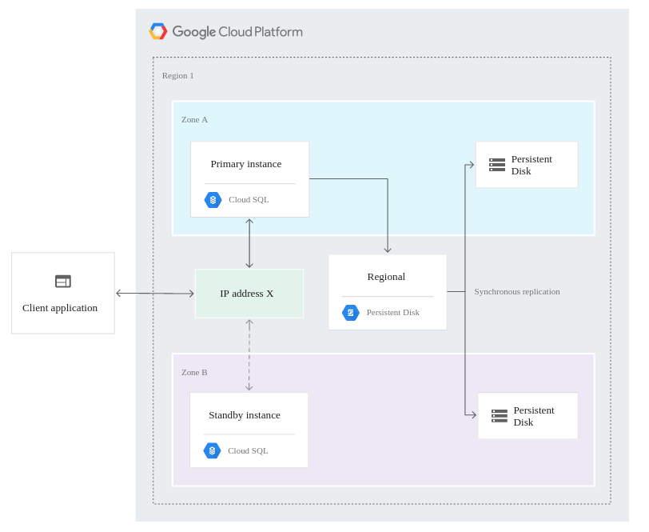
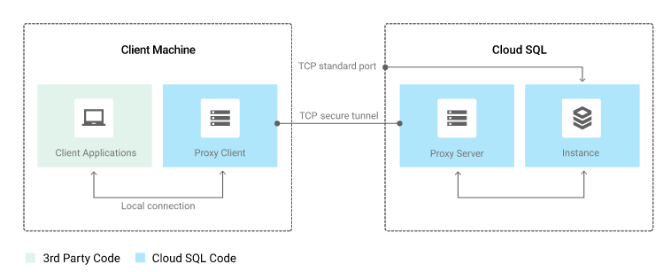
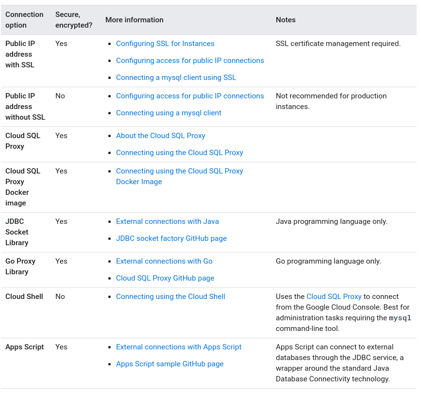
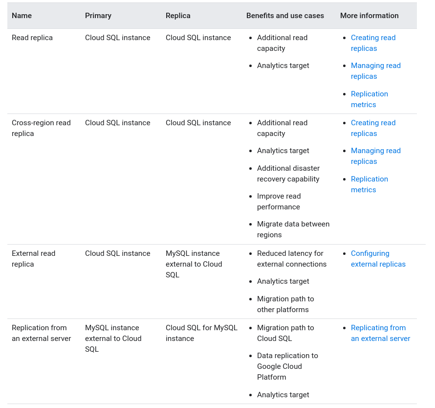

# Cloud SQL

## Key Features

- Fully managed
- Integrated
  - Easily conect from App Engine, CE, GKE or on-premisses workstation
  - BigQuery can directly query Cloud SQL
- Reliable
  - Replication and backups easily configured
  - Automatic failover can be enabled
  - 99.95 availability
- Easy migration
  - MySQL and PostgreSQL
  - No charge for native like-to-like migrations

## Highe availability (HA) configuration (cluster)

- Data redudancy
- Regional instance
  - Primary and secondary zones
  - Primaru and standby instances
  - Same region
  - Synchronous replication (like regional persistent disks)
- Charges double the price (from CPU, RAM and storage)
- Faliolver
  - If instance becomes unresponsive -> automatically switches to standby
  - heartbeate signal every second (write to system database) -> no response for about 60s -> failover
- Requirements:
  - Primary instance in normal operating state (not stopped, undergoing maintanance or performing long-running operation such as backup, import or export)
    - Control maintenance window to control when downtime occurs
  - Secondary zone and standby instance must be healthy
  - Automate backups and point-in-time recovery must be enabled
- Same usage as non-HA
- Legacy MySQL high availability option
  - not available in Cloud Console

## Connecting

### Connection Options

- Private IP
  - Lower latency
  - Limited attack vectors
  - Automatically authorized for RFC 1918 address ranges
- Public IP
  - Any connection must be authorized
    - Cloud SQL proxy
    - authorized networks

### Authentication options
- Cloud SQL proxy:
  
  - IAM permissions
  - SSL/TLS layer
  - Recommended and most secure
  - Some languages have client libraries
  - Cloud Run, Cloud Functions, and App Engine provide a mechanism that connects using the Cloud SQL Proxy
  - only on port 3307
  - requirements:
    - Cloud SQL Admin API must be enabled
    - provide proxy GC authentication credentials
      - required permissions for service accounts
        - Cloud SQL Client
        - Cloud SQL Editor
        - Cloud SQL Admin
  - Tips:
    - You can use one local proxy client to connect to multiple Cloud SQL instances. The way you do this depends on whether you are using Unix sockets or TCP.
    - 
- Self-managed SSL/TLS certificates
  - client/server SSL/TLS certificates that are specific to a Cloud SQL instance
- Authorized networks
  - IP addresses or ranges that the user has specified as having permission to connect
  - Not suitable for dynamically-assigned IP adresses applications

### Connection options compared

## Replication in Cloud SQL
Uses:
  - __Scale use of data without degraging performance__
  - Migrage between regions, platforms or from on-premises
  - Promote replica if original becomes corrupted
Supported types:
  - Read replicas
    - offload work from Cloud SQL instance
    - almost real time update
    - read-only
    - cannot have less CPU and memoty than primary
    - up to 10 replicas per primary instance
    - connect directly to replica, via name and IP address
  - Cross region read replicas
    - improve read performance for being closer
    - disaster recovery
    - migration
  - External read replicas
  - Cloud SQL replicas, when replicating from external server

- Failover
  - primary instances cannot failover to read replicas
  - replicas are unable to failover
- Maintenance windows cannot be set on read replicas. Maintenance can occur at any time
- 10 replicas per instance
- no load balancing
- before restoring primary all replicas must be deleted
- cannot stop replica

- Prerequisites:
  - automated backups enabled
  - Binary logging must be enabled which requires point-in-time recovery to be enabled
  - At least one backup must have been created after binary logging was enabled
  - For external:
    - The MySQL version of the replica must be the same or higher than the MySQL version of the primary instance
    - you must configure SSL/TLS on your primary instance

### Binary Logging
- Impacts
  - Performance overhead:
    - additional disk fsync is required for each write operations
  - Storage overhead
    - write-heavy workload consumes more storage
  - Instance restart when enabled or disbled
  - can be enabled on replicas

### Billing
- Same as standard Cloud SQL instance
- No charge for the data replication
- Extenal replicas -> data flow charged as network egress
- cross region -> cross region network egress

## Best practices for importing and exporting data
- Use the same SQL Mode for import and export
- Don't use Cloud Storage Requester Pays buckets
- Use the correct flags when you create a SQL dump file
- Compress data to reduce cost
- Reduce long-running import and export processes
  - smaller batches of data
  - serverless export
- Use InnoDB
- MySQL import and migration jobs containing metadata with DEFINER clause

## Backups

- Defaul retains 7 days of automated backups + on-demand backups
- Lower price for backup storage
- Differences from exports:
  - Managed by Cloud SQL
  - Ecompass entire database, exports can select specific contents
- Backups are incremental
- Types:
  - On-demand
    - any time
    - not automatically deleted
  - automated
    - occurs in a 4 hour backup window
    - evey day (if instance was running anytime in the past 36 hours)
    - from 1 to 365 days
- Store locations
  - Default:
    - two regions for redundancy
      - one can be the same region as the instance
      - try to be at the same continent
  - custom:
- Automated backup and transaction log retention
  - A combination of automated backups and transaction logs are used to perform a point-in-time recovery
- backups cannot be exported
- Typically, backups complete within a few seconds, but if a large amount of data has been written since the last backup, the backup takes longer to complete.

## Restore

- Point-in-time recovery
  - Always creates a new instance
  - is enabled by default
- Restore an instance from a backup
  - same instance or to a different instance
  - overwrites all data on the target instance
  - instance is unavailable for connections during the restore operation
  - you must delete all replicas and recreate them after
  - estore operation restarts the instance
  - restoring on different instance>:
    - target instance must have the same database version and editio
    - storage capacity of the target instance must be at least as large as the capacity of the instance being backed up. The amount of storage being used does not matter
    - The target instance must be in the RUNNABLE state
    - The target instance can be a different tier or machine type

## FAQ
- No QPS limit
- Storage limit
  - 30 TB