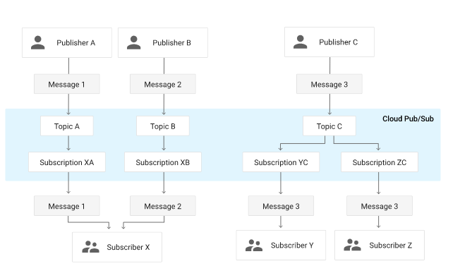

# Pub/sub
https://cloud.google.com/pubsub/docs/overview

- asynchronous messaging service
- decouples services that produce events from services that process events
- You can use Pub/Sub as messaging-oriented middleware or event ingestion and delivery for streaming analytics pipelines
- offers durable message storage and real-time message delivery with high availability and consistent performance at scale

### Core concepts

- Topic
- Subscription
- Message
- Message attribute

### Publisher-subscriber relationships

### Pub/Sub message flow

1. A publisher application creates a topic in the Pub/Sub service and sends messages to the topic
2. The service ensures that published messages are retained on behalf of subscriptions
3. Pub/Sub forwards messages from a topic to all of its subscriptions, individually.
4. A subscriber receives messages either by Pub/Sub pushing them to the subscriber's chosen endpoint, or by the subscriber pulling them from the service.
5. The subscriber sends an acknowledgement to the Pub/Sub service for each received message.
6. The service removes acknowledged messages from the subscription's message queue.

### Publisher and subscriber endpoints

- Publishers and pull subscribers can be any application that can make HTTPS requests to pubsub.googleapis.com
- Push subscribers must be Webhook endpoints that can accept POST requests over HTTPS.

### Common use cases

- Balancing workloads in network clusters
  - a large queue of tasks can be efficiently distributed among multiple workers, such as Google Compute Engine instances.
- Implementing asynchronous workflows
  - an order processing application can place an order on a topic, from which it can be processed by one or more workers.
- Distributing event notifications
  - a service that accepts user signups can send notifications whenever a new user registers, and downstream services can subscribe to receive notifications of the event.
- Refreshing distributed caches
  - an application can publish invalidation events to update the IDs of objects that have changed.
- Logging to multiple systems
  - a Google Compute Engine instance can write logs to the monitoring system, to a database for later querying, and so on.
- Data streaming from various processes or devices
  - a residential sensor can stream data to backend servers hosted in the cloud.
- Reliability improvement
  - a single-zone Compute Engine service can operate in additional zones by subscribing to a common topic, to recover from failures in a zone or region.

### Pub/Sub integrations

