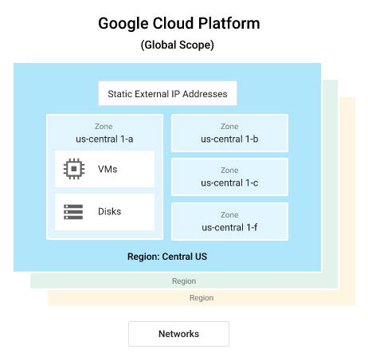
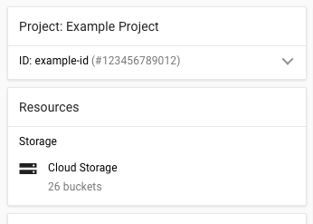
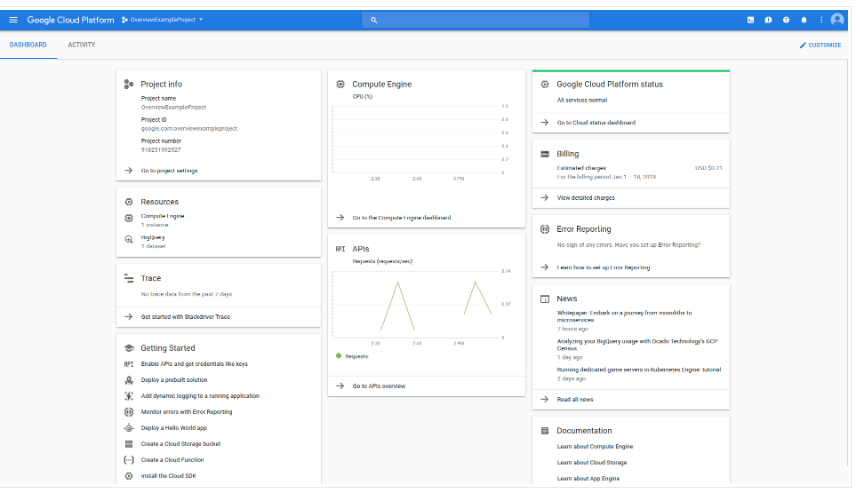
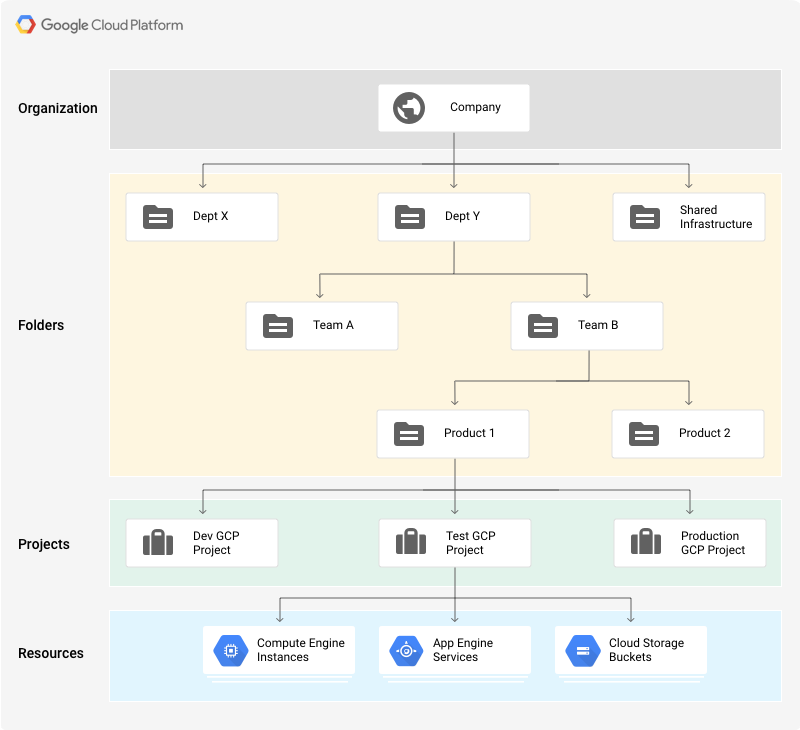

Google Cloud Overview

https://cloud.google.com/docs/overview/

# Google Cloud Resource
- Physical assets (computers, hds etc.)
- Virtual serources (VMs, etc.)

### Google Data Centers

- Different zones -> isolation from most physical infrastructure and infrastructure software failures
- Resources may be global (images), region (static ips) or zone specific (disks or vm instances)
- Zone specific resources can be used only by other resources within that zone
- Regions
    - May have one or more zone (most have 3+)
    - Locations
      - Asia (8)
      - Australia (1)
      - Europe (6)
      - North America (8)
      - South America (1)
- Zones
    - Isolated from each other within region
    - Identified by the name of region + letter (e.g.: asia-east1-a)

# Google Cloud Projects

- Allocated resources must belong to a project
- Resources within a projetct work together easily (e.g.: internal network), subject to regions-and-zones rules
- Resource access across projects must use SharedVPC or VPC Network Peering
- Projects have identifiers that can be used in command lines and API calls:
	- Name (user provided)
	- Id (user or GC provided)
	- Number (GC provided)

# Interacting with 
- Google Cloud console

- Command-ine interface
	- Cloud SDK -> terminal window on own computer
	- Cloud Shell -> browser-based shell (no installation). It provides:
		- A temporary Compute Engine virtual machine instance.
		- A built-in code editor.
		- 5 GB of persistent disk storage.
		- Pre-installed Cloud SDK and other tools.
		- Language support for Java, Go, Python, Node.js, PHP, Ruby and .NET.
		- Web preview functionality.
		- Built-in authorization for access to Cloud Console projects and resources. 
- Client Libraries:
	- App APIS to access services
	- Admin APIS for resource management
	- Products such as Maps, Drive etc.

# Resources hierarchy
https://cloud.google.com/resource-manager/docs/cloud-platform-resource-hierarchy
