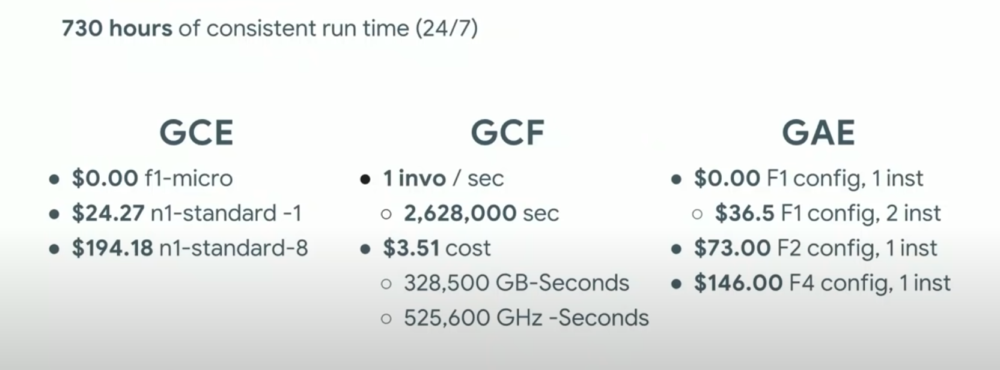
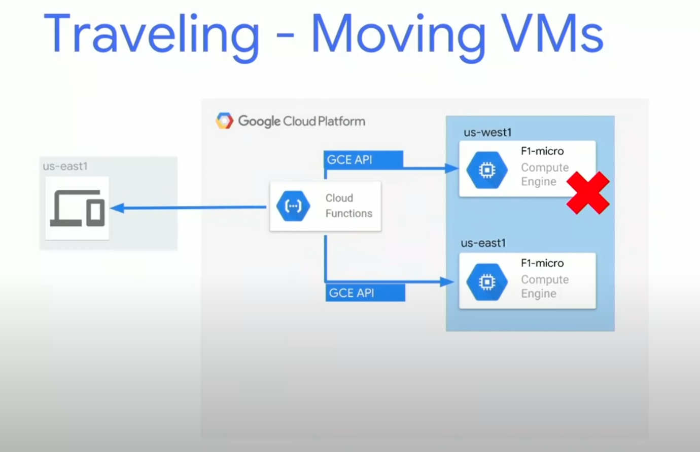

Google Cloud Platform on a shoestring budget 

https://www.youtube.com/watch?v=N2OG1w6bGFo
cloud.google.com/products/calculator

# Saving cost on GCP NETWORK
## Serving data
Components involved:
- Storage:
	- USD/GB/month
	- Free tier: 5GB per **region**
- Network:
	- Egress rates (outgoing)
	- Only charged if outside region
	- USD/GB
	- Free tier: 1GB from north america to others
- Get multiregional storage is cheaper than setting up multiple storages
- **1 bucket + CDN does all the job much cheapper**

# Saving costs on COMPUTE
- GCE
	- Cost based on config
	- Free tier: 1 f1-micro
	- Sustained use discount: 30%
	- Contact sales: up to 56% discount
	- **Rightsizing**: google recommends changes based on usage
	- Pre-emptive: allow scheduler to kill your instance when it needs (high demand). It sends a message to allow backups and etc.. Prices do from 24 USD to 7.30 USD
- GCF
	- Cost based on million calls or network and computing usage
	- 2 million calls/month or 400k GB-seconds or 200k GHz-seconds
- GAE
	- Const based on instance * hour
	- 28 isnt hrs/day (f1) or 9 inst hrs/day (B1)
Pricing simulation comparison:

