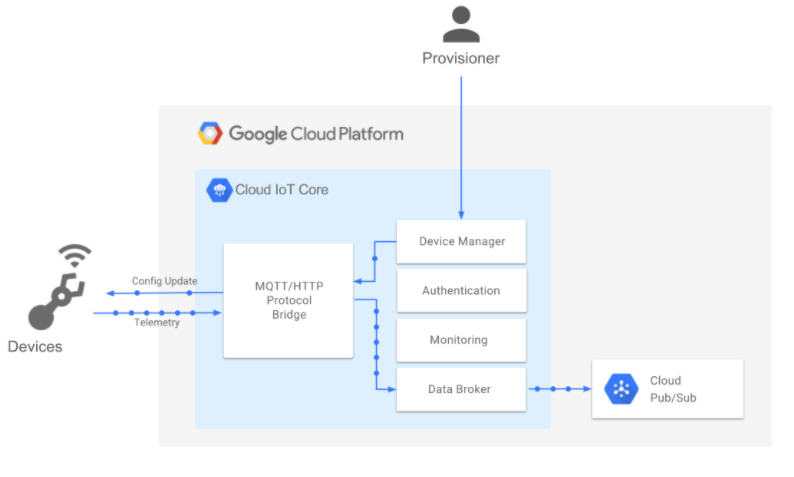

# Cloud IoT Core

### Key concepts

- Internet of Things (IoT)
  - A collective term for the physical objects that are connected to the internet (directly or indirectly) and can exchange data without user involvement.
- Device
  - A "Thing" in the "Internet of Things"
- Telemetry
  - All event data (for example, measurements about the environment) sent from devices to the cloud
- Device state
  - An arbitrary, user-defined blob of data that describes the current status of the device. Device state data can be structured or unstructured, and flows only in the device-to-cloud direction.
- Device configuration
  - An arbitrary, user-defined blob of data used to modify a device's settings. Configuration data can be structured or unstructured, and flows only in the cloud-to-device direction.
- Device registry
  - A container of devices with shared properties. You "register" a device with a service (like Cloud IoT Core) so that you can manage it (see the next item in this list).
- Device manager
  - The service you use to monitor device health and activity, update device configurations, and manage credentials and authentication.
- MQTT
    - An industry-standard IoT protocol (Message Queue Telemetry Transport). MQTT is a publish/subscribe (pub/sub) messaging protocol.

### Components

- device manager
  - for registering devices with the service, so you can then monitor and configure them
- protocol bridges (MQTT and HTTP)
  - devices can use to connect to Google Cloud Platform

