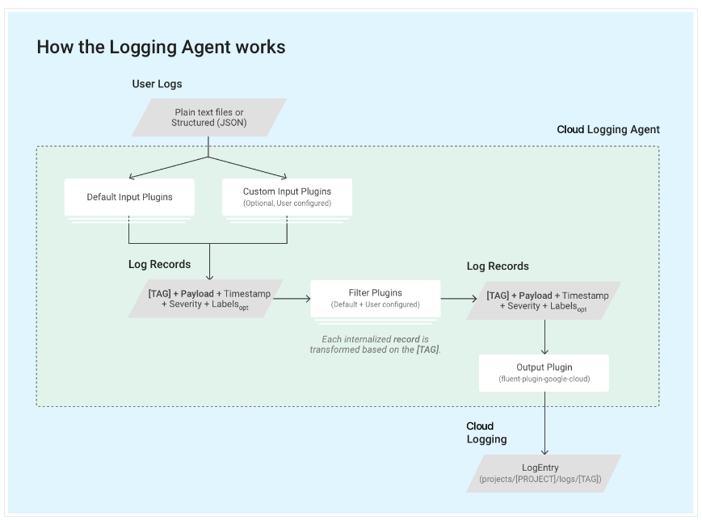

# Stackdriver

- __Cloud Monitoring__ collects metrics, events, and metadata from Google Cloud, Amazon Web Services (AWS), hosted uptime probes, and application instrumentation
- Using the BindPlane service, you can also collect this data from over 150 common application components, on-premise systems, and hybrid cloud systems
  - BindPlane is included with your Google Cloud project at no additional cost. 
- Google Cloud's operations suite ingests that data and generates insights via dashboards, charts, and alerts

## Basic Concepts

### Google Cloud projects and other resources

- Logs are associated primarily with Google Cloud projects, although other Google Cloud resources, such as organizations, folders, and billing accounts, can also have logs.

### Log entries

- records status or describes specific events or transactions that take place in computer systems.
- written by
  - your own code
  - Google Cloud services the code is running on
  - third-party applications
  - the infrastructure that Google Cloud depends on
- a log entry is analogous to a line in a log file and can be considered the basic unit of logging
- Google Cloud project receives log entries when
  - you begin to use the services that produce log entries, like Compute Engine or BigQuery
  - you connect Cloud Monitoring to AWS
  - when you install the Logging agent on your VM instances
  - when you call the entries.write method in the Logging API.
- A log entry minimally consists of:
  - A timestamp
  - The monitored resource that produced the log entry
  - A payload, also known as a message, either provided as unstructured textual data or as structured textual data in JSON format
  - The name of the log to which it belongs
- also carry associated metadata. Such metadata might include the severity for each associated log entry.

### Logs

- named collection of log entries within a Google Cloud resource
- exist only if they contain log entries
- identified by the full path of the resource to which the log entries belong, followed by a simple log ID, like syslog, or a structured ID that includes the log's writer
  - like `compute.googleapis.com/activity.`

### Retention period

- Log entries are held in Cloud Logging for a limited time known as the retention period
- The retention periods for different types of logs are listed in Logging Quotas and limits
- You can configure the retention periods of some of your logs
- you can backup your logs

### Monitored resources

- Each log entry indicates where it came from by including the name of a monitored resource

### Queries

- A query is an expression in the Logging query language
- used in the Logs Explorer and the Logging API to select log entries

### Logs Router

- All logs are sent to the Cloud Logging API where they pass through the Logs Router
- The Logs Router checks each log entry against existing rules to determine
  - which log entries to ingest (store)
  - which log entries to include in exports
  - which log entries to discard.


### Exporting logs using sinks

- Log entries received by Logging can be routed to Cloud Storage buckets, BigQuery datasets, and Pub/Sub topics.
- You export logs by configuring log sinks
- A sink includes a destination and a filter that selects the log entries to export

### Logs-based metrics

- Metrics are a feature of Cloud Monitoring
- A logs-based metric is a metric whose value is the number of log entries that match a query that you specify

### Access control

- Most logs can be read by any member with the IAM Viewer role
- To read Data Access audit logs or Access Transparency logs, the member requires either the IAM Owner role or a custom role with special permissions

## Using exported logs

- object called a sink
  - can be create in
    - Google Cloud projects
    - organizations
    - folders
    - billing accounts.
  - contain
    - filter
    - destination options:
      - Cloud Storage: JSON files stored in Cloud Storage buckets.
        - files are organized in directory hierarchies by log type and date (`my-gcs-bucket/syslog/YYYY/MM/DD/`)
        - The leaf directories (DD/) contain multiple files, each of which holds the exported log entries for a time period specified in the file name (`08:00:00_08:59:59_S0.json`, `08:00:00_08:59:59_S1.json`)
        - A single Cloud Storage bucket can contain logs from multiple resource types.
        - Logging doesn't guarantee deduplication of log entries from sinks containing identical or overlapping queries
      - BigQuery: Tables created in BigQuery datasets.
        - it might take several minutes before the first log entries appear in the new table. Subsequent log entries usually appear within a minute
        - Logging creates dated tables to hold the exported log entries `syslog_20170523`
        - table schemas for exported logs are based on the structure of the LogEntry type and the contents of the log payloads
        - table schema used to represent complex log entry payloads can be confusing and, in the case of exported audit logs, some special naming rules are used
      - Pub/Sub: JSON messages delivered to Pub/Sub topics. Supports third-party integrations, such as Splunk, with Logging.
        - The data field of each message is a base64-encoded LogEntry object
        - third party can receive your logs by subscribing to the same topic.
      - Another Google Cloud Cloud project: Log entries held in Cloud Logging logs buckets.
- Exported logs availability
  - If there aren't any exported logs, check the export system metrics
  - The export system metrics can tell you how many log entries are exported and how many are dropped due to errors
- Late-arriving log entries
  - Exported log entries are saved to Cloud Storage buckets in hourly batches. It might take from 2 to 3 hours before the first entries begin to appear. Exported log file shards with the suffix An ("Append") hold log entries that arrived late.
  - If the export destination experiences an outage, then Cloud Logging buffers the data until the outage is over.


## Logging agent

- Cloud Logging agent is an application based on fluentd that runs on your virtual machine (VM) instances



- In its default configuration, the Logging agent streams logs from common third-party applications and system software to Logging
  - You can configure the agent to stream additional logs
- If you are running specialized logging workloads that require higher throughput and/or improved resource-efficiency compared to the standard Cloud Logging agent, consider using the Ops agent.
- Supported operating systems:
  - CentOS 6, 7, and 8
  - Debian 9 "Stretch" and 10 "Buster"
  - Red Hat Enterprise Linux 6, 7, and 8
  - Ubuntu LTS 16.04 (Xenial Xerus), LTS 18.04 (Bionic Beaver), LTS 20.04 (Focal Fossa), and 20.10 (Groovy Gorilla)
  - Ubuntu Minimal LTS 16.04 (Xenial Xerus), LTS 18.04 (Bionic Beaver), LTS 20.04 (Focal Fossa), and 20.10 (Groovy Gorilla)
  - SUSE Linux Enterprise Server 12 SP3, 12 SP2 for SAP, 12 SP3 for SAP, 15, 15 for SAP, and 15 SP1 for SAP
  - Windows Server 2008 R2, 2012 R2, 2016, and 2019
  - Windows Server Core 2008 R2, 2012 R2, 2016, and 2019
  - Windows Server Core, version 1809, 1903, 1909
  - Amazon Linux AMI (except Amazon Linux 2.0 AMI)

- Supported environments
  - Compute engine
    - sends the logs to the project associated with each VM
    - For instances without external IP addresses, you must enable Private Google Access to allow the Logging agent to send logs.
  - Amazon Web Services Elastic Compute Cloud (AWS EC2) instances
  - App Engine standard environment instances
    - built-in support
  - App Engine flexible environment
  - Google Kubernetes Engine node instances
  - For instances running on Anthos clusters on VMware, the agent collects system logs but doesn't collect application logs.
  - Cloud Run
    - built-in support
  - Cloud Functions HTTP and background functions
    - built-in support
  - Support for on-premise and hybrid clouds
    - Google Cloud partners with Blue Medora to provide logging services for on-premise and hybrid cloud platforms in a consistent and predictable way
    - Blue Medora's Bindplane integrates with Cloud Logging 

- Running the agent requires access to the following DNS names:
  - OAuth2 token server: oauth2.googleapis.com
  - Logging APIs: logging.googleapis.com
  - (Linux) Google Cloud package repository: packages.cloud.google.com
  - (Windows) Google download server: dl.google.com
  - 
- google-fluentd, is a modified version of the fluentd log data collector. google-fluentd is distributed in two separate packages. The source code is available from the associated GitHub repositories

## Cloud Audit Logs

- provides the following audit logs for each Cloud project, folder, and organization:
  - Admin Activity audit logs
    - entries for API calls or other administrative actions that modify the configuration or metadata of resources
    - you can't configure or disable them
    - no charge
  - Data Access audit logs
    - API calls that read the configuration or metadata of resources
    - user-driven API calls that create, modify, or read user-provided resource data
    - do not record the data-access operations on resources that are publicly shared
    - disabled by default because they can be quite large
    - might result in your Cloud project being charged
  - System Event audit logs
    - Google Cloud administrative actions that modify the configuration of resources
    - can't configure or disable them
    - no charge
  - Policy Denied audit logs
    - when a Google Cloud service denies access to a user or service account because of a security policy violation
    - generated by default and your Cloud project
    - charged for the logs storage
- "who did what, where, and when?" 
- Publicly available resources that have the Identity and Access Management policies allAuthenticatedUsers or allUsers don't generate audit logs
- Every audit log entry in Cloud Logging is an object of type LogEntry
  - What distinguishes an audit log entry from other log entries is the protoPayload field; this field contains an AuditLog object that stores the audit logging data.
- The following are the audit log names; they include variables for the identifiers of the Cloud project, folder, or organization:
```
   projects/PROJECT_ID/logs/cloudaudit.googleapis.com%2Factivity
   projects/PROJECT_ID/logs/cloudaudit.googleapis.com%2Fdata_access
   projects/PROJECT_ID/logs/cloudaudit.googleapis.com%2Fsystem_event
   projects/PROJECT_ID/logs/cloudaudit.googleapis.com%2Fpolicy

   folders/FOLDER_ID/logs/cloudaudit.googleapis.com%2Factivity
   folders/FOLDER_ID/logs/cloudaudit.googleapis.com%2Fdata_access
   folders/FOLDER_ID/logs/cloudaudit.googleapis.com%2Fsystem_event
   folders/FOLDER_ID/logs/cloudaudit.googleapis.com%2Fpolicy

   organizations/ORGANIZATION_ID/logs/cloudaudit.googleapis.com%2Factivity
   organizations/ORGANIZATION_ID/logs/cloudaudit.googleapis.com%2Fdata_access
   organizations/ORGANIZATION_ID/logs/cloudaudit.googleapis.com%2Fsystem_event
   organizations/ORGANIZATION_ID/logs/cloudaudit.googleapis.com%2Fpolicy
```
- You can export audit log entries to Cloud Logging or to certain Google Cloud services.
  - create a logs sink
- Individual audit log entries are kept for a specified length of time and are then deleted. You cannot otherwise delete or modify audit logs entries
  - For longer retention, you can export audit log entries
  - You can also configure Cloud Logging to retain your logs between 1 day and 3650 days
- Audit logs record the identity that performed the logged operations on the Google Cloud resource
  - caller's identity is held in the AuthenticationInfo field of AuditLog objects
  - caller's principal email address is redacted from audit logs if all of these conditions are met:
    - This is a read-only operation.
    - The operation fails with a "permission denied" error.
    - If the identity is a service account, and the identity isn't a member of the Google Cloud organization associated with the resource. If the identity isn't a service account, then this condition doesn't apply.
  - In addition to the conditions listed above, the following applies to certain Google Cloud products:
    - Legacy App Engine API: Identities are not collected at all.
    - BigQuery: Caller identities and IP addresses, as well as some resource names, are redacted from the audit logs, unless certain conditions are met. For details, go to BigQuery audit logs overview.