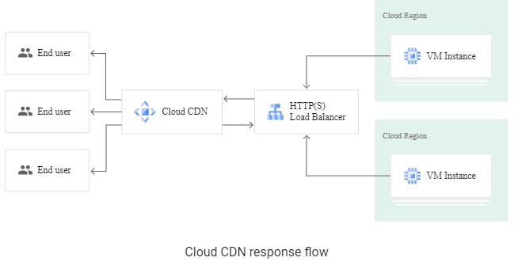
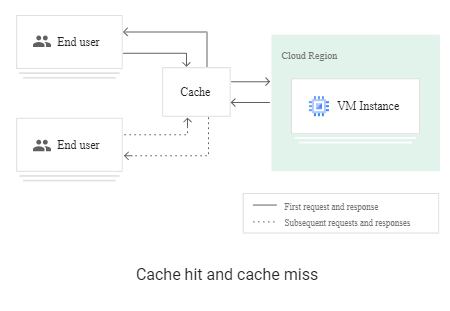
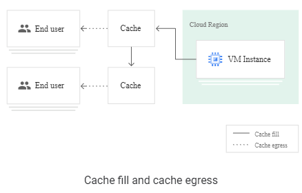

# Cloud CDN (Content Delivery Network) 
https://cloud.google.com/cdn/docs/overview

- uses Google's global edge network to serve content closer to users
- works with external HTTP(S) Load Balancing
- content can be sourced from various types of backends (also called origin servers):
  - Instance groups
  - Zonal network endpoint groups (NEGs)
  - Serverless NEGs: One or more App Engine, Cloud Run, or Cloud Functions services
  - Internet NEGs, for endpoints that are outside of Google Cloud (also known as custom origins)
  - Buckets in Cloud Storage

### How Cloud CDN works

- When a user requests content from an external HTTP(S) load balancer, the request arrives at a Google Front End (GFE)
- If the load balancer's URL map routes traffic to a backend service or backend bucket that has Cloud CDN configured -> GFE uses Cloud CDN.

#### Cache hits and cache misses

- A cache is a group of servers that stores and manages content so that future requests for that content can be served faster
  - a copy of cacheable content that is stored on origin servers
- cache hit
  - If the GFE looks in the Cloud CDN cache and finds a cached response to the user's request, the GFE sends the cached response to the user
  - When a cache hit occurs
    - GFE looks up the content by its cache key
    - responds directly to the user
    - shortening the round-trip time and saving the origin server from having to process the request.
- cache miss
  - first time that a piece of content is requested
  - GFE determines that it can't fulfill the request from the cache
  - GFE might attempt to get the content from a nearby cache
    - GFE sends the content to the first cache by using cache-to-cache fill
    - Otherwise, the GFE forwards the request to the external HTTP(S) load balancer
    - 

### Cache egress and cache fill
- If the origin server's response to this request is cacheable, Cloud CDN stores the response in the Cloud CDN cache for future requests.
- Data transfer from a cache to a client is called cache egress

### No URL redirection

- Cloud CDN doesn't perform any URL redirection. The Cloud CDN cache is located at the GFE

### Cache hit ratio

- percentage of times that a requested object is served from the cache
- cache hit ratio is reported for each origin in the Cache hit ratio column

### Inserting content into the cache

- an object is stored in a particular cache if a request goes through that cache and if the response is cacheable
- You cannot preload caches except by causing the individual caches to respond to requests

### Serving content from a cache

- After you enable Cloud CDN, caching happens automatically for all cacheable content

### Removing content from the cache

- To remove an item from a cache, you can invalidate cached content

### Cache bypass

- To bypass Cloud CDN, you can request an object directly from a Cloud Storage bucket or a Compute Engine VM

### Eviction and expiration

- Eviction
  - Every cache has a limit on how much it can hold
  - To insert content into a full cache, the cache first removes something else to make room
    - this is called evition
  - Caches are usually full
  - generally evict content that hasn't recently been accessed
  - Setting an expiration time doesn't affect eviction.
  - As with all large-scale caches, content can be evicted unpredictably
- Expiration
  - Content in HTTP(S) caches can have a configurable expiration time
  - informs the cache not to serve old content

### Requests initiated by Cloud CDN

- When your origin server supports byte range requests, Cloud CDN can send multiple requests to the origin server in reaction to a single client request. As described in Support for byte range requests, Cloud CDN can initiate two types of requests: validation requests and byte range requests.

### Data location settings of other Cloud Platform Services

-  data may be stored at serving locations outside of the region or zone of your origin server

### Support for Google-managed SSL certificates

- You can use Google-managed certificates when Cloud CDN is enabled.

### Google Cloud Armor with Cloud CDN

- security policies are enforced only for requests for dynamic content, cache misses, or other requests that are destined for your origin server
- Cache hits are served even if the downstream Google Cloud Armor security policy would prevent that request from reaching the origin server