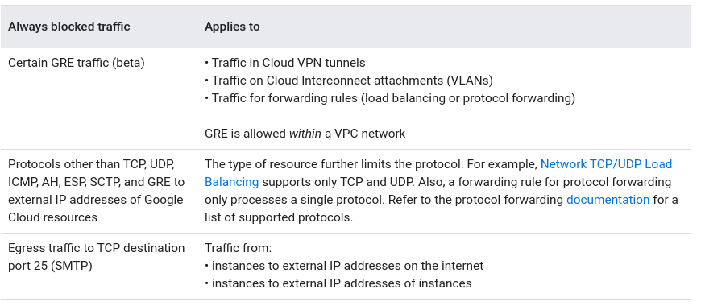

## Firewall rules
- Apply to given project and network
- For rules accross an organization, use Firewall Policies
- Can be create via GC Console, gcloud and REST API
- Applied to all egress and ingress traffic, even if within network
- Some traffic is blocked regardless of firewall rules
- Firewall rules logging
### Specifications
- Each firewall rule applies to ingress or egress, not both
- IPv4 only
- Action is either allow or deny
- Firewall rules are associated with a VPC network
  - not shared among VPC networks including connect by VPC Network Peering or using Cloud VPN tunnels
- VPC firewall rules are stateful:
  - Return traffic matching allowed connection is also allowed
  - Return traffic must match the 5-tuple (source and dest IPs and ports, protocol)
  - Connection tracking table
  - GCP implements connection tracking regardless of whether the protocol supports is
  - Tracking state is considered active if at least one packet is sent every 10 min
- VPC firewall rules do not reassemble fragmented TCP packets. Firewall rule can olny apply to the first fragment, because it contains the TCP header
- Maximum number of tracked connections depends on number of stateful connections supported by machine type (130,000 per vCPU (1-8vCPUs))
###  Implied rules
- Every VPC has two implied firewall rules, that cannot be deleted, but overridden:
  - allow most egress traffic
  - deny all ingress traffic
### Pre-populated rules in default network
- `default-allow-internal`
- `default-allow-ssh`
- `default-allow-rdp`
- `default-allow-icmp`
### Always blocked traffic:

### Always allowed traffic:
- DHCO
- DNS resolution
- Instance metadata
- Network Time Protocol
### GKE firweall rules
Google Kubernetes Engine creates firewall rules automatically when creating the following resources:
- GKE clusters
- GKE Services
- GKE Ingresses

### Firewall rule components:
- direction of connecition (ingress, if not set)
- numerical priority (0-65535) (deny overrides allw if same priority)
- action or match (allow or deny)
- enforcement status (enabled or disabled)
- target (all instances/ instances by network tag/ instances by service account)
- source (range of IPv4 / instances by network tag/ instances by service account)
  - alias IP ranges not included
- protocol (all protocols, if not set)
  - destination ports can be assigned in addition to protocol (if protocol suports it)
  - source ports are not supported
  - multiple protocols can be assigned to firewall rule: `icmp,tcp:80 tcp:443 udp:67-69`
#### Service accounts vs network tag
- Network tag is an arbitrary attribute, any IAM member who can edit an instance can edit it
- A service account represents an identity associated with an instance
- To change service account associated with an instance  needs stopping and restarting it, adding or removing tags don't
- Service account firewall rules apply to GKE node, not GKE Pod
### Firewall Rules Logging
- Enabled individually for each rule
- Records of allowed or denied connections can be viewed in Cloud Logging
- Source and destination IPs, protocol and ports, date and time, reference to firewall rule applied
- available for firewall rules and firewall policies
- Available to VPC networks
- Available only to TCP and UDP protocols
- Cannot be eenabled to implied rules
- Number of logged connections per time interval depends on machine type
- Changes to firewall tules can be viewed in VPC audit logs
- Log format:
  - Log records contain base fields, which are the core fields of every log record, and metadata fields that add additional information. You can control whether metadata fields are included. If you omit them, you can save on storage costs.