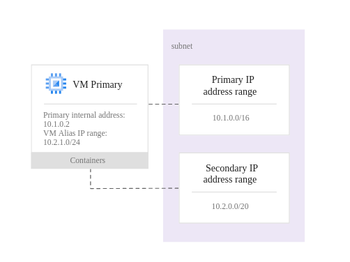

# IP Addresses
- Each VM instance can have one primary internal IP address, one or more secondary IP addresses
- Both external and internal primary IP addresses can be either ephemeral or static
- A forwarding rule is required for network, global, and internal load balancing. The forwarding rule must have an external or internal IP address, depending on the load balancer you are using.

## External IP addresses
- Needd to send and receive traffic directly to and from outside the network
- Types:
  - Static external IP address
    - global
      - avalilable only to global forwarding rules, used for global load balancing
      - cannot be assigned to regional or zonal resource (like VM instances)
    - regional
  - Ephemeral externa IP address
    - Attached to a VM instance only until the VM is stopped and restarted or the instance is terminated
    - can be promoted to static
- To assign multiple external IP addresses to a single instance, you can set up multiple forwarding rules to point to a single target instance using protocol forwarding

## Primary internal IP addresses
- Accessible from other instances within the same network or from a linked network
- Types:
  - Static internal IP addresses
  - Ephemeral internal IP addresses

## Internal DNS names
- Between instances in the same VPC network, you can send packets to an instance by specifying the fully qualified DNS name (FQDN) of the target instance.
- FQDN formats
  - Instances using zonal DNS: `[INSTANCE_NAME].[ZONE].c.[PROJECT_ID].internal`
  - Instances using global DNS: `[INSTANCE_NAME].c.[PROJECT_ID].internal`

## Alias IP ranges

- Useful if you have multiple services running on a VM and you want to assign each service a different IP address. Alias IP ranges also work with GKE Pods.
- Can be allocated from subnet primary or secondary ranges
  - Secondary subnet ranges merely provide an organizational tool (separate infrastructure IPs from containers IPs, for example)
- No need for separate network interface
- VMs can have multiple IP alias ranges
- Alias IP addresses can be configured in the VM OS manually or by using scripts
- For a VM network interface, the alias IP must be from the same subnet resource that provides the IP address for the primary network interface
- An alias IP range can be configured as an explicit CIDR range (for example, 10.128.1.0/24), a single IP address (for example, 10.128.7.29), or as a netmask (/24).

### Benefits:
- When alias IP ranges are configured, Google Cloud automatically installs Virtual Private Cloud (VPC) network routes for primary and alias IP ranges for the subnet of the primary network interface. Your container orchestrator does not need to specify VPC network connectivity for these routes
- When container IP addresses are allocated by Google Cloud, validation processes in Google Cloud ensure that container pod IP addresses do not conflict with VM IP addresses
- When alias IP addresses are configured, anti-spoofing checks are performed against traffic, ensuring that traffic exiting VMs uses VM IP addresses and pod IP addresses as source addresses
  - anti-spoofing checks would be disabled if IP forwarding was enabled
- Alias IP ranges are routable within the Google Cloud virtual network without requiring additional routes
- Alias IP addresses can be announced by Cloud Router to an on-premises network connected via VPN or Interconnect

### Alias IP addresses in auto mode VPC networks and subnets
- Secondary ranges are not asigned to subnets automatically
- Alias IP addresses can be asgined from:
  - Subnet primary ranges
  - Manually added subnet secondary range
  - New manually created subnet

### DNS with alias IP addresses
- Google Cloud does not associate alias IP addresses on the primary interface with the host name, and it does not associate any IP addresses of secondary interfaces with the host name.
- You can manually configure DNS to associate other IP addresses.

### Firewalls
- All ingress or egress traffic, including traffic for Alias IP ranges, is evaluated by a VPC firewall rule for a matching target tag or target service account
- Alias IP ranges are not included when you specify sources for an ingress firewall rule using source tags or source service accounts

### Static routes
In a static route, the next-hop IP address must be the primary IP address of the virtual machine instance. An alias IP address is not supported as the next-hop IP address

### VPC Networ
- Both primary and secondary IP ranges of a subnet are reachable by VM instances in a peered network.
- Subnet overlap checks across peered networks ensure that primary and secondary ranges do not overlap with any peered ranges.k Peering
