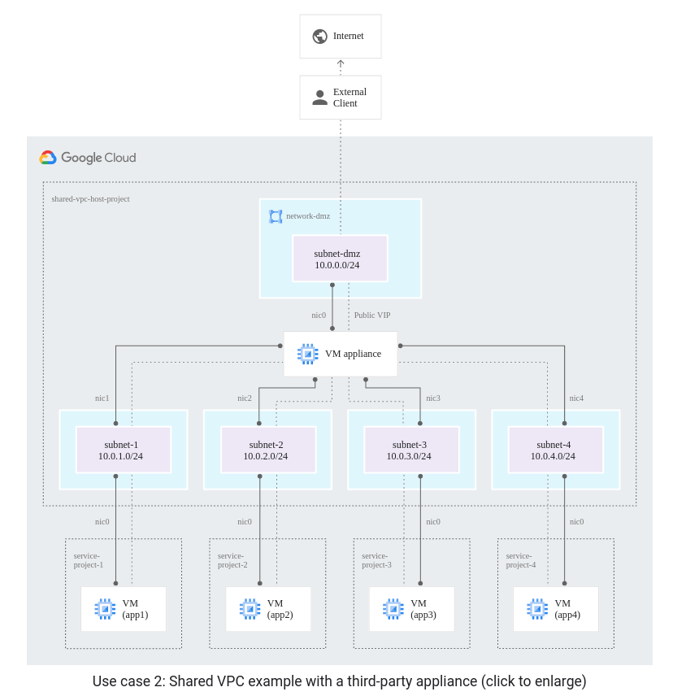
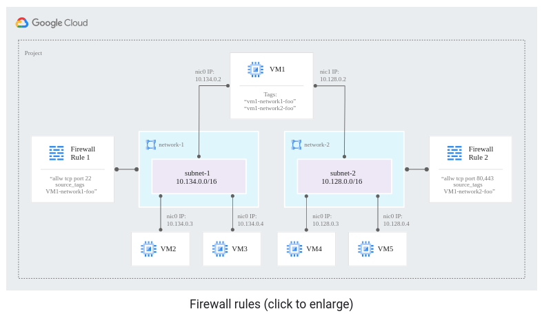

# Multiple network interfaces
- You can create additional network interfaces attached to your VMs, but each interface must attach to a different VPC network
- Multiple network interfaces enable you to create configurations in which an instance connects directly to several VPC networks
- 1 NIC per vCPU, with minimum of 2 NICs and a maximum of 8 NICs
- Typically, you might require multiple interfaces if you want to configure an instance as a network appliance that does load balancing, Intrusion Detection and Prevention (IDS/IPS), Web Application Firewall (WAF), or WAN optimization between networks.
- Multiple network interfaces are also useful when applications running in an instance require traffic separation, such as separation of data plane traffic from management plane traffic.
- Use Cases:
  - __Network and security function:__ Multiple network interfaces enable virtualized network appliance functions such as load balancers, network address translation (NAT) servers, and proxy servers that are configured with multiple network interfaces. See Example 1: Networking and security virtual appliances for more details.
  - __Perimeter and DMZ isolation:__ An important best practice in tiered networking architectures is to isolate public-facing services from an internal network and its services. Use multiple network interfaces to create configurations where there are separate network interfaces on the instance, one of them accepting public-facing traffic and another handling backend private traffic that has more restrictive access controls.

## Additional operational details
- Any interface on the VM can be connected to the Shared VPC network
- internal DNS query resolves to the primary interface (nic0) of the instance
  - If the nic0 interface of the instance belongs to a VPC network different from the VPC network of the instance issuing the internal DNS query, the query will fail.
  - Private Compute Engine DNS records are not generated per interface.
- In a default multiple interface configuration, the OS is configured to use DHCP
  - Unless manually configured otherwise, any traffic leaving an instance for any destination other than a directly connected subnet will leave the instance using the default route on eth0
- When a VM instance has multiple interfaces and a network tag, the network tag might not impact all of the VM's interfaces. A VM's network tag impacts an interface if the interface is in a VPC network that contains a custom static route with a matching tag.
- If you choose to use tags with routes, note that tags are applied at the instance level and, as such, tags apply to all interfaces of a virtual machine instance. If this is not desirable, you set up your configuration so that only certain tags are used in routes in a given VPC network, effectively ensuring those tags only apply to the interfaces associated with the specific VPC network.
- Except for Internal TCP/UDP Load Balancing, all Google Cloud load balancers only distribute traffic to the first interface (nic0) of a backend instance.
- Each VPC network has its own set of firewall rules. If an instance's interface is in a particular VPC network, that network's firewall rules apply to that interface.
  - Ingress firewall rules can use either network tags or service accounts to identify sources, targets (destinations), or both.
  - Egress firewall rules can use either network tags or service accounts to identify targets (sources).
