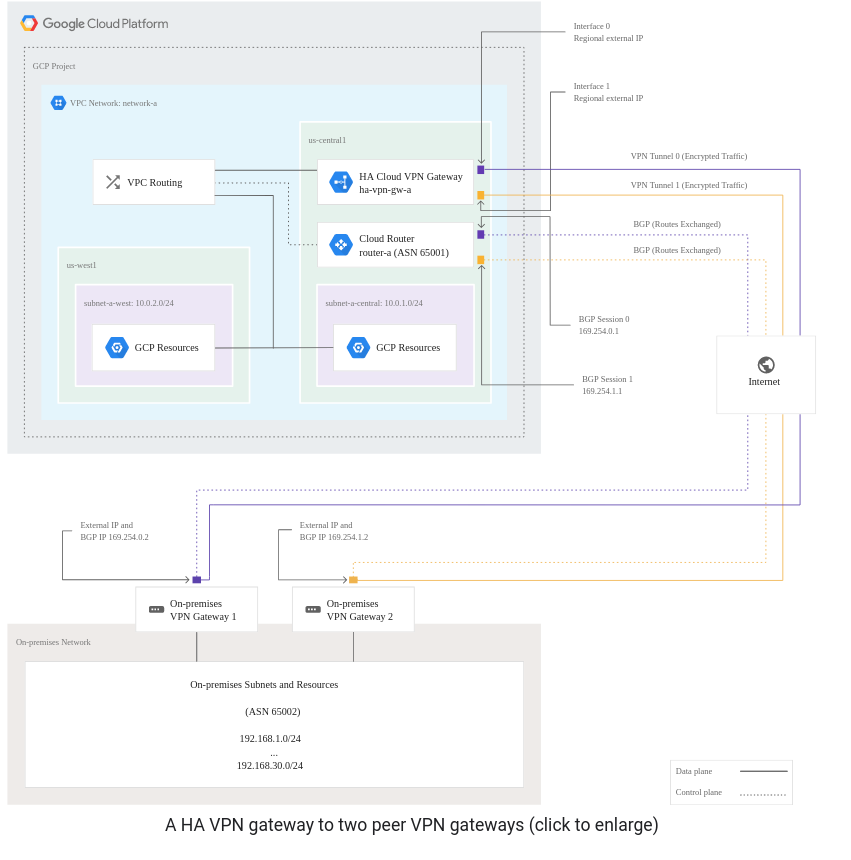
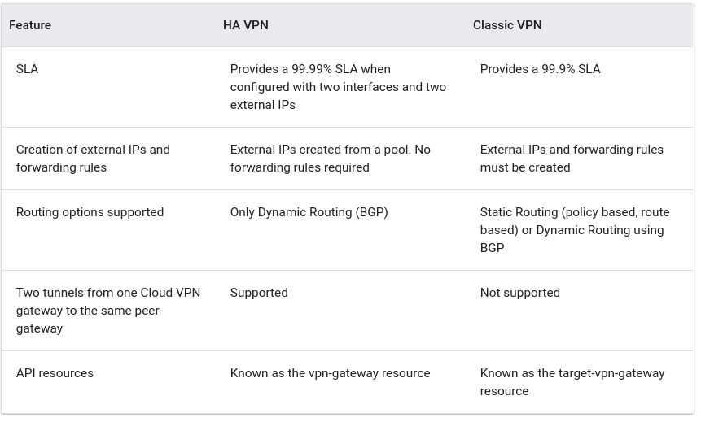
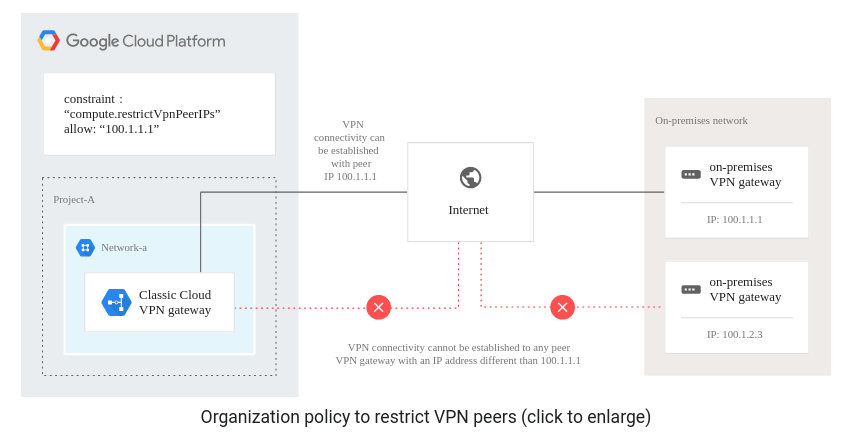
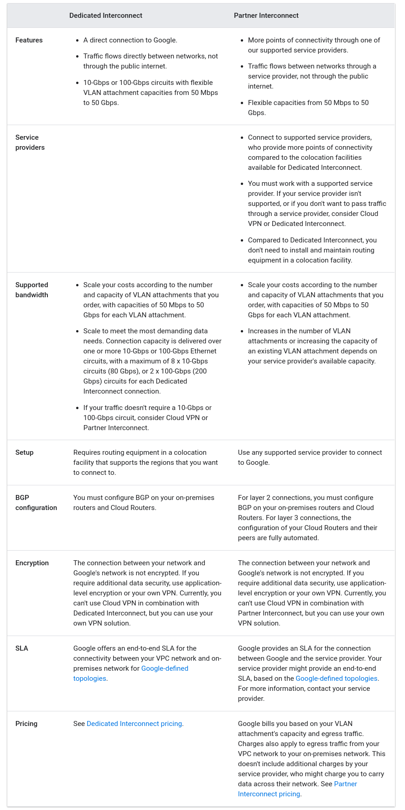
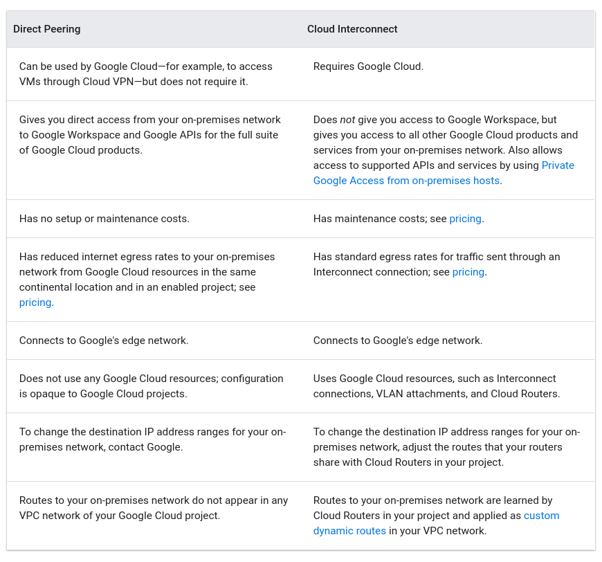
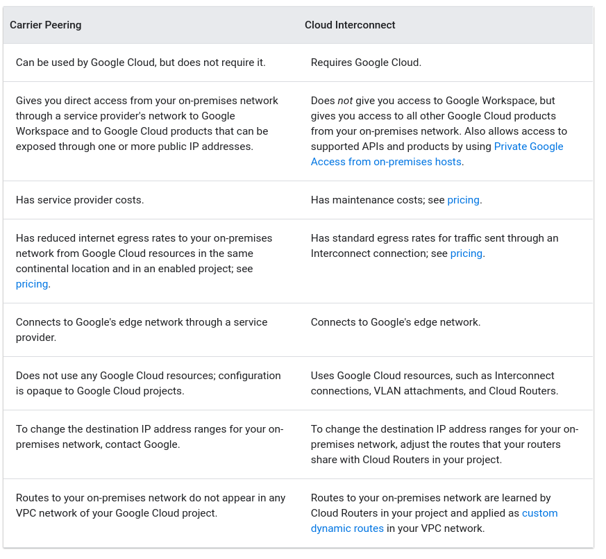

# Cloud VPN
https://cloud.google.com/network-connectivity/docs/vpn/concepts/overview
## High Availability (HA) Cloud VPM
- 99.99% service availability
-  HA VPN gateway has two external IP addresses, one for each of its fixed number of two interfaces
- Each of the HA VPN gateway interfaces supports multiple tunnels
- You can create multiple HA VPN gateways
- Google Cloud releases the IP addresses for reuse, when gateway is deleted
- You can configure an HA VPN gateway with only one active interface and one public IP address; however, this configuration does not provide a 99.99% service availability SLA.

Requirements:
- Only if both sides are Google Cloud gateways and are properly configured, end-to-end 99.99% availability is guaranteed
- To achieve high availability when both VPN gateways are located in VPC networks, you must use two HA VPN gateways, and both of them must be located in the same region.
- HA VPN rejects Google Cloud IP addresses when they are configured in an external VPN gateway resource
- You must configure two VPN tunnels from the perspective of the Cloud VPN gateway
- A peer VPN device must be configured with adequate redundancy
- Your peer VPN gateway device must support dynamic (BGP) routing

## Classic VPN
__Classic VPN is deprecating certain functionality on October 31, 2021.__
- support tunnels using dynamic (BGP) or static routing (route based or policy based)
- gateways have a single interface and a single external IP address
- SLA of 99.9% service availability

## Specifications
- Cloud VPN only supports site-to-site IPsec VPN connectivity
  - Cloud VPN doesn't support use cases where client computers need to "dial in" to a VPN using client VPN software
  - Cloud VPN only supports IPsec. Other VPN technologies (such as SSL VPN) are not supported
- Cloud VPN can be used with VPC networks and legacy networks
- For VPC, custom mode is recommended so that you have full control over the ranges of IP addresses
- Cloud VPN requires that the peer VPN gateway be configured to support prefragmentation
### Network bandwidth
- Each tunnel supports up to 375 MBps total for ingress and egress
- Factors that affect bandwidth:
  - The network connection between the Cloud VPN gateway and your peer gateway
  - Capabilities of your peer VPN gateway.
  - Packet size
  - Packet rate (250,000 packets per second (pps) maximum per tunnel)

### IPsec and IKE support
- Cloud VPN supports IKEv1 and IKEv2 using a shared secret (IKE pre-shared key) and these IKE ciphers.
- Cloud VPN supports ESP in tunnel mode with authentication, but does not support AH or ESP in transport mode.

## Cloud VPN as a transit network
- Do not use Cloud VPN tunnels to connect two or more on-premises networks for the sole purpose of passing traffic through a VPC network as a transit network
- Hub-and-spoke configurations like this are a violation of the Google Cloud Service Specific Terms.

Missing notes from remaining topics:
https://cloud.google.com/network-connectivity/docs/vpn/concepts/overview#active

# Cloud Interconnect
- transfer data between on-premises and VPC networks
- low latency, high availability 
- internal IP addresses are directly accessible from both networks
- Options:
  - Dedicated Interconnect
    - direct physical connection 
  - Partner Interconnect
    - through a supported service provider

## Benefits
- Traffic doesn't traverse the public internet
- No need to use a NAT device or VPN tunnel to reach internal IP addresses
- Can scale your connection capacity:
  - For Dedicated Interconnect:
    - 8 x 10-Gbps connections (80 Gbps total)
    - 2 x 100-Gbps connections (200 Gbps total)
  - For Partner Interconnect:
    - 50-Mbps to 50-Gbps VLAN attachments
- Dedicated Interconnect, Partner Interconnect, Direct Peering, and Carrier Peering can all help you optimize egress traffic from your VPC network and reduce your egress costs. Cloud VPN by itself does not reduce egress costs.
- You can use Cloud Interconnect with Private Google Access for on-premises hosts so that on-premises hosts can use internal IP addresses rather than external IP addresses to reach Google APIs and services

## Considerations
- If there is no need for low latency and high availability -> consider Cloud VPN
  - Secure
  - No overhead or costs associated with a direct and private connection
- Which VPC subnets are available depends on the dynamic routing mode of your VPC network
- The IP address spaces must not overlap
- The following configurations require that you create a custom route advertisement on your Cloud Router to direct traffic from your on-premises network to certain internal IP addresses through an Interconnect connection:
  - Configuring Private Google Access for on-premises hosts
  - Creating a Cloud DNS forwarding zone
  - Alternative name server network requirements
  - 
- You can create a hub-and-spoke linking of VPC networks and your on-premises network as long as you don't include more than one on-premises network.
  - a hub-and-spoke configuration that links two or more on-premises networks to each other by using a VPC network and VPNs or Cloud Interconnect is a violation of the Terms of Service.
- By default, any VPC network can use Cloud Interconnect.
  - To control which VPC networks can use Cloud Interconnect, you can set an organization policy

# Choosing a Network Connectivity product
Google Cloud products that provide network connectivity between your on-premises network and Google Cloud, or from Google Cloud to another cloud provider:
- Cloud VPN
- Dedicated Interconnect
- Partner Interconnect
- Cloud Router (Cloud Router isn't a connectivity option, but a service that works over Cloud VPN or Interconnect connections)

To access only Google Workspace or supported Google APIs:
- Direct Peering to directly connect (peer) with Google at a Google edge location
- Carrier Peering to connect through a supported peering partner

Comparison between Cloud Interconnect products

## Connecting to CDN providers
### CND Interconnect
- CDN Interconnect enables select third-party Content Delivery Network (CDN) providers to establish direct peering links with Google's edge network at various locations, which enables you to direct your traffic from your Virtual Private Cloud (VPC) networks to a provider's network
- CDN Interconnect enables you to optimize your CDN population costs and use direct connectivity to select CDN providers from Google Cloud.
- No setup needed for partner CDN providers
- Typical use cases:
  - High-volume egress traffic
  - Frequent content updates

## Connecting to Google Workspace and Google APIs

