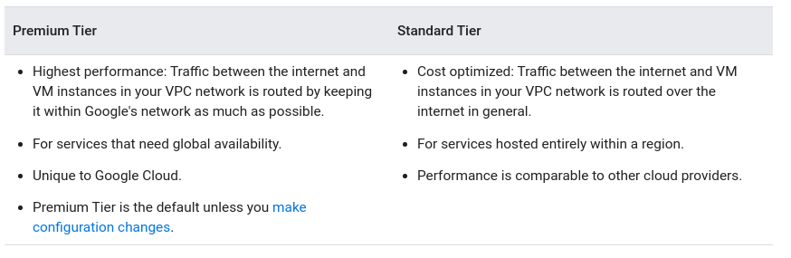
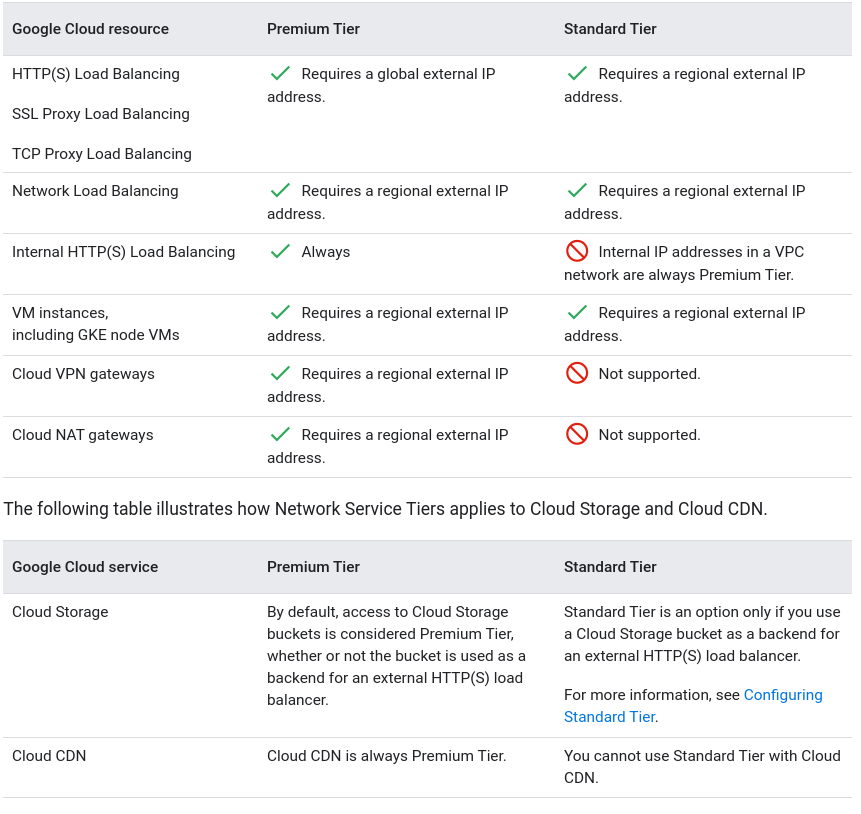
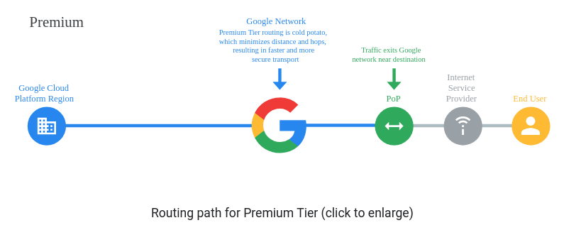
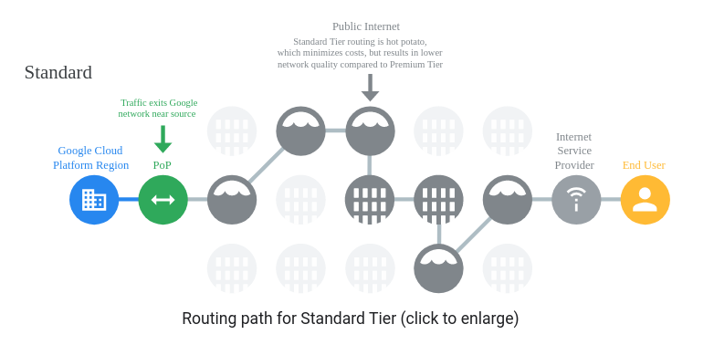

# Network Service Tiers
- Optimize connectivity between systems on the internet and your Google Cloud instances
  - Premium Tier delivers traffic on Google's premium backbone
    - highest perfomance
    - uses Google's low latency, highly reliable global network
    - supports both regional external IP addresses and global external IP addresses for VM instances and load balancers
    - global external IP addresses must use Premium Tier
    - Applications that require high performance and availability, such as those that use HTTP(S), TCP proxy, and SSL proxy load balancers with backends in more than one region, require Premium Tier
  - Standard Tier uses regular ISP networks
    - cost optimized
    - only to resources that use regional external IP addresses in given Google Cloud regions (most of them)

No notes taken for the remainning of the doc:
https://cloud.google.com/network-tiers/docs/overview#standard-and-storage