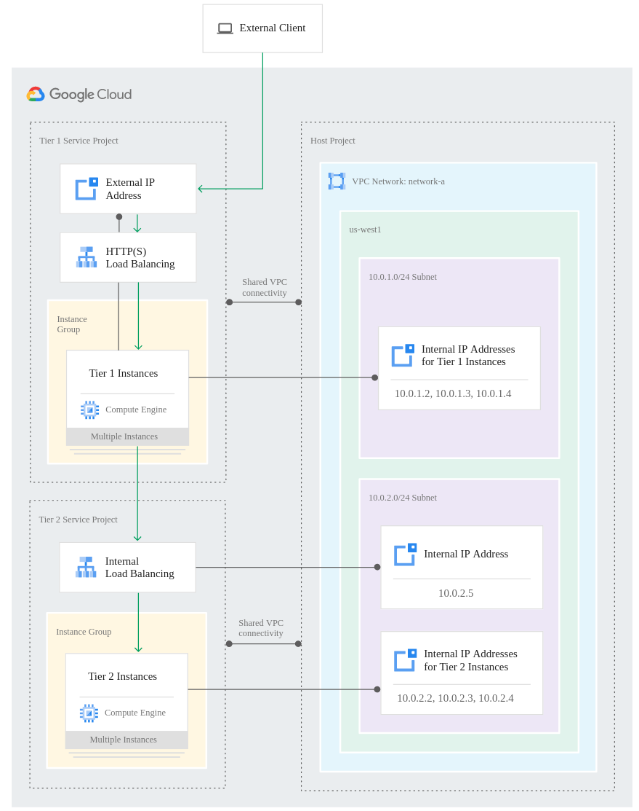

# Shared VPC

Allows an organization to connect resources from multiplo projects to a common VPC network.
- Host Project:
  - contains one or moreShared VPC networks
  - shared VPC admin can attach service projects to it
- Service projects:
  - eligible resources can use subnets in the Shared VPC network

Shared networks allows organizations to:
- Delegate responsabilities, while mantaining centralized control over network resources
- Implementat a security best practice of least privilege for network administration, auditing, and access control
- Apply and enforce consistent access control policies at the network level for multiple service projects
- Use service projects to separate budgeting or internal cost centers

### Concepts
- A project cannot be both a host and a service project simultaneously
- A service project can belong to only one host project
- Shared VPC can be either auto or custom mode, but not legacy
- When a host project is enabled, all of its existing VPC networks become Shared VPC networks

### Organization policy constraints
Organizations policies and IAM permissions work together to provide differente levels of access control
Organization policy administrators can specify the following Shared VPC contraints:
- Limit set of host projects to which non-host projects in a folder can be attached
  - does not affect existing attachments
- Specify the Shared VPC subnets a service project can access at the project, folder or organization level
  - does not affect existing resources

### Administrators and IAM
#### Required administrative roles
|Administrator (IAM role)| Purpose|
|-|-|
|Organization Admin (resourcemanager.organizationAdmin)| Nominate Shared VPC Adminis. Can define organization-level policies. Aditional roles for specific folder and project actions|
|Shared VPC Admin (compute.xpnAdmin and resourcemanager.projectIamAdmin)|Perform various tasks necessary to set up Shared VPC, such as enabling host projects, attaching service projects to host projects, and delegating access to some or all of the subnets in Shared VPC networks to Service Project Admins. A Shared VPC Admin for a given host project is typically its project owner as well. A Shared VPC Admin can link projects in two different folders only if the admin has the role for both folders.|
|Service Project Admin (compute.networkUser)|Service Project Admins also maintain ownership and control over resources defined in the service projects, so they should have the Instance Admin (compute.instanceAdmin) role to the corresponding service projects. They may have additional IAM roles to the service projects, such as project owner. __Project-level permissions__ or __Subnet-level permissions__|
#### Network and Security Admins
|Administrator|Purpose|
|-|-|
|Network Admin|Have full control over all network resources except for firewall rules and SSL certificates.|
|Security Admin| Security Admins manage firewall rules and SSL certificates.|

### Billing
- Rates and rules used to calculate billing amounts for resources in service projects using a Shared VPC network is the same as if the resources were located in the host project itself.
- Billing for egress traffic generated by a resource is attributed to the project where the resource is defined

### Resources
#### Eligible resources
- Compute Engine Instances
- Compute Engine Instance Templates
- Compute Engine Instance Groups
- Google Kubernetes Engine clusters
- Cloud Run (fully managed) services
- Cloud Functions
- App Engine standard environment services
- App Engine flexible environment instances
- Internal IP Addresses
  - Static internal and external IPs must be created in the same service project as the instance that uses it
- Internal DNS
  - the project ID portion of either the zonal or a global (project wide) internal DNS name is the ID of the service project
- Cloud DNS Private Zones
  - Must be created in the host project
- Load Balancing:
  - All components must be created in the same project (can be either a host or service project)
  - As it makes more sense to have the backend instances in a service project, the components will most likely be in a service project
- Memorystore for Redis
#### Ineligible resources
Deployment Manager can only manage resources within a single project, so using it in a Shared VPC scenario requires a specific setup.

#### Practical limitations for eligible resources
- Use of a Shared VPC network is not mandatory
- Some resources must be re-created in order to use a Shared VPC network
- If you create a VM instance with multiple network interfaces in the host project, you can reference subnets of any Shared VPC network on any network interface
