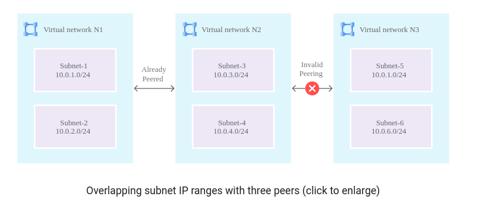
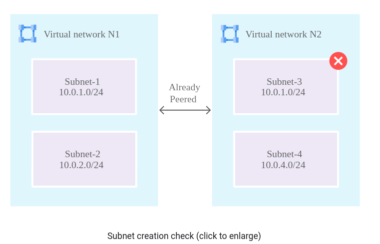
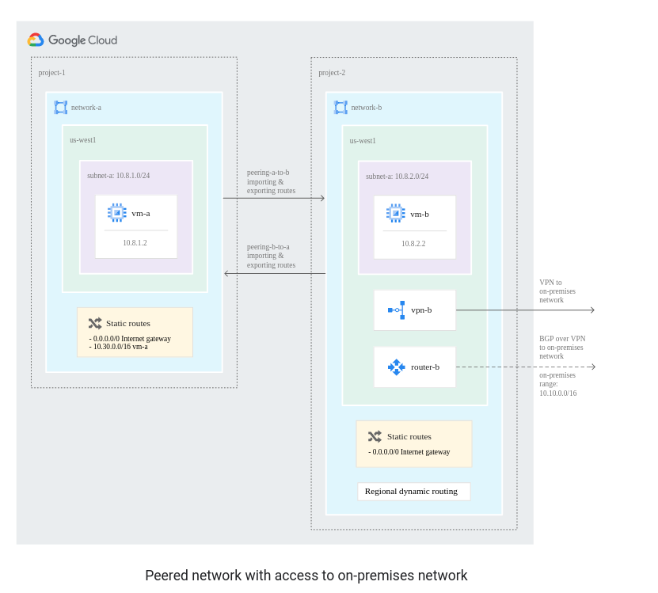
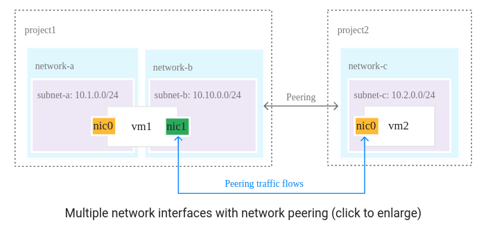
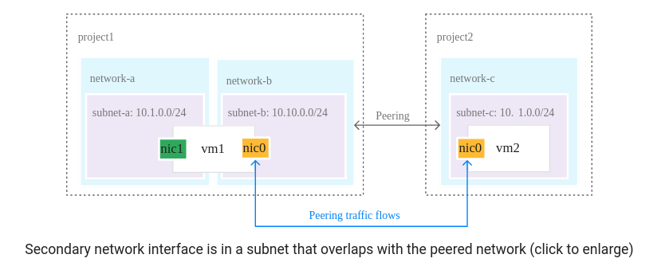
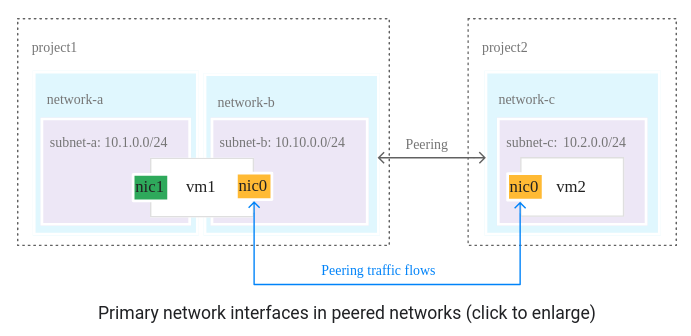
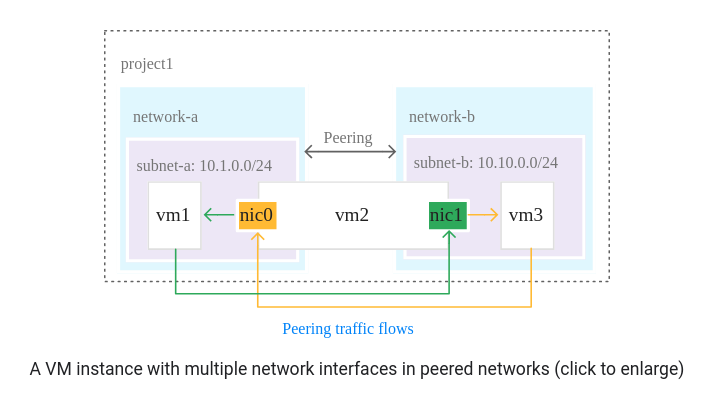

# VPC Network Peering
Allows connectivity across VPC networks regardless of whether they belong to the same project or organization

## Useful for:
- SaaS (Software-as-a-Service) ecosystems in Google Cloud. You can make services available privately across different VPC networks within and across organizations
- Organizations that have several network administrative domains that need to communicate using internal IP addresses
  
## Benefits over external IPs or VPNs:
- Lower network latency
- Higher network security
- Lower network cost

## Key Properties:
- Works with Compute Engine, GKE, App Engine flexible environment
- VPC networks remain administratively separate: Routes, firewalls, VPNs and other are administered separately
- Each side of peering is set up independently. Only active when the configuration from both sides matches.
- Always exchange subnet routes that don't use privately used public IP addresses (in that case it should be explicitly export and import)
- It is possible to exchange custom routes
- A VPC network can peer with multiple VPC networks, but there is a limit (25)
- Compute Network Admin (roles/compute.networkAdmin) role has permission for creating and deletin VPC Network Peering
- If you're an organization policy administrator, you can use an organization policy to constrain which VPC networks can peer with VPC networks in your organization.

## Restrictions:
- A subnet CIDR range in one peered VPC network cannot overlap with a static route in another peered network
- A dynamic route can overlap with a subnet route in a peer network. For dynamic routes, the destination ranges that overlap with a subnet route from the peer network are silently dropped. Google Cloud uses the subnet route.
- Only VPC networks are supported for VPC Network Peering. Peering is NOT supported for legacy networks
- You can't disable the subnet route exchange or select which subnet routes are exchanged. Firewalls should be used to restrict access
- Only directly peered networks can communicate. Transitive peering is not supported.
- Compute Engine internal DNS names created in a network are not accessible to peered networks
- By default, VPC Network Peering with GKE is supported when used with IP aliases. If you don't use IP aliases, you can export custom routes so that GKE containers are reachable from peered networks.

## Importing and exporting custom routes
### Benefits:
- If you have GKE clusters without VPC native addressing, you might have multiple static routes to direct traffic to VM instances that are hosting your containers
- If you have a VPN tunnel or interconnect, you can share custom routes so that peer networks can reach your on-premises network. For dynamic routes, you must add Cloud Router custom route advertisements in your VPC network to announce peered network subnets to your on-premises network.
### Considerations:
- Overlap check is for VPC subnet ranges only. Static and dynamic routes are not checked. If the peering goes forward, they are exported as they are
- Both static and dynamic routes are exported or imported. You can't choose to import or export only one type of route.
- Custom routes imported from one VPC network can't be exported to another peered VPC network transitively
- The following routes are excluded from being imported and exported:
  - Tagged routes are never exchanged between peer networks
  - Static routes with a next hop to the default Internet gateway are never exchanged
- Imported routes could lead to unintended changes to traffic flow
- When a VPC network imports custom routes from a peer network, the destination ranges are imported as-is. However, the next hop for an imported routes is set to the name of the peering connection. Traffic is routed to the peered network where the actual next hop is defined.

## Examples

## Multiple Network interface per VM instance
- Destination-based routing is the defauld:
  - any traffic that's not destined to any of the instance's subnets egresses from the primary network interface
- When you have peer networks that include VM instances with multiple network interfaces, you might need to change the default destination-based routing policy to a source-based routing policy

### Examples that require source-based routing policy

### Examples that does not require source-based routing policy

