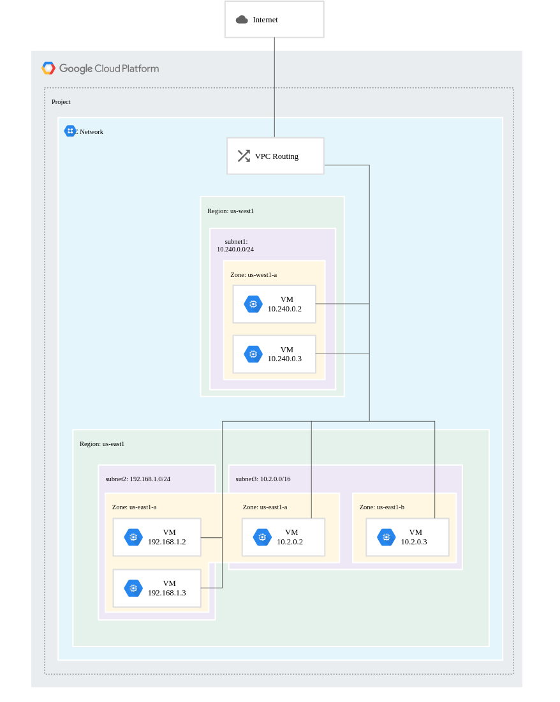
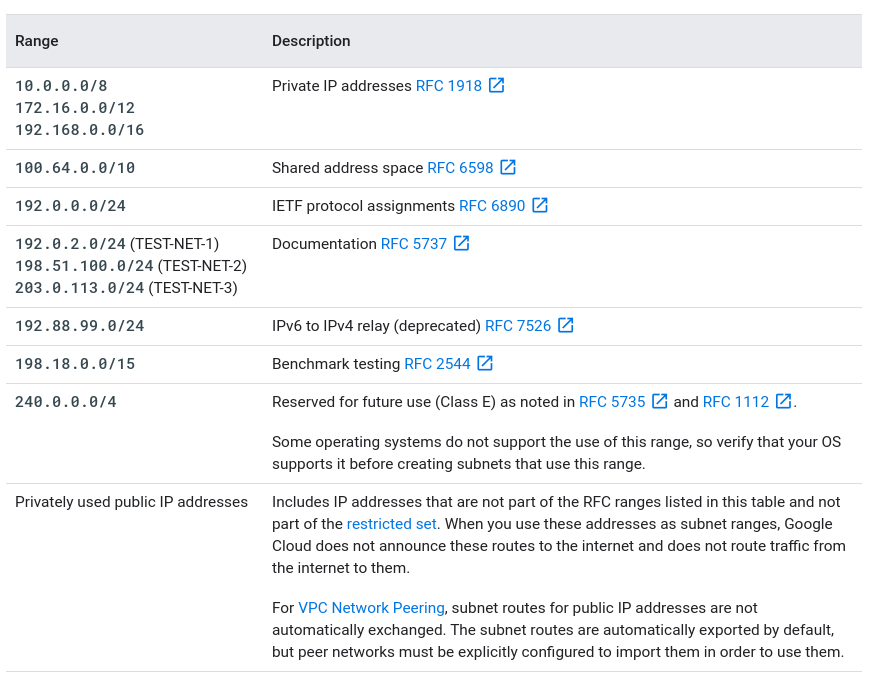
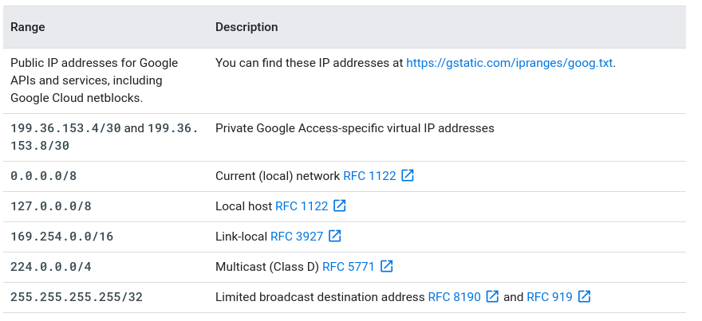
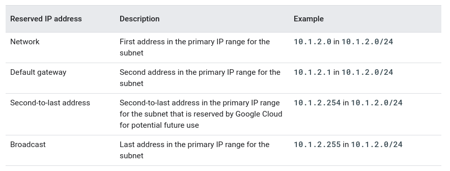
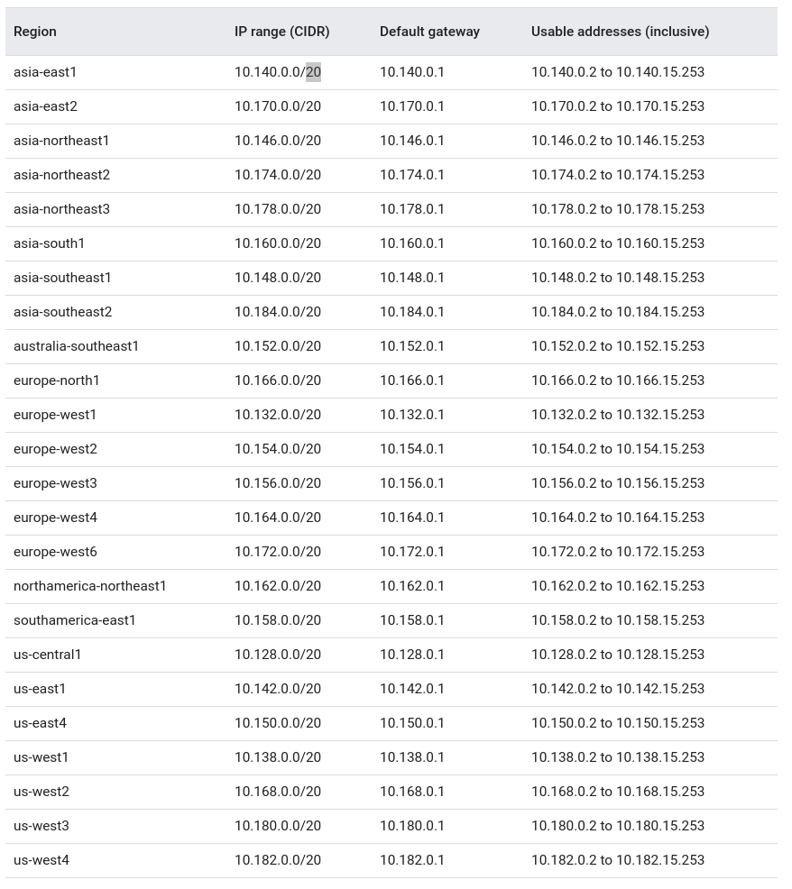

# VPC Networks
https://cloud.google.com/vpc/docs/overview

https://cloud.google.com/vpc/docs/vpc
## Overview

- Works as a physical network, but it is virtualized whithin GCP (using Andromeda)
- Global resource
- Consists of a list of regional subnetworks (subnets) in data centers
- Logically isolated from each other
- Provides the following:
  - Connectivity for CE virtual machine instances:
    - Including Kubernets Engine, App Engine flexible environment and other GCP products built on CE VMs
    - Internal TCP/UDP Load Balancing and proxy systems for internal HTTP(s) Load Balancing
    - Connection to on-premises networks using Cloud VPN tunnels and Cloud Interconnect attachments
    - Distributes traffic from Google Cloud external load balancers to backends
- Projects can contain multiple VPC networks

## Properties
- Global Resource
- Suvnets are regional resources
- Traffic can be controlled by firewall rules
  - Implemented on the VMs
  - Can only be controlled and logged as it leaves or arrives at a VM
- Resources can communicate using internal IPv4 adrresses (within a VPC)
- Instances with internal IP can communicate with Google APIs and services
- Network administration can ve secured by IAM roles
- *"An organization can use Shared VPC to keep a VPC network in a common host project. Authorized IAM members from other projects in the same organization can create resources that use subnets of the Shared VPC network"*
- VPC Network Peering -> connect VPC networks in different projects or organizations
- Cloud VPN or Cloud Interconnect -> hybrid environments
- Supports GRE traffic (beta) **
- Supports only unicast and IPV4 traffic whithin the network

## Teminology
- subnet = subnetwork
  - Used interchangeably in GC Console, gcloud commands and API documentation
- subnet ~= (VPC) network

## Networks and subnets
- VPC network
  - must have at least on subnet
  - no IP ranges associated with it
  - Modes:
    - auto mode:
      - subnets created in each region automatically
      - predefined IP ranges (whith 10.128.0.0/9 CIDR block)
      - if new regions became available -> subnet created automatically
      - subnets can be added manually with IP ranges outside 10.128.0.0/9
      - can switch to custom mode
    - custom mode:
      - start with no subnets
      - cannot switch to automode
      - Should be used when:
        - new region IP ranges could overlap with IP ranges in other subnets
        - planning to connect VPC networks using VPC Network Peering or Cloud VPN (because subnets would have the same range of IP addresses)
- subnet
  - associated with a region
  - IP range associated with it
  - multiple subnets can be created within a region
  - When creating a resource in GCP a network and subnet is choosen (must be in same region as resource)

## Subnet ranges
- Primary
- Secondary
  - used only by alias IP ranges
- Restrictions:
  - Cannot match, be narrower or broader than a restricted range
  - Cannot span an RFC range and a privately used public IP range
  - Cannot span multiple RFC ranges
- Valid ranges:

- Restricted ranges:

- Reserved IP adresses:

- Auto mode IP ranges:

## Advanced VPC concepts
Good read for overall understanding of how VPC networking works
https://cloud.google.com/vpc/docs/advanced-vpc

## Communications and access
### Within network
- System-generated subnet routes define paths
- Firewall rules must be configured
  - default network includes firewall rules (`default-allow-internal`, for example)
### Internet access requirements
For outgoing internet access, following criteria must be satisfied:
    - Valid default internet gatewary route or custom route whose destination IP range is the most general (0.0.0.0/0)
    - Firewall rules must allow egress traffic from the instance
    - One of the following must be true:
      - Instance must have external IP address
      - Instance must be able to use Cloud NAT or instance-based proxy targeted for a static 0.0.0.0/0 route
### Access for App Engine
- App Engine standard environment:
  - Only App Engine rules apply to ingress traffic
  - App Engine standard environment instances do not run inside VPC network
- App Engine flexible environment
  - Both App Engine and VPC firewall rules apply to ingress traffic
  - For outbound, VPC firewall rules apply

### Traceroute to external IP addresses
Tools like traceroute and mtr might provide incomplete results because the TTL doesn't expire on some of the hops. Hops that are inside and outside of Google's network might be hidden.
The number of hidden hops varies based on the instance's Network Service Tiers, region, and other factors. If there are only a few hops, it's possible for all of them to be hidden. Missing hops from a traceroute or mtr result don't mean that outbound traffic is dropped.

## Maximum transmission unit
- default 1460 bytes (maximum 1500) 
- **** incomplete notes

## Network Performance
### Latency
80 $\mu$s at the 99th percentile in the same zone
### Packet loss
Global average lower than 0.01% between all regions