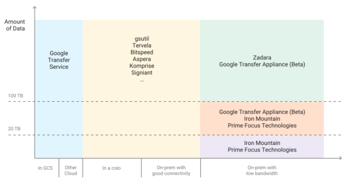

# Disaster Recovery
https://cloud.google.com/solutions/dr-scenarios-planning-guide

## Disaster recovery planning guide

### Basics of DR planning

- DR is a subset of business continuity planning
- Begins defining two key metrics
  - Recovery time objective (RTO)
    - maximum acceptable time application can be offiline
    - usually defined as part of a larger SLA
  - Recovery point objective (RPO)
    - maximum acceptable length of time during which data might me lost
- Service Level Objective (SLO)
  - SLOs are the specific, measurable characteristics of the SLA
  - RTOs and RPOs are SL)s
- Highe Availability (HA)
  - is often necessary to take HA into account when thinking about RTO and RPO

# Why Google Cloud

- reduce the costs associated with RTO and RPO, compared to on premises
- Traditional DR planning requires to account for:
  - Capacity -> enough space to scale
  - Security -> physical security to protect assets
  - Network infrastructure -> hardware, firewalls, load balancers
  - Support -> skilled technicians for maintenance
  - Bandwith -> for peak load
  - Facilities -> equimament and power
- Google offers:
  - Global network
  - Redudancy
    - multiple points of presence (PoPs)
    - data mirrored automatically
  - Scalability
  - Security
  - Compliance
    - certifications such as ISO 27001, SOC 2/3 and PCI DSS 3.0

### DR patterns
- Indicates how readily the system ca recover
- Can be:
  - cold
    - example: you have no spare tire -> must call someone and wait
  - warm
    - example: you have a space tire and replacement kit
  - hot
    - example: you have run-flat tires -> might have to slow down, but not a big impact -> latter you can address the issue

### Creating a detailed DR plan

#### Design according to your recovery goals

- Based on RTO and RPO
- Examples
  - historical compliance-oriented data: Large RTO and cold pattern
  - online service: small RTO and hot pattern
  - email notificatio system: warm pattern

#### Design for end-to-end recovery

- It isn't enough just to have a plan for backing up or archiving your data
- DR plan must address full recovery process
  - backup
  - restore
  - cleanup

#### Make your tasks specific

- Make each task in your DR plan consist of one or more concrete, unambiguous commands or actions
  - "Run the restore script" is too general
  - "Open Bash and run /home/example/restore.sh" is precise and concrete

#### Implementing control measures

- Add controls to prevent disasters from occurring and to detect issues before they occur
  - example: monitor that sends an alert when a data-destructive flow, such as a deletion pipeline, exhibits unexpected spikes or other unusual activity

### Preparing your software

- make sure that the software you rely on is ready for a recovery event
- Verify you can install the software
  - from source or from a preconfigured image
  - you are appropriately licensed -> check with the supplier
- Make sure needed CE resources are available
  - might require preallocating or reserving
- Design continuous deployment (CD) for recovery
  - Plan where you want to host your CD environment and artifacts — they need to be available and operational in the event of a disaster.

### Implementing security and compliance controls

- The same controls that you have in your production environment must apply to your recovered environment
  - same separation and blocking that the source production environment uses
  - least privilege for applications that access Google Cloud APIs
  - grant users the same access to the DR environment that they have in the source production environment
  - ways to synchronize permissions between environments:
    - replicating IAM policies in the DR environment
      - use infrastructure as code (IAC) methods and employ tools such as Cloud Deployment Manager to deploy your IAM policies to production
      - use the same tools to bind the policies to corresponding resources in the DR environment
    - If your production environment is on-premises, you map the functional roles, such as your network administrator and auditor roles, to IAM policies that have the appropriate IAM roles
    - If your production environment is another cloud provider, map the permissions in the provider's IAM policies to Google Cloud IAM policies
- Compliance regulations will also apply to your recovered environment
  - Make sure that PII data is redacted and encrypted
  - If you perform regular penetration tests on your production environment, you should include your DR environment as part of that scope and carry out regular tests by standing up a DR environment
  - logs that you collect are backfilled into the log archive of your production environment
  - you can export audit logs that are collected through Cloud Logging to your main log sink archive
- Verify your DR security
  - test everything
- Make sure users can log in to the DR environment
  - If you are using an alternative identity system, make sure that accounts have been synced with your Cloud Identity account
  - Incorporate users who are logging in to the DR environment as part of the regular DR tests that you implement
  - To centrally manage who has SSH access to virtual machines (VMs) that are launched, enable the OS login feature on the Google Cloud projects that constitute your DR environment
- Train users
- Use Cloud Storage as part of your daily backup routines
- Manage secrets properly
- Treat recovered data like production data

### Making sure your DR plan works

- Maintain more than one data recovery path
  - Implement an alternative means of access to Google Cloud to help ensure that you can transfer data to Google Cloud
  - Regularly test that the backup path is operational.
- Test your plan regularly
  - Automate infrastructure provisioning with Deployment Manager
  - Monitor and debug your tests with Cloud Logging and Cloud Monitoring
  - Perform the testing noted earlier

## Disaster recovery building blocks

### Compute Engine
- you can prevent accidental deletion of VMs by setting the delete protection flag
- configure an instance with your application preinstalled, and then save that configuration as a custom image.
  - can reflect the RTO you want to achieve
- instance templates to save the configuration details of the VM and then create instances from existing instance templates
- Managed instance groups -> identically configured instances that are copied across zones
- Reserved Instances (same price as resource)
- incremental backups or snapshots of Compute Engine VMs or persistent disks -> copy across regions and use to recreate persistent disks in the event of a disaster
- Regional persistent disks replicate writes across two zones in a region
- Compute Engine live migrates your running instances to another host in the same zone rather than requiring your VMs to be rebooted (on maintenance events)
- Virtual disk import tool
  - file formats including VMDK, VHD, and RAW to create new Compute Engine virtual machines+
  - create Compute Engine virtual machines that have the same configuration as your on-premises virtual machines

### Cloud Storage

- Nearline, Coldline, and Archive Storage
  - reduce your storage cost compared to Standard storage
  - optimized for infrequent access
- Storage Transfer Service
  - Back up data from other storage providers to a Cloud Storage bucket.
  - Move data from a bucket in a multiregion to a bucket in a region to lower your costs for storing backups
- Filestore instances are zonal and do not support replication across zones
  - periodically back up your data by syncing your Filestore volume to a Filestore instance in another region using the gsutil rsync

### GKE

- features:
  - Node auto repair (if unhealthy for about 10 min)
  - liveness probe -> periodically check pods
  - persistent volumes
  - multi-zone and regional clusters
  - Kubemci -> tool -> configure a global load balancer across multiple GKE clusters in different regions

### Networking and data transfer

- Cloud Load Balancing
  - globally accessible IP address 
  - instances running in different regions
- Traffic Director
  - fully managed traffic control plane for your service mesh
  - will offload service health checks and initiate a failover configuration of service proxies
  - supports advanced traffic control concepts, circuit breaking (limits on requests), and fault injection (test your service's ability to survive request delays or aborted requests)
- Cloud DNS
  - programmatic way to manage your DNS entries as part of an automated recovery process
- Cloud Interconnect
  - ways to move information from other sources to Google Cloud

### Management and monitoring

- Cloud Status Dashboard shows you the current availability Google Cloud services
- Cloud Monitoring
- Deployment Manager
  - use the templates to create environments with a single command repeatedly and consistently

### Cross-platform DR building blocks

- reduce the operational overhead slecting tooling that works with all of the platforms you're using:
  - Declarative templating tools
    - For cross-platform deployments, Terraform is one of the most popular declarative templating tools
  - Configuration management tools
    -  we recommend platform-agnostic software management tools like Chef and Ansible
    -  ensure that reproducible configurations can be applied no matter where your compute workload is
 - Object storage
   - __boto__, which is an open source Python library that lets you interface with both Amazon S3 and Cloud Storage
 - Orchestrator tools
   - Kubernetes provides a way to orchestrate container-based workloads across multiple platforms
   - Google Cloud, AWS, and Microsoft Azure all provide managed versions of Kubernetes
 - Data transfer
   - Make sure that you design, implement, and test your cross-platform DR scenarios using realistic mockups of what the DR data transfer scenario calls for

### Patterns for DR

- Transferring data to and from Google Cloud
  - How do you connect to Google Cloud?
  - How much bandwidth is there between you and the interconnect provider?
  - What is the bandwidth provided by the provider directly to Google Cloud?
  - What other data will be transferred using that link?

- Balancing image configuration and deployment speed
  - tradeoff between the amount of image preconfiguration, the costs of maintaining the image, and the speed of deployment

- Maintaining machine image consistency across hybrid environment
  - If a fully configured image is required __Packer__, which can create identical machine images for multiple platforms
  - As another option, you can use configuration management tools such as Chef, Puppet, Ansible, or Saltstack to configure instances with finer granularity, creating base images, minimally-configured images, or fully-configured images as needed
  - manually convert and import existing images such as Amazon AMIs, Virtualbox images, and RAW disk images to Compute Engine.
- Implementing tiered storage
  - tiered storage pattern is typically used for backups where the most recent backup is on faster storage, and you slowly migrate your older backups to cheaper slow storage

- Maintaining the same IP address for private instances
  - The simplest configuration is to set up a managed instance group that maintains exactly one instance. This managed instance group is integrated with an internal (private) load balancer that ensures that the same IP address is used to front the instance regardless of whether it's the original image or a replacement.

### Technology partners

- customers using partner solutions to do the following:
  - Back up data from on-premises to Google Cloud. In these cases, Cloud Storage is integrated as a storage target for most on-premises backup platforms. You can use this approach to replace tape and other storage appliances.
  -Implement a DR plan that goes from on-premises to Google Cloud. Our partners can help eliminate secondary data centers and use Google Cloud as the DR site.
  - Implement DR and backup for cloud-based workloads.

## Disaster recovery scenarios for data

- Data backups
  - copying a discrete amount of data from one place to another
  - Typically, data backups have a small to medium RTO and a small RPO
- Database backups
  - more complex
  - also need to consider how to back up transaction logs
  - you have to apply the latest database backup and then the recovered transaction logs that were backed up after the last backup
  - high-availability-first approach to minimize the time to recover from a situation that could cause unavailability of the database server allows you to achieve smaller RTO and RPO values

### Production environment is on-premises

- DR building blocks:
  - Cloud Storage
- your production environment is on-premises
- disaster recovery plan involves using Google Cloud as the recovery site.
#### Solution 1: Back up to Cloud Storage using a scheduled task
- scheduled task that runs a script or application to transfer the data to Cloud Storage
  - gsutil command-line tool or by using one of the Cloud Storage client libraries

1. Install gsutil
2. Create a bucket
3. Generate a service account key
4. Copy service account key to on-premises machine
5. Create an IAM policy
6. Test upload and download
7. Set up a scheduled script
8. configure a recovy process

- You can also use the gsutil rsync command to perform real-time incremental syncs between your data and a Cloud Storage bucket.
  - If the volume of data that has changed between successive backup sessions is small relative to the entire volume of the source data, using gsutil rsync can be more efficient than using gsutil cp

#### Solution 2: Back up to Cloud Storage using Transfer service for on-premises data

- DR building blocks:
  - Cloud Storage
  - Transfer service for on-premises data
- Custom scripts can often lead to lowered RPO values and even increased risks of data loss
- scalable, reliable, and managed service that enables you to transfer large amounts of data from your data center to a Cloud Storage bucket without investing in engineering teams or buying transfer solutions.

#### Solution 3: Back up to Cloud Storage using a partner gateway solution

- DR building blocks:
  - Cloud Interconnect
  - Cloud Storage tiered storage
- On-premises applications are often integrated with third-party solutions that can be used as part of your data backup and recovery strategy

### Database backup and recovery

- recover a database system from on-premises to Google Cloud

#### Solution 1: Backup and recovery using a recovery server on Google Cloud

- Create a database backup using the built-in backup mechanisms of your database management system.
- Connect your on-premises network and your Google Cloud network.
- Create a Cloud Storage bucket as the target for your data backup.
- Copy the backup files to Cloud Storage using gsutil or a partner gateway solution (see the steps discussed earlier in the data backup and recovery section). For details, see Transferring big data sets to Google Cloud.
- Copy the transaction logs to your recovery site on Google Cloud. Having a backup of the transaction logs helps keep your RPO values - small.

continue from here:
https://cloud.google.com/solutions/dr-scenarios-for-data#backup-and-recovery-using-a-recovery-server-on-gcp