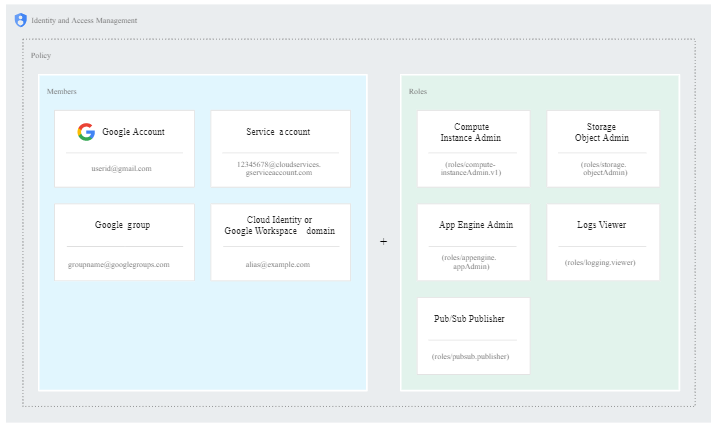
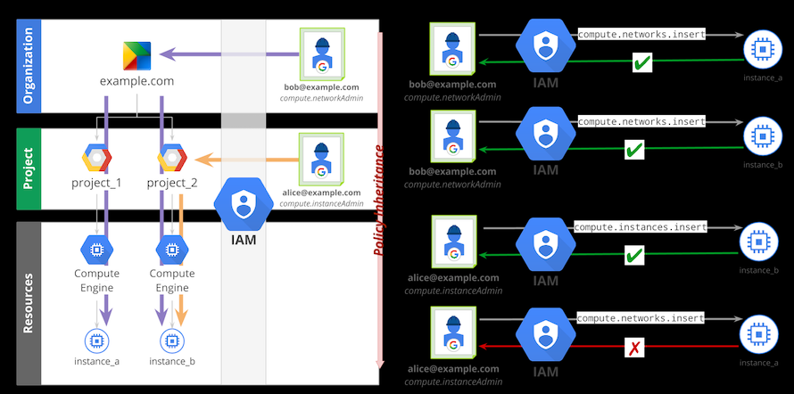

# Identity and Access Management (IAM)

- lets you grant granular access to specific Google Cloud resources
- IAM lets you adopt the security principle of least privilege
  - nobody should have more permissions than they actually need
- manage access control by defining
  - who (identity)
  - has what access (role)
  - for which resource
- permission to access a resource isn't granted directly to the end user
  - permissions are grouped into roles
  - roles are granted to authenticated members

- This model for access management has three main parts:
  - Member
    - Google account
    - service account
    - google group
    - google workspace domain (google accounts inside internet domain name. e.g.: username@example.com)
    - cloud identity domain ( like a Google Workspace domain, but users don't have access to Google Workspace applications and features)
    - all authenticated users
    - all users
  - Role
    - collection of permissions
  - Policy
    - binds one or more members to a role

### Resources

- organizations, folders, and projects that you use to organize your resources are also resources
- Some services support granting IAM permissions at a granularity finer than the project level ( a specific CE instance, for example)

### Permissions
- `service.resource.verb` => pubsub.subscriptions.consume
- often correspond one-to-one with REST API methods
- not granted directly to users

### Roles

- `roles/service.roleName`
- collection of permissions
- Basic roles: 
  - Owner, Editor, and Viewer
- Predefined roles
  - finer-grained access
- Custom roles

### IAM policy

- You can grant roles to users by creating an IAM policy
- A policy is attached to a resource and is used to enforce access control whenever that resource is accessed
- An IAM policy is represented by the IAM Policy object. An IAM Policy object consists of a list of bindings. A Binding binds a list of members to a role.
- IAM and policy APIs
  - setIamPolicy()
  - getIamPolicy()
  - testIamPermissions()

### Resource hierarchy

- Google Cloud resources are organized hierarchically:
  - The organization
  - Folders
  - Project
  - Resources
- You can set an IAM policy at any level in the resource hierarchy
- The effective policy for a resource is the union of the policies
- If you change the resource hierarchy, the policy inheritance changes as well
  - moving a project into an organization causes the project to inherit from the organization's IAM policy.

## Service accounts

- special account that can be used by services and applications running on your Compute Engine instance to interact with other Google Cloud APIs
- you can also create firewall rules that allow or deny traffic to and from instances based on the service account that you associate with each instance
- An instance can have only one service account, and the service account must have been created in the same project as the instance
- Two types of service accounts are available to Compute Engine instances:
  - User-managed service accounts
  - Google-managed service accounts

### User-managed service accounts

- new service accounts that you explicitly create
- Compute Engine default service account
  - `PROJECT_NUMBER-compute@developer.gserviceaccount.com`
  - New projects that have enabled the Compute Engine API have a Compute Engine default service account
  - Google creates automatically, but you have full control over it
    - When you create an instance by making a request to the API directly without using the gcloud command-line tool or the Google Cloud Console, the default service account does not come enabled with the instance
  - created with the IAM project editor role
  - You can disable or delete this service account from your project
    - you can try to recover deleted accounts within 30 days
  - Enabled by default on all instances created by the gcloud command-line tool and the Cloud Console
  - You can override this by specifying another service account when creating instance
  - automatically configured with the following access scopes:
    - Read-only access to Cloud Storage
    - Write access to write Compute Engine logs
    - Write access to publish metric data to your Google Cloud projects
    - Read-only access to Service Management features required for Google Cloud Endpoints(Alpha)
    - Read/write access to Service Control features required for Google Cloud Endpoints(Alpha)

### Google-managed service accounts

- created and managed by Google and assigned to your project automatically
- represent different Google services and each account has some level of access to your Google Cloud project.

#### Google APIs service account

- `PROJECT_NUMBER@cloudservices.gserviceaccount.com`
- designed specifically to run internal Google processes on your behalf
- owned by Google and is not listed in the Service Accounts section of Cloud Console
- automatically granted the project editor role on the project and is listed in the IAM section of Cloud Console
- only deleted when the project is deleted
- you can change the roles granted to this account, including revoking all access to your project
- Certain resources rely on this service account and the default editor permissions granted to the service account
  - managed instance groups and autoscaling uses the credentials of this account to create, delete, and manage instances
- you should not modify this service account's roles

#### Compute Engine System service account

- `service-PROJECT_NUMBER@compute-system.iam.gserviceaccount.com`
- All projects that have enabled the Compute Engine API have a Compute Engine System service account
- for Compute Engine to perform its service duties on your project
- service account Compute Engine uses to access the customer-owned service account on VM instances
- Google owns this account, but it is specific to your project and is listed in the IAM section of the console
- By default, the account is automatically granted the compute.serviceAgent role on your project.
- This service account is deleted only when you delete your project
- You can change the roles granted to this account and revoke all access to your project from the account.
- avoid modifying the roles for this service account as much as possible.

### Service account permissions

There are many access scopes that you can choose from but you can also just set the cloud-platform access scope, which is an OAuth scope for all Google Cloud services, and then securely limit the service account's access by granting it IAM roles.

Then the service account has only the permissions included in those three IAM roles. That account cannot perform actions outside of these roles despite the Google Cloud access scope.

more details: https://cloud.google.com/compute/docs/access/service-accounts#service_account_permissions

### IAM roles

- You must set access scopes on the instance to authorize access.
  - While a service account's access level is determined by the IAM roles granted to the service account, an instance's access scopes determine the default OAuth scopes for requests made through the gcloud tool and client libraries on the instance. As a result, access scopes potentially further limit access to API methods when authenticating through OAuth.

### Access scopes

Access scopes are the legacy method of specifying permissions for your instance. They define the default OAuth scopes used in requests from the gcloud tool or the client libraries.

You must set up access scopes when you configure an instance to run as a service account.

A best practice is to set the full cloud-platform access scope on the instance, then securely limit the service account's API access with IAM roles.

Access scopes apply on a per-instance basis. You set access scopes when creating an instance and the access scopes persists only for the life of the instance.

Access scopes have no effect if you have not enabled the related API on the project that the service account belongs to. For example, granting an access scope for Cloud Storage on a virtual machine instance allows the instance to call the Cloud Storage API only if you have enabled the Cloud Storage API on the project.

Examples:
- https://www.googleapis.com/auth/cloud-platform. Full access to all Google Cloud resources.
- https://www.googleapis.com/auth/compute. Full control access to Compute Engine methods.
- https://www.googleapis.com/auth/compute.readonly. Read-only access to Compute Engine methods.
- https://www.googleapis.com/auth/devstorage.read_only. Read-only access to Cloud Storage.
- https://www.googleapis.com/auth/logging.write. Write access to the Compute Engine logs.

## Using resource hierarchy for access control
https://cloud.google.com/iam/docs/resource-hierarchy-access-control

### Best practices

- Mirror your Google Cloud resource hierarchy structure to your organization structure
  - The Google Cloud resource hierarchy should reflect how your company is organized
- Use projects to group resources that share the same trust boundary
- Set policies at the organization level and at the project level rather than at the resource level