# Security

- Google Cloud Armor security policies protect your application by regulating which requests are allowed and denied access to your load balancer
  - Each security policy is made up of a set of rules that filter traffic based on
    - request's IP address
    - IP range
    - region code
    - URL path
    - request method,
    - or request headers
  - available only for backend services behind an external HTTP(S) load balancer
  - backends to the backend service can be
    - virtual machine (VM) instances in an instance group
    - zonal network endpoint groups (zonal NEGs)
    - internet network endpoint groups (internet NEGs).
  - Google Cloud Armor can protect hybrid deployment multi-cloud architecture
    - backends must be internet NEGs
    - or hybrid connectivity NEGs when you use Traffic Director in a on-premises or multi-environment deployment
  - Google Cloud Armor also protects serverless NEGs

### Edge security with Google Cloud Armor security policies

- HTTP(S) Load Balancing is implemented at the edge of Google's network in Google's points of presence (PoPs) around the world
  - enable you to allow or deny access to your external HTTP(S) load balancer at the Google Cloud edge, as close as possible to the source of incoming traffic

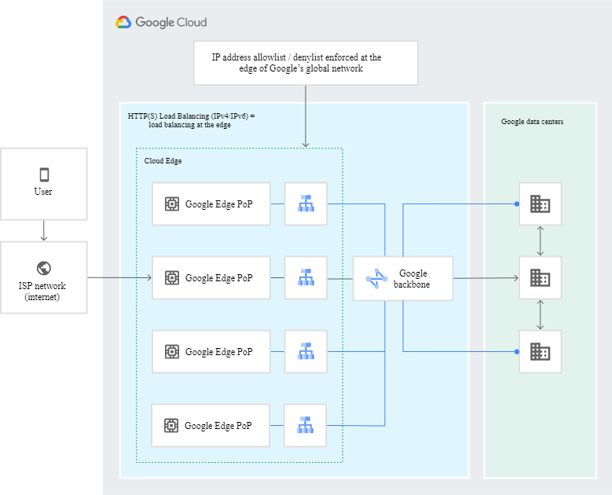

### Requirements

- The load balancer must be an external HTTP(S) load balancer.
- The backend service's load balancing scheme must be EXTERNAL.
- The backend service's protocol must be one of HTTP, HTTPS, or HTTP/2

### About Google Cloud Armor security policies

- sets of rules that match on attributes from L3 (layer 3 -Network Firewalls) to L7 (layer 7 Application Firewalls) to protect externally facing applications or services
- policy rule -> a match condition and an action to take when that condition is met
- You can associate a Google Cloud Armor security policy with one or more backend services
- backend service can have only one security policy associated with it

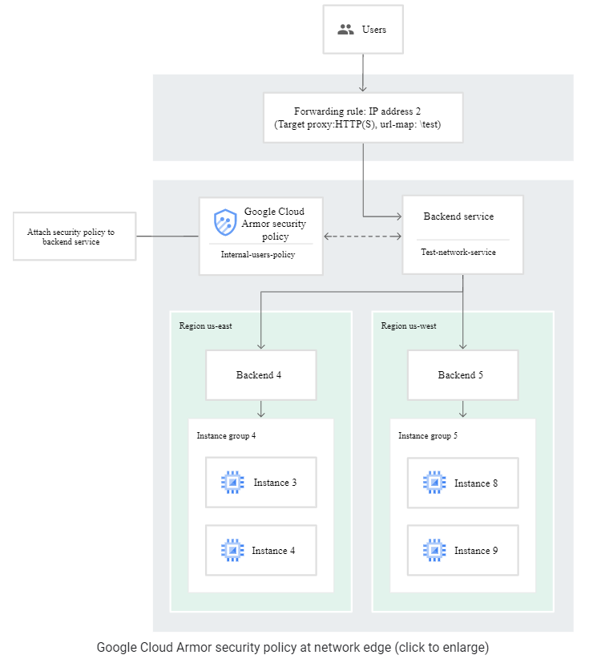

#### core features:
- You can optionally use the QUIC protocol with load balancers that use Google Cloud Armor.
- You can use security policies with GKE and the default Ingress controller.

#### actions

- allow
- deny

#### Rule evaluation order

- determined by rule priority, from the lowest number to the highest number (0-2147483646)
- highest priority aplies
  - except for POST requests on preconfigured rules that use evaluatePreconfiguredExpr() 
    - After Google Cloud Armor receives the HTTP POST body, it evaluates rules that apply to both the request headers and body. As a result, it's possible that lower priority rules that allow a request's header are matched before higher priority rules that block the request's body. In such cases, it is possible that the HTTP header portion of the request is sent to the target backend service, but the POST body containing potentially malicious content is blocked.

#### Default rule
- priority of 2147483647
- cannot delete the default rule, but you can modify it
- default action for the default rule is allow

#### Fingerprint

- when you update a security policy, you must specify the current fingerprint
  - you get when you export or describe the policy (using EXPORT or DESCRIBE, respectively).
- The fingerprint protects you from overriding another user's update
- If the fingerprint that you provide is out of date, it means that the security policy was updated since you last retrieved the fingerprint

#### Rules language and enforcement engine

- custom rule expressions that can match on various layer 3 through layer 7
- multiple subexpressions in a single rule
- deny or allow requests based on the incoming request's region code

#### Types of rules

- IP address allowlist and denylist rules (IPv4 and IPv6)
- Preconfigured rules for XSS, SQLi, LFI, RFI, and RCE
  - You can use preconfigured rules to mitigate the following attacks:
      - Cross-site scripting (XSS)
      - SQL injection (SQLi) attacks
      - Local file inclusion (LFI) attacks
      - Remote file inclusion (RFI) attacks
      - Remote code execution (RCE) attacks
- Preconfigured rules for named IP address lists (beta)
  - Integrate third-party providers' named IP address lists with Google Cloud Armor.
  - Simplify maintenance of allowed or denied IP address ranges.
  - Synchronize third-party providers' lists daily.
  - Increase your capacity for configuring IP addresses and ranges in security policies because named IP address lists are not subject to limits on the number of IP addresses per rule.
- Preview mode
  - preview the effects of a rule without enforcing it
  - In preview mode, actions are noted in Cloud Monitoring
  - `gcloud compute security-policies rules update --preview`

#### Logging

- The Google Cloud Armor security policy name, matched rule priority, associated action, and related information are logged for HTTP(S) requests to your external HTTP(S) load balancer]

### Google Cloud Armor with Google Kubernetes Engine (GKE) Ingress

- you can enable it through Kubernetes Ingress.
```
apiVersion: cloud.google.com/v1
kind: BackendConfig
metadata:
  namespace: cloud-armor-how-to
  name: my-backendconfig
spec:
  securityPolicy:
    name: "example-security-policy"
```

### Limitations

- An IP address denylist/allowlist for HTTP(S) Load Balancing is not supported for Cloud Storage backend buckets.
- Security policies are enforced for CDN cache misses only. Content is served from cache even if a rule in a security policy would have denied the request.

#### How WebSocket connections are handled

- Cloud Armor does not evaluate any messages after the first request.

## Cloud HSM (Hardware Security Module)

- service that allows you to host encryption keys and perform cryptographic operations in a cluster of FIPS 140-2 Level 3 certified HSMs
- Cloud HSM uses Cloud KMS (key managment) as its front end, you can leverage all the conveniences and features that Cloud KMS provides.
- symmetric or asymmetric

### Create a key ring
- When you create a key, you add it to a key ring in a given Google Cloud location. You can create a new key ring or use an existing one
- `gcloud kms keyrings create key-ring --location location`

### Create a key

- `gcloud kms keys create key --keyring key-ring --location location --purpose "encryption" --protection-level "hsm"`

### Encrypt data
- Now that you have a key, you can use that key to encrypt text or binary content.
- `gcloud kms encrypt --key key --keyring key-ring --location location  --plaintext-file file-with-data-to-encrypt --ciphertext-file file-to-store-encrypted-data`

### Decrypt ciphertext

- `gcloud kms decrypt --key key --keyring key-ring --location location  --ciphertext-file file-path-with-encrypted-data --plaintext-file file-path-to-store-plaintext`

### Known limitations

- Block size is limited to 16,384 bytes (as opposed to 64 KiB for Cloud KMS software keys)
- Cloud HSM may not be available in certain multi or dual regions
- If you use Cloud HSM keys with customer-managed encryption key (CMEK) integrations in other Google Cloud services, the locations you use for the services must match the locations of your Cloud HSM keys exactly
- Currently key operations for keys stored in Cloud HSM may incur a noticeably greater latency compared to using Cloud KMS software keys.

## Cloud Key Management

### Key features
- lets you manage symmetric and asymmetric keys
- Centrally manage encryption keys
  - generate, use, rotate, and destroy AES256, RSA 2048, RSA 3072, RSA 4096, EC P256, and EC P384 cryptographic keys.
- Deliver hardware key security with HSM
  - Toggle between software- and hardware-protected encryption keys with the press of a button. Host encryption keys and perform cryptographic operations in FIPS 140-2 Level 3 validated HSMs
- Provide support for external keys with EKM
  - Encrypt data in BigQuery and Compute Engine with encryption keys that are stored and managed in a third-party key management system that’s deployed outside Google’s infrastructure
- Be the ultimate arbiter of access to your data
  - Key Access Justifications works with Cloud EKM to greatly advance the control you have over your data. It’s the only product that gives you visibility into every request for an encryption key, a justification for that request, and a mechanism to approve or deny decryption in the context of that reques

### All features
- Symmetric and asymmetric key support	
- Create external keys with EKM	
- Delay for key destruction	
- Encrypt and decrypt via API
- High global availability
- Automated and at-will key rotation
- Statement attestation with HSM
- Integration with GKE
- Maintain key-data separation
- Key data residency
- Key import
- Justified access
- Automated policy
- Integrity commitment

### Use cases
- Support regulatory compliance
  - compliant with FIPS 140-2
- Manage encryption keys via secure hardware
  - critical for customers seeking a level of assurance that the cloud provider cannot see or export their key material
- Manage encryption keys outside the cloud
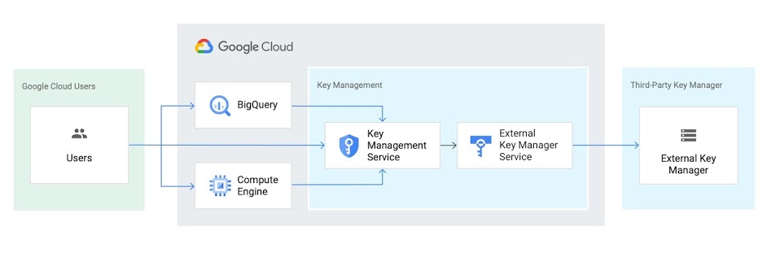
- Key Access Justifications and EKM data flow
  - visibility into every request for an encryption key, a justification for that request, and a mechanism to approve or deny decryption in the context of that request
  - 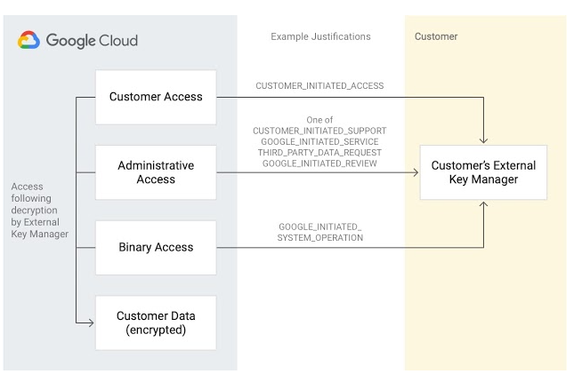

### Pricing

| PRODUCT                                          | PRICE (US$)                                                              |
| ------------------------------------------------ | ------------------------------------------------------------------------ |
| Cloud KMS: active key versions                   | $0.06 per month                                                          |
| Cloud KMS: key use operations (Encrypt/ Decrypt) | $0.03 per 10,000 operations                                              |
| Cloud KMS: key admin operations                  | free                                                                     |
| Cloud HSM: key versions (AES256, RSA2048)        | $1.00 per month                                                          |
| Cloud HSM: key versions (RSA 3072, RSA 4096)     | 0–2000 key versions: $2.50 per month 2001+ key versions: $1.00 per month |
| Cloud HSM: key versions (EC P256, EC P384)       | 0–2000 key versions: $2.50 per month 2001+ key versions:$1.00 per month  |
| Cloud EKM: key versions                          | $3.00 per month                                                          |
| Cloud EKM: key use operations                    | $0.03 per 10,000 operations                                              |

## Cloud Data Loss Prevention

- Fully managed service designed to help you discover, classify, and protect your most sensitive data.
- Take charge of your data on or off cloud
- Inspect your data to gain valuable insights and make informed decisions to secure your data
- Effectively reduce data risk with de-identification methods like masking and tokenization
- Seamlessly inspect and transform structured and unstructured data

### Key features

- Data discovery and classification
  - native support for scanning and classifying sensitive data in Cloud Storage, BigQuery, and Datastore and a streaming content API
- native support for scanning and classifying sensitive data in Cloud Storage, BigQuery, and Datastore and a streaming content API
  - Cloud DLP provides tools to classify, mask, tokenize, and transform sensitive elements to help you better manage the data that you collect, store, or use for business or analytics
  - With support for structured and unstructured data, Cloud DLP can help you preserve the utility of your data for joining, analytics, and AI while protecting the raw sensitive identifiers.
- Measure re-identification risk in structured data
  - Quasi-identifiers are partially-identifying elements or combinations of data that may link to a single person or a very small group
  -  Cloud DLP allows you to measure statistical properties such as k-anonymity and l-diversity, expanding your ability to understand and protect data privacy.

### Use cases

- Classify data across your enterprise

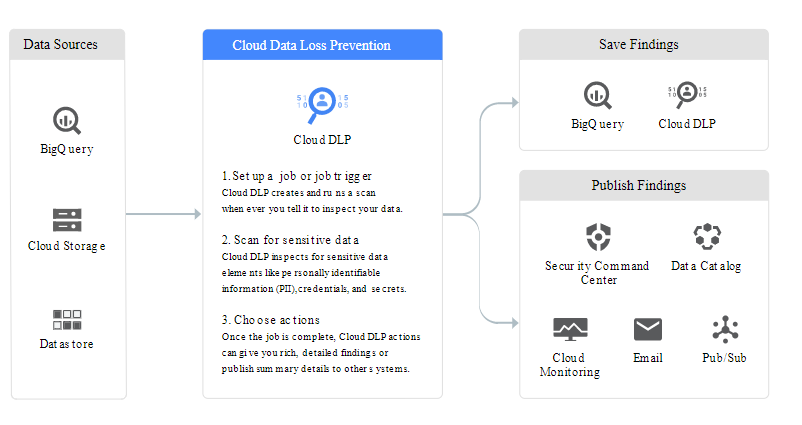

- Protect sensitive data as you migrate to the cloud

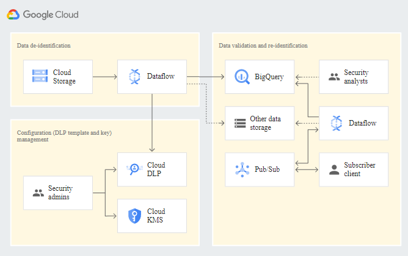

### All features
- Flexible classification
- Simple and powerful redaction
- Serverless
- Detailed findings
- Secure data handling
- Pay-as-you-go pricing
- Easy workload integration
- Custom rules

### Pricing rules
- based on total bytes processed with rate schedules based on total volume

## Overview of VPC Service Controls

- create perimeters that protect the resources and data of services that you explicitly specify
- additional layer of security defense independent of IAM
- For all Google Cloud services secured with VPC Service Controls, you can ensure that:
  - Resources within a perimeter are accessed only from clients within authorized VPC networks using Private Google Access with either Google Cloud or on-premises.
- Clients within a perimeter that have private access to resources do not have access to unauthorized (potentially public) resources outside the perimeter.
- Data cannot be copied to unauthorized resources outside the perimeter using service operations such as gsutil cp or bq mk.
- When enabled, internet access to resources within a perimeter is restricted using whitelisted IPv4 and IPv6 ranges.

### Security benefits of VPC Service Controls

- mitigate the following security risks without sacrificing the performance advantages of direct private access to Google Cloud resources
  - Access from unauthorized networks using stolen credentials
  - Data exfiltration by malicious insiders or compromised code
  - Public exposure of private data caused by misconfigured IAM policies
  - Monitoring access to services
    - monitor requests to protected services without preventing access

### VPC Service Controls and metadata

- VPC Service Controls is not designed to enforce comprehensive controls on metadata movement.
- there may be scenarios in which metadata can be copied and accessed without VPC Service Controls policy checks

### Capabilities

- Isolate GCP resources into service perimeters
  - A service perimeter allows free communication within the perimeter but, by default, blocks all communication across the perimeter.
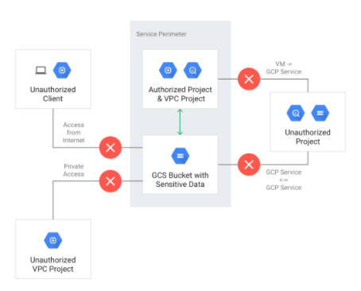|
- Extend perimeters to on-premises networks to authorized VPN or Cloud Interconnect
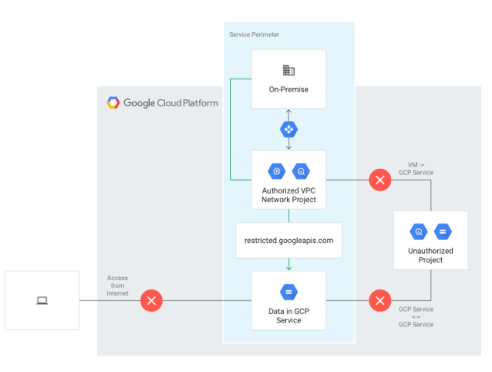
- Control access to GCP resources from the internet
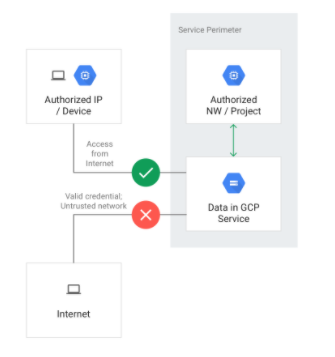

### Unsupported Services

Attempting to restrict an unsupported service using the gcloud command-line tool or the Access Context Manager API will result in an error.

### Terminology
- VPC Service Controls
  - Technology that enables you to define a security perimeter around resources of Google-managed services to control communication to and between those services
- restricted VIP
  - The restricted VIP provides a private network route for products and APIs supported by VPC Service Controls in order to make data and resources used by those products inaccessible from the internet. restricted.googleapis.com resolves to 199.36.153.4/30. This IP address range is not announced to the internet.
- service perimeter
  - A security perimeter around Google-managed resources. Allows free communication within the perimeter but, by default, blocks all communication across the perimeter.
- service perimeter bridge
  - A perimeter bridge allows projects in different security perimeters to communicate. Perimeter bridges are bidirectional, allowing projects from each service perimeter equal access within the scope of the bridge.
- Access Context Manager
  - A context-aware request classification service that can map a request to an access level based on specified attributes of the client, such as the source IP address.
- access level
  - A classification of requests over the internet based on a number of attributes, such as source IP range, client device, geolocation, and others. A service perimeter can be configured to grant access from the internet based on the access level associated with a request. Access - levels are determined by the Access Context Manager service.
- access policy
  - A Google Cloud resource object that defines service perimeters. There can be only one access policy object in an organization, and it is a child of the Organization resource.

## Security Command Center

- Security Command Center is the canonical security and risk database for Google Cloud
- Security Command Center is an intuitive, intelligent risk dashboard and analytics system
  - for surfacing, understanding, and remediating Google Cloud security and data risks across an organization.

### Features
- Sensitive data discovery
- Continuous compliance monitoring
- Rest API and SIEM
- Access control monitoring
- Real-time notifications and remediation
- Audit logs

### Security Command Center tiers

#### Standard tier features
- Security Health Analytic
  -  managed vulnerability assessment scanning for Google Cloud that can automatically detect the highest severity vulnerabilities and misconfigurations
- Web Security Scanner custom scans
  - custom scans of deployed applications with public URLs and IPs that aren't behind a firewall

#### Premium tier features

- Event Threat Detection
  - monitors your organization's Cloud Logging stream and consumes logs for one or more projects as they become available to detect the following threats:
    - Malware
    - Cryptomining
    - Brute force SSH
    - Outgoing DoS
    - IAM anomalous grant
    - Data exfiltration
- Container Threat Detection detects the following container runtime attacks:
  - Added binary executed
  - Added library loaded
  - Reverse shell
- Security Health Analytics
  - monitoring for many industry best practices, and compliance monitoring across your Google Cloud assets

### Pricing
Standard tier -> free
Premium tier pricing -> 5% of annual spend ( minimum cost of $25,000)
__no more notes taken from here__
https://cloud.google.com/security-command-center/docs/concepts-security-command-center-overview#actionable

## Cloud Identity

-  Identity as a Service (IDaaS) solution that centrally manages users and groups
-  You can configure Cloud Identity to federate identities between Google and other identity providers, such as Active Directory and Azure Active Directory
-  When you adopt Cloud Identity, you can manage access and compliance across all users in your domain

## Identity-Aware Proxy

- IAP lets you establish a central authorization layer for applications accessed by HTTPS
- you can use an application-level access control model instead of relying on network-level firewalls.
- IAP policies scale across your organization
  - You can define access policies centrally and apply them to all of your applications and resources

### When to use IAP

- enforce access control policies for applications and resources
- With IAP, you can set up group-based application access
  - a resource could be accessible for employees and inaccessible for contractors
  - or only accessible to a specific department.

### How IAP works

- When an application or resource is protected by IAP, it can only be accessed through the proxy by members, also known as users, who have the correct Identity and Access Management (IAM) role

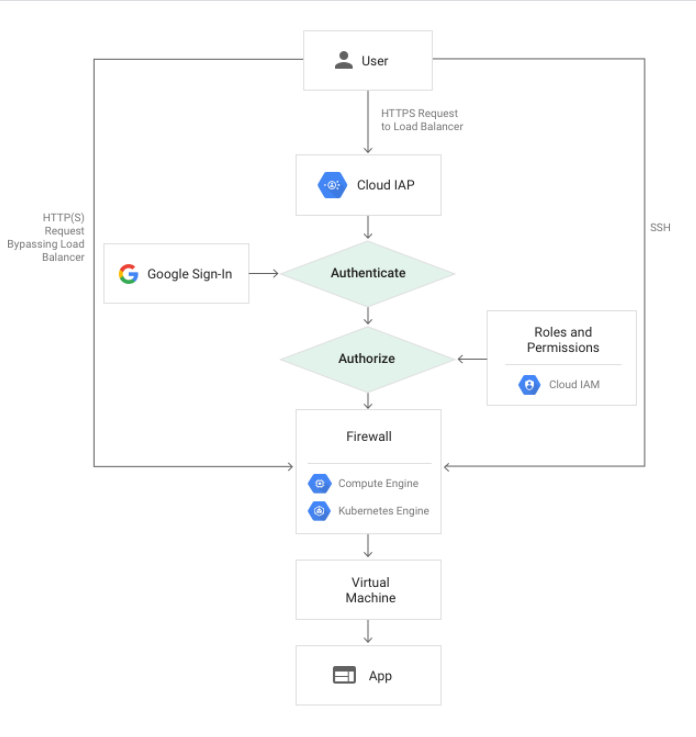

Compute Engine Example

### Authentication

- request => information like the Google Cloud project number, the request URL, and any IAP credentials in the request headers or cookies is sent to IAP authentication server
- IAP checks the user's browser credentials. If none exist, the user is redirected to an OAuth 2.0 Google Account sign-in flow that stores a token in a browser cookie for future sign-ins

### Authorization

- If the user has the IAP-secured Web App User role on the Cloud Console project where the resource exists, they're authorized to access the application

## Encryption

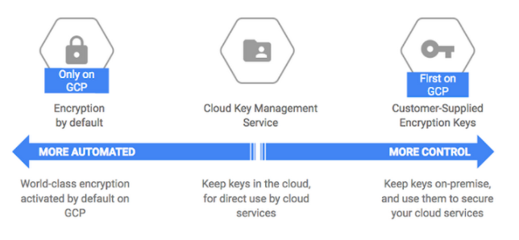
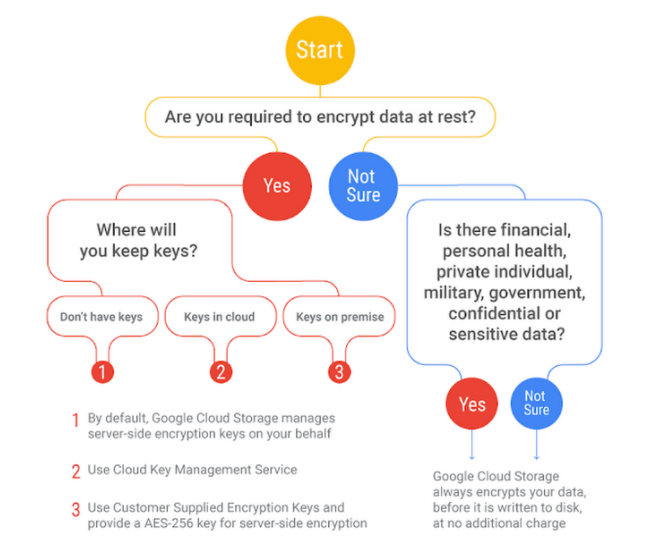

### ENCRYPTION AT REST

Google Cloud Platform encrypts customer data stored at rest by default

### Customer-managed encryption keys (CMEK) using Cloud KMS
- available on: AI Platform Training, BigQuery, Cloud Build, Cloud Dataproc, Container Registry, Cloud SQL, Cloud Storage, Compute Engine, Kubernetes Engine, Cloud Logging, Pub/Sub
### Customer-supplied encryption keys (CSEK)
- available only on Cloud Storage and Compute Engine