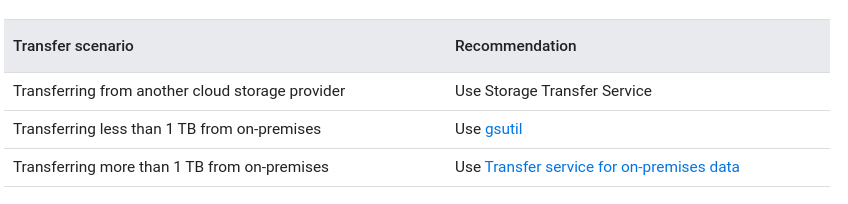

# Google Cloud Storage
## Key terms
### Buckets: 
- basic containers that hold your data
- everything in Cloud Storage must be contained in a bucket
- cannot be nested
- creation and deletion limit (~1 per 2 secongs)
- Creation parameters:
  - globally-unique name
    - cannot be changed
  - geographic location
    - Types:
      - regional (e.g. London)
      - dual-regional (e.g: Finland and the Netherlands)
      - multi-regional (e.g. large geographic area, such as the United States, that contains two or more geographic places)
    - cannot be changed
  - default storage class
    - can be changed
  - bucket labels:
    - maximum of 64 per bucket
### Objects:
- Individual piece of data stored in Cloud Storage
- No limit for number of objects in a bucket
- Components:
  - object data -> file
  - object metadata -> name-value pairs that describe object qualities
    - some metadata can be edited any time, some only when object is created and some you can only view
    - metadata users can change:
      - Fixed-key metadata
      - custom metadata
- Object names
  - treated as object metadata
  - must be unique within a bucket
  - flat namespace
    - tools such as Google Cloud Console and gsutil work with objects that use the slash (/) character as if they were stored in a virtual hierarchy
  - Object versions and generation numbers
    - By default, old versions are deleted
    - Enable Object Versioning to keep older versions
  - Object immutability
    - uploaded object cannot change throughout its storage lifetime
      - no append or truncate operations, for example

#### FIxed-key metadata
- __Access control metadata__
- **Cache-Control**:
  - only applies when accessing objects that:
    - Are publicly accessible
    - Are not stored in a bucket that has Requester Pays enabled
  - allows you to serve objects as they are stored, without applying any transformations to the data, such as removing gzip content-encoding for incompatible clients. To serve an object as-is, set Cache-Control:no-transform
  - Controls whether and for how long browser and Internet caches are allowed to cache your objects
    - public -> may be cached anywhere
    - no-cache -> object may be cached, but cannot be used to satisfy future requests unless first validated by Cloud Storage
    - max-age=TIME_IN_SECONDS -> indicates the length of time an object may be cached before it's considered stale
    - If you allow caching, downloads may continue to receive older versions of an object, even after uploading a newer version
    - Example: `public, max-age=3600`
- **Content-Disposition**
  - allows you to control presentation style of the content, for example determining whether an attachment should be automatically displayed or whether some form of action from the user should be required to open it
- **Content-Encoding**
  - can be used to indicate that an object is compressed, while still maintaining the object's underlying `Content-Type`
-  **Content-Language**
-  **Content-Type**
-  **Custom-Time**
   - a user-specified date and time represented
   - typically set in order to use the DaysSinceCustomTime condition in Object Lifecycle Management
   - the value for Custom-Time cannot decrease

### Data opacity
An object's data component is completely opaque to Cloud Storage. It is just a chunk of data to Cloud Storage.
### Data envcryption
- Server-side encryption
  - data is always enctypted on the server side, before its written to disk
  - Customer-supplied encryption keys: additional encryption layer
  - Customer-managed encryption keys: additinoal encryption layer, with keys generated by Cloud Key Managment Service
- Client-side encryption
  - data is sent to Cloud Storage already encrypted

## Storage Classes
- Affects avalilability and pricing
- It is possible to change the storage class of a object
  - rewriting object
  - using Object Lifecycle Managment
- Default class for a bucket can be set
  - if not set, default is Standard Storage
  - changin default does not affect existing objects
- Aspects that apply to all classes:
  - unlimited storage with no minimum object size
  - Worldwide accessibility and storage locations
  - Low latency
  - High durability (99.999999999% annual durability)
  - Geo-redundancy if multi-region or dual-region
  - A uniform experience with Cloud Storage features, security, tools, and APIs

### Aditional classes
- Multi-Regional Storage: Equivalent to Standard Storage, except Multi-Regional Storage can only be used for objects stored in multi-regions or dual-regions.
- Regional Storage: Equivalent to Standard Storage, except Regional Storage can only be used for objects stored in regions.
- Durable Reduced Availability (DRA) Storage: Similar to Standard Storage except:
  - DRA has higher pricing for operations.
  - DRA has lower performance, particularly in terms of availability (DRA has a 99% availability SLA).

## Pricing

### Operations

### Data retrieval

### Operation classes

## Pub/sub notifications for Cloud Storage
Pub/Sub notifications sends information about changes to objects in your buckets to Pub/Sub, where the information is added to a Pub/Sub topic of your choice in the form of messages
### Alternative options:
- Cloud Function: trigger a lightweight, stand-alone function in response to events
  - must be in the same project as the bucket
- Object change notification:
  - not recommended (old and more expensive)
  - sends HTTPS messages to a client application that you've set up separately

### Notification configurations
- rules you attach to a bucket that specifies:
  - The topic in Pub/Sub that receives notifications.
  - The events that trigger a notification to be sent.
  - The information contained within notifications.
- maximum 100 configurations per bucket
- maximum 10 configurations for specific event
- identified by an integer

### Event types
- `OBJECT_FINALIZE`: new object is successfully created in the bucket
- `OBJECT_METADATA_UPDATE`: metadata of an existing object changes
- `OBJECT_DELETE`: object has been permanently deleted. Includes objects that are replaced or are deleted as part of the bucket's lifecycle configuration
- `OBJECT_ARCHIVE`: Only sent when a bucket has enabled object versioning. Indicates that the live version of an object has become a noncurrent version
#### Replacing objects
When a object is replaced:
- `OBJECT_FINALIZE` event contains an additional attribute overwroteGeneration, which provides the generation number of the object that was replaced.
- `OBJECT_ARCHIVE` or `OBJECT_DELETE` event contains an additional attribute overwrittenByGeneration, which provides the generation number of the new object.

### Notification format
Consists of two parts:
- Attributes
  - Always contains:
    - notificationConfig
    - eventType
    - payloadFormat
    - bucketId
    - objectId
    - objectGeneration
  - Sometimes contains:
    - overwrittenByGeneration
    - overwroteGeneration
  - Can contain up to 10 additional custom attributes
- Payload
  - String that contains the metadata of the changed object
  - Two types of payload can be configured when creating a notification:
    - NONE -> No payload is included
    - JSON_API_V1 -> payload will be a UTF-8 string containing the resource representation of the object’s metadata

### Delivery guarantees
- Up to 30 seconds to begin sending notifications associated with a event
- at-least-once delivery to Pub/Sub
  - Pub/Sub also offers at-least-once delivery to the recipient
  - is is possible to receive multiple messages, with multiple IDs, associated with the same event
- Notifications are not guaranteed to be published in the order Pub/Sub receives them

## Object Versioning
Once object versioning is enabled:
- Cloud Storage retains a noncurrent object version each time you replace or delete a live object version
  - Noncurrent versions retain the name of the object, but are uniquely identified by their generation number
  - Noncurrent versions only appear in requests that explicitly call for object versions to be included
- You permanently delete versions of objects by including the generation number in the deletion request or by using Object Lifecycle Management

Additional information
- Turning off versioning leaves existing object versions in place
- Noncurrent version retains its ACLs that may differ from the live version

## Object LifeCycle Management
Lifecycle configuration:
- Applies to a bucket
- Set of rules which apply to current and future objects in the bucket
- When an object meets one of the rules, Cloud Storage performs a specified action
- All conditions in a rule needs to be matched for the action to be taken
- Each rule should contain only one action
- If multiple rules have their conditions satisfied simultaneously, for a single object, only one action is performed:
  - The `Delete` action takes precedence over any `SetStorageClass` action
  - The `SetStorageClass` action switches the object to the class with the lowest at-rest storage pricing

### Lifecycle actions
- `Delete`:
  - deletes object
- `SetStorageClass`:
  - changes the storage class of an object

### Lifecycle conditions
- `Age` (age in days)
- `CreatedBefore`
- `CustomTimeBefore`
- `DaysSinceCustomTime`
- `DaysSinceNoncurrentTime` (number of days have passed since the object became noncurrent)
- `IsLive` (typically only used in conjunction with Object Versioning)
- `MatchesStorageClass`
- `NoncurrentTimeBefore`
- `NumberOfNewerVersions`

### Object lifecycle behavior
- If a lifecycle configuration rule deletes millions of objects in a bucket at the same time, object listing performance could be severely degraded after the deletions occur.
- Cloud Storage performs an action asynchronously, so there can be a lag between when the conditions are satisfied and when the action is taken
- Updates to your lifecycle configuration may take up to 24 hours to go into effect
- An object lifecycle Delete action will not take effect on an object while the object either has an object hold placed on it or a retention policy that it has not yet fulfilled
- An object lifecycle SetStorageClass action is not affected by the existence of object holds or retention policies

#### SetStorageClass cost considerations
- `SetStorageClass` counts as a Class A operation and is billed accordingly.
- Unlike changing an object's storage class manually, using `SetStorageClass does` not rewrite an object. This gives Object Lifecycle Management certain pricing advantages:
  - There are no retrieval fees or early deletion fees associated with the storage class change, even when the object is originally set to Nearline Storage or Coldline Storage
  - The object's time spent set at the original storage class counts towards any minimum storage duration that applies for the new storage class

#### Object creation time
- An object is not subject to lifecycle rules until after its upload completes.
- An object's creation time is based on when the upload completes. This impacts the Age and CreatedBefore lifecycle conditions.
- When you set a Custom-Time for the object, you do so at the beginning of the upload. If you set a Custom-Time based on the time of the request, the Custom-Time could be much earlier than the object's creation time. This impacts the CustomTimeBefore and DaysSinceCustomTime lifecycle conditions.

#### Expiration time metadata
- If a Delete action is specified for a bucket with the Age condition (and no other conditions besides matchesStorageClass), then some objects may be tagged with expiration time metadata. An object's expiration time indicates the time at which the object becomes (or became) eligible for deletion by Object Lifecycle Management. The expiration time may change as the bucket's lifecycle configuration or retention policy change.
- You are not charged for storage after the object expiration time even if the object is not deleted immediately
- You can continue to access the object before it is deleted and are responsible for other charges

### Options for tracking Lifecycle actions
- Use Cloud Storage usage logs
  - logs action and who performed theaction
- Enable Pub/Sub Notifications for Cloud Storage for your bucket
  - does not record who performed the actions

## Requester Pays
- To make a bucket Requester Pays, enable the metadata flag on the desired bucket
- Requester Pays enabled on your bucket:
  - Require requesters to include a billing project in their requests
  - Billing the requester's project
- Charges covered:
  - Operation charges for performing a request
  - Network charges for reading the data
  - Data retrieval
- Charges not covered:
  - Storage charges for storing data in a bucket
  - Any applicable early deletion charges
- Only the following users can access the bucket:
  - Requesters who include a billing project in their request
  - Requesters who don't include a billing project but have resourcemanager.projects.createBillingAssignment:
    - Access charges associated with these requests are billed to the project that contains the bucket
  - All other requests to the bucket fail with a 400 UserProjectMissing error.
- Restrictions
  - You cannot use a bucket that has Requester Pays enabled for imports and exports from Cloud SQL

## Retention policies and retention policy locks
- Retention policies can be added to buckets to specify retetion periods
  - With a retention policy, objects can only be deleted or replaced once their age is greate than the retention period
  - Retention policy retroactively applies to existing objects
  - Attempts to delete or replace objects whose age is less than the retention period fail with a 403 - retentionPolicyNotMet error
- Changing a retention policy is considered a single Class A operation
- Object's editable metadata are not subject to the retention policy and can be modified
- retention expiration date portion of the object's metadata -> earliest date a object can be deleted
- Retention policies and Object Versioning are mutually exclusive features in Cloud Storage: for a given bucket, only one of these can be enabled at a time
- Any versioned objects remaining in a bucket when you apply a retention policy are also protected by the retention policy
- Object Lifecylce Managment can be used to delet objects:
  - objects won't be deleted until after it fulfills retetion policy
- You should not perform parallel composite uploads if your bucket has a retention policy, because the component pieces cannot be deleted until each has met the bucket's minimum retention period
- You can use the retention policy constraint in your organization policies to require that retention policies with specific retention periods be included as part of creating a new bucket or as part of adding/updating the a retention policy on an existing bucket
- Retention period:
  - in seconds
  - can be set with other units in some tools (like GC console or gsutil)
  - maximum is 100 year
- Retention policies can be locked
  - Redution period can not be reduced
  - Bucket cannot be deleted, unless all objects are older than retention period
  - __LOCKING RETENTION IS IRREVERSIBLE__
  - Locking a retention policy can help data comply with record retention regulations
  - Cloud Storage automatically applies a lien to the projects.delete permission for the project that contains the bucket
    - removing a lien requires the resourcemanager.projects.updateLiens permission

## Transcoding gzip-compressed files
- Cloud Storage supports the decompressive form of transcoding
- Reduce storage costs but gives requester the file itself
- Requirements
  - File must be gzip-compressed when stored
  - associated metadata must include `Content-Encoding: gzip`
- Two ways to disable decompressive transconding (reduces egress cost and time):
  - request includes `Accept-Encoding: gzip` header
  - `Cache-Control` metadata is set to no-transform
- `Range` header is ignored when transcoding occours:
  - `Range`is used to request just a portion of content (e.g., `Range: bytes=0-10000`)
- Best practices
  - Seting Content-Type and Content-Encoding metadata (if content is compressed)
    - its is possible not to set both, but not recommended
  - Content-Type should be the type of the file when uncompressed (not application/gzip, for example)
  - Some objects (many video, audio and images) are already compressed
    - using gzip will make the object larger

## IAM roles for Cloud Storage

AM permissions apply to all objects within a bucket

- Storage Object Creator (roles/storage.objectCreator)
- Storage Object Viewer (roles/storage.objectViewer)
- Storage Object Admin (roles/storage.objectAdmin)
- Storage HMAC Key Admin (roles/storage.hmacKeyAdmin)
- Storage Admin (roles/storage.admin)

## Access control lists (ACLs)

https://cloud.google.com/storage/docs/access-control/lists

- In most cases, Identity and Access Management (IAM) is the recommended method
- a user only needs permission from either IAM or an ACL to access a bucket or object
- ACLs if you need to customize access to individual objects within a bucket
- Maximum of 100 for bucket or object
- Each ACL consists of one or more entries. Each entry consists of two pieces of information:
  - Permission (e.g., read or write)
  - Scope (user, group, etc.)

### Permissions

||Buckets|Objects|
|-|-|-|
|READER| List contents and read bucket metadata (excluding ACLs)| Download object's data|
|WRITER| List, create, replace and delete objects|N/A|
|OWNER|READER+WRITER + read and write bucket metadata (including ACLs)|READER + read and wrtie object metadata (including ACLs)
|DEFAULT|projectPrivate -> owned by project-owners group|project-private -> owned by requester that uploaded|
(for XML API equivalent permissions are `READ`, `WRITE` and `FULL_CONTROL`)

### Scopes

|Scope ("grantee")|Entity Type(s)|Example|
|-|-|-|
|Google account email address|User|collaborator@gmail.com|
|Google group email address|Group|work-group@googlegroups.com|
|Convenience values for projects|Project|owners-123456789012|
|G Suite domain|Domain|USERNAME@YOUR_DOMAIN.com|
|Cloud Identity domain|Domain|USERNAME@YOUR_DOMAIN.com|
|Special identifier for all Google account holders|User|allAuthenticatedUsers|
|Special identifier for all users|User|allUsers|

### Predefined ACLs

A predefined or "canned" ACL is an alias for a set of specific ACL entries that you can use to quickly apply many ACL entries at once to a bucket or object.
By applying a predefined ACL to an existing bucket or object, you completely replace the existing bucket or object ACL with the predefined ACL

- private (private)
- bucketOwnerRead (bucket-owner-read) -> for objects only
- bucketOwnerFullControl (bucket-owner-full-control) -> for objects only
- projectPrivate (project-private)
  - project viewers -> `READER`
  - project editors -> `OWNER`
  - project owners -> `OWNER`
- authenticatedRead (authenticated-read)
- publicRead (public-read)
- publicReadWrite (public-read-write)

### Best practices

- Use the principle of least privilege when granting access to your buckets and objects.
- Avoid granting OWNER permission to people you do not know.
- Be careful how you grant permissions for anonymous users.
- Avoid setting ACLs that result in inaccessible objects.
  - can happen when the owner of an object leaves a project without granting anyone else OWNER
  - bucket-owner-read or bucket-owner-full- control predefined ACLs to avoid this problem
- Be sure you delegate administrative control of your buckets.
- Be aware of Cloud Storage's interoperable behavior. https://cloud.google.com/storage/docs/migrating
- You cannot apply an ACL that specifies a different bucket or object owner.
- The bucket or object owner always has OWNER permission of the bucket or object.

## Signed URLs

Signed URLs contain authentication information in their query string, allowing users without credentials to perform specific actions on a resource

- user not required to have a Google account in order to access Cloud Storage, but you 
- still controls access using your application-specific logic

methods for generating a signed URL:

- V4 signing with service account authentication
- V2 signing with service account authentication
- Signing with HMAC authentication

Signed URL query parameters:

- X-Goog-Algorithm: The algorithm used to sign the URL.
- X-Goog-Credential: Information about the credentials used to create the signed URL.
- X-Goog-Date: The date and time the signed URL became usable.
- X-Goog-Expires: The length of time the signed URL remained valid, measured in seconds from the value in X-Goog-Date (maximum 7 days).
- X-Goog-SignedHeaders: Headers that had to be included as part of any request that used the signed URL.
- X-Goog-Signature: The authentication string that allowed requests using this signed URL to access file

### Using signed URLs with resumable uploads

- When working with resumable uploads, you only create and use a signed URL for the POST request that initiates the upload.
- This initial request returns a session URI that you use in subsequent PUT requests to upload the data

## Composite Objects

Composite objects are useful for making appends to an existing object, as well as for recreating objects that you uploaded as multiple components in parallel.

The source objects all must:

- Have the same storage class.
- Be stored in the same Cloud Storage bucket.
- NOT use customer-managed encryption keys.
- 
When you perform a composition:

- The source objects are unaffected.
- You can use between 1 and 32 source objects.
- Source objects can themselves be composite objects.
- The resulting composite object has the same storage class as the source objects.
- The resulting composite object does not change if the source objects are subsequently replaced or deleted.
- When using gsutil to perform object composition, the Content-Type of the resulting composite object is set to match the Content-Type of the first source object.

### Limited Append and Edit
You can use the compose operation to perform limited object appends and edits.
You accomplish appending by uploading data to a temporary new object, composing the object you wish to append along with this new data, optionally naming the output of the compose operation the same as the original object, and deleting the temporary object.

## Cross-origin resource sharing (CORS)

## Request endpoints

- JSON API https://cloud.google.com/storage/docs/xml-api/overview
- XML API https://cloud.google.com/storage/docs/xml-api/overview

### CNAME redirects

  - lets you use URIs from your own domain to access resources in Cloud Storage through the XML API without revealing the actual XML API URIs
  - Domain registration service should have a way for you to add a CNAME resource record.
### Authencticated browser downloads
- Use cookie-based authentication
- Asks users to sign in to their Google account to stablish their identity
- Google account must have appropriate permission
#### Access to public objects
- All requests to the storage.cloud.google.com URI require authentication
  - even when allUsers have permission to access an object

## Cloud Storage Transfer Service

Storage Transfer Service is a product that enables you to:

- Move or backup data to a Cloud Storage bucket either from other cloud storage providers or from your on-premises storage.
- Move data from one Cloud Storage bucket to another, so that it is available to different groups of users or applications.
- Periodically move data as part of a data processing pipeline or analytical workflow.

