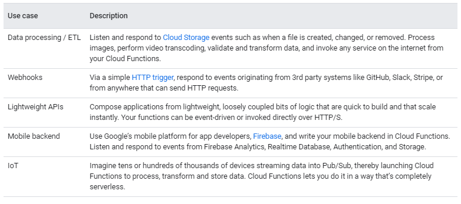

# Cloud Shell

- provisions a Google Compute Engine virtual machine running a Debian-based Linux operating system
  - per-user, per-session basis
  - persists while your Cloud Shell session is active
  - after an hour of inactivity, your session terminates and its VM, discarded
  - ephemeral, pre-configured VM and the environment you work with is a Docker container running on that VM
  - You can also customize your environment automatically on VM boot to ensure that your Cloud Shell instance includes your preferred tools
- Cloud Shell provisions 5 GB of free persistent disk storage mounted as your $HOME
  - does not time out on inactivity
- Cloud Shell prompts you with the 'Authorize Cloud Shell' dialog
  - Click 'Authorize' to allow the tool to use your credentials to make calls
- GOOGLE_CLOUD_PROJECT, the environmental variable used by Application Default Credentials library support to define project ID, is also set to point to the active project in Console.
- When you first connect to Cloud Shell, you will be automatically assigned to the closest available geographical region
- You cannot pick your own region
  - it will try to migrate your Cloud Shell VM to a closer region when it is not in use
- The Cloud Shell container image is updated weekly to ensure prepackaged tools are kept up to date
- you have full root privileges on your allocated VM and can even run sudo commands, if you need to
- Available tools:
  - Linux shell interpreters
  - Linux utilities
  - Google SDKs and tools
  - Text editors
  - Build and package tools
  - Source control tools
  - Additional tools (Docker, iPython, MySQL client, gRPC compiler, TensorFlow, Terraform)
- Language support:
  - Java
  - Go
  - Python
  - Node.js
  - Ruby
  - PHP
  - .NET Core
- Cloud Shell will immediately close after connection if there is a problem in your .bashrc or .tmux.conf files. To resolve this, open Cloud Shell in safe mode by appending cloudshellsafemode=true to the URL. This will restart your Cloud Shell and log you in as root, allowing you to fix any issues in the files.

# Cloud Composer

- solution for creating and deploying workflows with Apache Airflow
- fully managed workflow orchestration service, enabling you to create workflows that span across clouds and on-premises data centers
- Built on the popular Apache Airflow

### Workflows, DAGs, and tasks

- workflow represents a series of tasks for ingesting, transforming, analyzing, or `utilizing data
- In Airflow, workflows are created using DAGs, or "Directed Acyclic Graphs"
- DAG is a collection of tasks that you want to schedule and run, organized in a way that reflects their relationships and dependencies
  - created in Python scripts, which define the DAG structure (tasks and their dependencies) using code
- tasks can represent almost anything:
  - Preparing data for ingestion
  - Monitoring an API
  - Sending an email
  - Running a pipeline
- A DAG shouldn't be concerned with the function of each constituent task—its purpose is to ensure that each task is executed:
  - at the right time
  - in the right order
  - with the right issue handling

### Environments

- To run workflows first need to create an environment
- Airflow depends on many micro-services to run
  - Cloud Composer environment
- Environments are self-contained Airflow deployments based on Google Kubernetes Engine
  - they work with other Google Cloud services using connectors built into Airflow
- You can create one or more environments in a single Google Cloud project, using any supported region

# Cloud Scheduler

- set up scheduled units of work to be executed at defined times or regular intervals
  - commonly known as cron jobs
  - using either the Cloud Console or the gcloud command line tool
- examples
  - sending out a report email on a daily basis
  - updating some cached data every 10 minutes
  - updating some summary information once an hour
- Each cron job created using Cloud Scheduler is sent to a target according to a specified schedule
- The target must be one of the following types:
  - HTTP/S endpoints
  - Pub/Sub topics
  - App Engine applications
- Cloud Scheduler is currently available in all App Engine supported regions
- your Cloud project must contain an App Engine app that is located in one of the supported regions

# Cloud Taks

- Cloud Tasks lets you separate out pieces of work that can be performed independently
  - outside of your main application flow
  - send them off to be processed, asynchronously, using handlers that you create
- task is added to a queue, which persists the task until it is successfully executed
- The queue can also act as a kind of dispatch flow control, based on your initial configuration
- Complexities associated with that process, such as user-facing latency costs, server crashes, resource consumption limitations, and retry management, are handled by the service
- Service accessed via:
  - App Engine Task Queue API (for App Engine standard environment first generation)
  - Cloud Tasks API ( for others )
    - you must have a project that contains an App Engine app that hosts the Cloud Tasks queues that you create
- Once the task has been handed off to the queue, no data is made available to the initial request.

### Use cases
Typical use cases include:
  - Speeding user response times by delegating potentially slow background operations like database updates to a worker
  - Preserving requests in the context of unexpected production incidents
  - Helping smooth traffic spikes by removing non-user-facing tasks from the main user flow
  - Managing third-party API call rates

### Cloud Tasks queues with HTTP targets

- Cloud Tasks forwards the task request to the worker
  - located at any generic HTTP endpoint, such as Cloud Functions, Cloud Run, GKE, Compute Engine, or even an on-prem web server
- upon success
  - all workers must send an HTTP response code (200-299), before a 10 minute deadline
  - If a different response is sent, or no response, the task is retried.
- The target must manage scaling workers and cleaning up tasks once they are complete.

### Cloud Tasks queues with App Engine targets

- Cloud Tasks forwards the task request to the worker
  - located within App Engine
  - all workers must send an HTTP response code (200-299), before a 10 minute deadline for automatic scaling (or up to 24 hours for manual scaling)
- Because the handlers are part of App Engine, the Cloud Tasks service itself can do much of the process management for the task, scaling workers up and down in relation to traffic and deleting tasks when they are completed.

### Features

Using Cloud Tasks, you can dispatch asynchronous work items with the following controls:
  - Schedule specific delivery times
  - Manage delivery rates
  - Configure retry behavior
  - Access and manage individual tasks in a queue
  - Enable task deduplication

### Cloud Functions

- serverless execution environment for building and connecting cloud services
- write simple, single-purpose functions that are attached to events emitted from your cloud infrastructure and services
  - function is triggered when an event being watched is fired
  - JavaScript, Python 3, Go, or Java
- fully managed environmen

### Connect and extend cloud services

- connective layer of logic that lets you write code to connect and extend cloud services
  - Listen and respond to
    - a file upload to Cloud Storage
    - a log change
    - an incoming message on a Pub/Sub topic

### Events and triggers

- Cloud events are things that happen in your cloud environment
  - changes to data in a database
  - files added to a storage system
  - new virtual machine instance being created.
- You create a response to an event with a trigger

### Serverless

- a function can scale from a few invocations a day to many millions of invocations without any work from you

### Use cases

